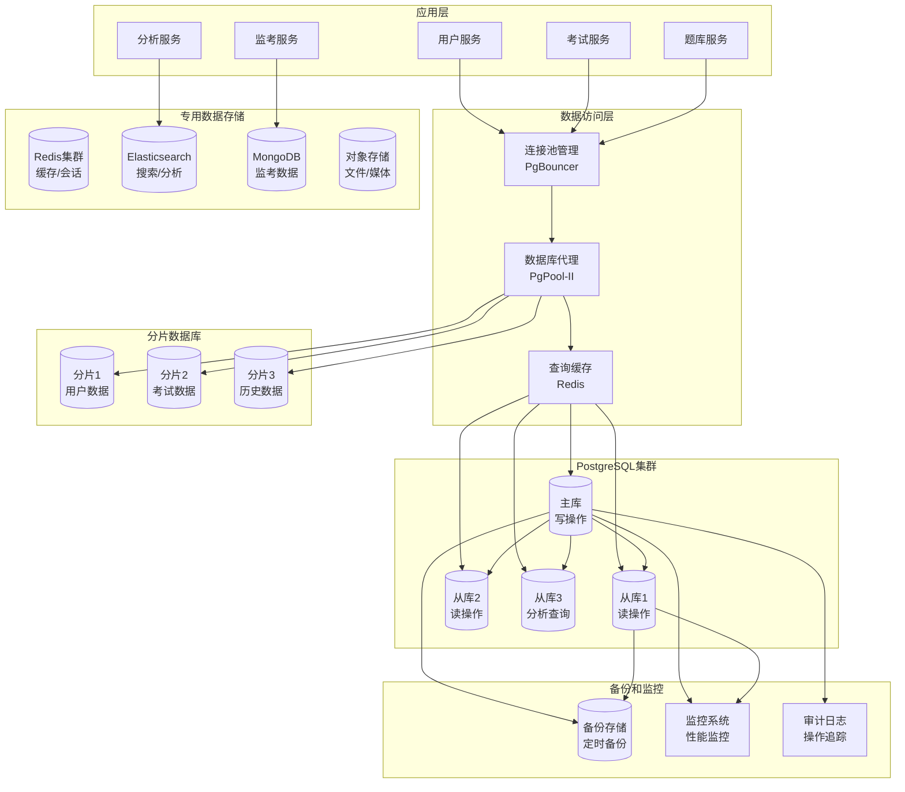
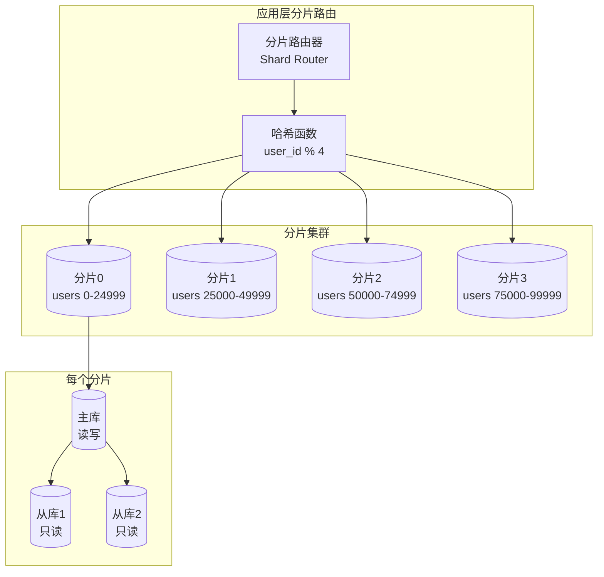
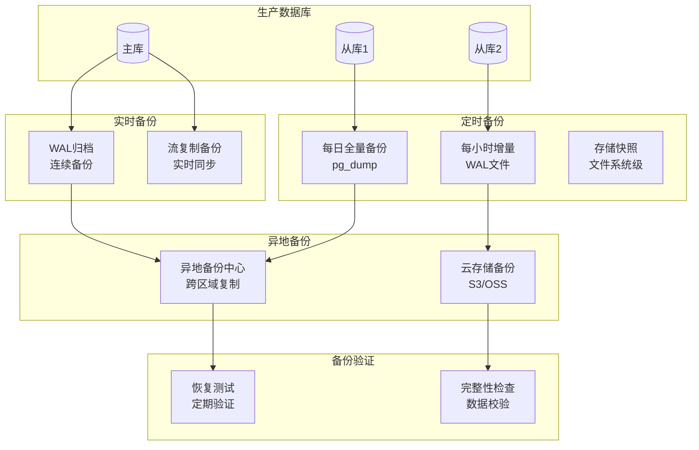

# 在线考试系统 - 数据库设计文档

## 概述

基于系统设计需求，设计一个支持10K+并发用户、99.9%可用性的高性能数据库架构。采用PostgreSQL作为主数据库，配合Redis、Elasticsearch、MongoDB形成多数据源架构，满足不同业务场景的数据存储需求。

### 核心设计原则
- **数据一致性**: ACID事务保证，强一致性优先
- **高性能**: 索引优化、查询优化、连接池管理
- **高可用性**: 主从复制、读写分离、故障自动切换
- **可扩展性**: 分库分表、水平分片、弹性扩容
- **数据安全**: 加密存储、访问控制、审计日志

---

## 1. 数据库架构设计

### 1.1 整体数据架构



### 1.2 数据存储分层策略

#### 热数据层 (PostgreSQL主库)
- **存储内容**: 活跃用户数据、进行中的考试、最近7天的考试记录
- **性能要求**: 读写延迟<10ms，TPS>5000
- **存储容量**: 500GB-1TB
- **备份策略**: 实时同步备份

#### 温数据层 (PostgreSQL从库)
- **存储内容**: 历史考试记录、用户学习数据、统计分析数据
- **性能要求**: 读延迟<50ms，QPS>10000
- **存储容量**: 2TB-5TB
- **备份策略**: 每日增量备份

#### 冷数据层 (归档存储)
- **存储内容**: 6个月以上的历史数据、已删除用户数据
- **性能要求**: 读延迟<1s，主要用于合规和审计查询
- **存储容量**: 10TB+
- **备份策略**: 每周全量备份

#### 缓存层 (Redis)
- **存储内容**: 会话数据、热点查询结果、考试配置缓存
- **性能要求**: 读写延迟<1ms，QPS>50000
- **存储容量**: 100GB-200GB
- **持久化**: AOF + RDB混合持久化

---

## 2. 核心数据模型设计

### 2.1 标准化数据模型

#### 用户体系表设计

```sql
-- 用户主表
CREATE TABLE users (
    id BIGSERIAL PRIMARY KEY,
    username VARCHAR(50) UNIQUE NOT NULL,
    email VARCHAR(255) UNIQUE NOT NULL,
    password_hash VARCHAR(255) NOT NULL,
    first_name VARCHAR(100),
    last_name VARCHAR(100),
    phone VARCHAR(20),
    avatar_url TEXT,
    profile JSONB DEFAULT '{}',
    is_active BOOLEAN DEFAULT true,
    is_verified BOOLEAN DEFAULT false,
    email_verified_at TIMESTAMP,
    phone_verified_at TIMESTAMP,
    last_login TIMESTAMP,
    login_count INTEGER DEFAULT 0,
    failed_login_attempts INTEGER DEFAULT 0,
    locked_until TIMESTAMP,
    created_at TIMESTAMP DEFAULT CURRENT_TIMESTAMP,
    updated_at TIMESTAMP DEFAULT CURRENT_TIMESTAMP,
    
    -- 约束
    CONSTRAINT users_email_format CHECK (email ~* '^[A-Za-z0-9._%+-]+@[A-Za-z0-9.-]+\.[A-Za-z]{2,}$'),
    CONSTRAINT users_phone_format CHECK (phone ~* '^\+?[1-9]\d{1,14}$'),
    CONSTRAINT users_username_length CHECK (length(username) >= 3)
);

-- 用户角色表
CREATE TABLE user_roles (
    id BIGSERIAL PRIMARY KEY,
    user_id BIGINT NOT NULL REFERENCES users(id) ON DELETE CASCADE,
    role VARCHAR(20) NOT NULL CHECK (role IN ('student', 'teacher', 'admin', 'super_admin')),
    organization_id BIGINT REFERENCES organizations(id),
    permissions JSONB DEFAULT '[]',
    granted_by BIGINT REFERENCES users(id),
    granted_at TIMESTAMP DEFAULT CURRENT_TIMESTAMP,
    expires_at TIMESTAMP,
    is_active BOOLEAN DEFAULT true,
    created_at TIMESTAMP DEFAULT CURRENT_TIMESTAMP,
    
    -- 复合唯一索引：用户在同一机构只能有一个相同角色
    UNIQUE(user_id, organization_id, role)
);

-- 用户会话表
CREATE TABLE user_sessions (
    session_id VARCHAR(128) PRIMARY KEY,
    user_id BIGINT NOT NULL REFERENCES users(id) ON DELETE CASCADE,
    device_type VARCHAR(20) DEFAULT 'web',
    device_fingerprint VARCHAR(255),
    ip_address INET NOT NULL,
    user_agent TEXT,
    location_country VARCHAR(2),
    location_city VARCHAR(100),
    metadata JSONB DEFAULT '{}',
    is_active BOOLEAN DEFAULT true,
    created_at TIMESTAMP DEFAULT CURRENT_TIMESTAMP,
    expires_at TIMESTAMP NOT NULL,
    last_activity TIMESTAMP DEFAULT CURRENT_TIMESTAMP,
    
    -- 检查约束
    CONSTRAINT sessions_expires_future CHECK (expires_at > created_at),
    CONSTRAINT sessions_device_type CHECK (device_type IN ('web', 'mobile', 'tablet', 'desktop'))
);
```

#### 组织机构表设计

```sql
-- 组织机构表
CREATE TABLE organizations (
    id BIGSERIAL PRIMARY KEY,
    name VARCHAR(255) NOT NULL,
    code VARCHAR(50) UNIQUE NOT NULL,
    type VARCHAR(20) NOT NULL CHECK (type IN ('university', 'school', 'company', 'training', 'government')),
    parent_id BIGINT REFERENCES organizations(id),
    settings JSONB DEFAULT '{}',
    branding JSONB DEFAULT '{}',
    contact_info JSONB DEFAULT '{}',
    billing_info JSONB DEFAULT '{}',
    subscription_plan VARCHAR(20) DEFAULT 'basic',
    subscription_expires_at TIMESTAMP,
    max_users INTEGER DEFAULT 100,
    max_exams INTEGER DEFAULT 50,
    features JSONB DEFAULT '[]',
    is_active BOOLEAN DEFAULT true,
    created_at TIMESTAMP DEFAULT CURRENT_TIMESTAMP,
    updated_at TIMESTAMP DEFAULT CURRENT_TIMESTAMP,
    
    -- GIN索引用于JSON字段搜索
    CONSTRAINT org_code_format CHECK (code ~* '^[A-Z0-9_-]+$')
);

-- 创建组织层级视图
CREATE VIEW organization_hierarchy AS
WITH RECURSIVE org_tree AS (
    -- 根节点
    SELECT id, name, code, parent_id, 0 as level, ARRAY[id] as path
    FROM organizations WHERE parent_id IS NULL
    
    UNION ALL
    
    -- 递归查找子节点
    SELECT o.id, o.name, o.code, o.parent_id, ot.level + 1, ot.path || o.id
    FROM organizations o
    JOIN org_tree ot ON o.parent_id = ot.id
)
SELECT * FROM org_tree;
```

#### 课程和考试体系设计

```sql
-- 课程表
CREATE TABLE courses (
    id BIGSERIAL PRIMARY KEY,
    title VARCHAR(255) NOT NULL,
    description TEXT,
    code VARCHAR(50) UNIQUE NOT NULL,
    instructor_id BIGINT NOT NULL REFERENCES users(id),
    organization_id BIGINT NOT NULL REFERENCES organizations(id),
    category_id BIGINT REFERENCES course_categories(id),
    status VARCHAR(20) DEFAULT 'draft' CHECK (status IN ('draft', 'active', 'archived', 'suspended')),
    difficulty_level VARCHAR(20) DEFAULT 'medium' CHECK (difficulty_level IN ('beginner', 'intermediate', 'advanced', 'expert')),
    duration_hours INTEGER,
    max_students INTEGER,
    enrollment_start TIMESTAMP,
    enrollment_end TIMESTAMP,
    course_start DATE,
    course_end DATE,
    metadata JSONB DEFAULT '{}',
    tags TEXT[],
    prerequisites BIGINT[],  -- 课程ID数组
    learning_objectives TEXT[],
    is_public BOOLEAN DEFAULT false,
    requires_approval BOOLEAN DEFAULT false,
    created_at TIMESTAMP DEFAULT CURRENT_TIMESTAMP,
    updated_at TIMESTAMP DEFAULT CURRENT_TIMESTAMP,
    
    -- 检查约束
    CONSTRAINT courses_dates_valid CHECK (
        (enrollment_start IS NULL OR enrollment_end IS NULL OR enrollment_start <= enrollment_end) AND
        (course_start IS NULL OR course_end IS NULL OR course_start <= course_end)
    )
);

-- 考试表（核心表，需要重点优化）
CREATE TABLE exams (
    id BIGSERIAL PRIMARY KEY,
    title VARCHAR(255) NOT NULL,
    description TEXT,
    code VARCHAR(50) UNIQUE NOT NULL,
    course_id BIGINT NOT NULL REFERENCES courses(id),
    created_by BIGINT NOT NULL REFERENCES users(id),
    type VARCHAR(20) NOT NULL CHECK (type IN ('quiz', 'assignment', 'midterm', 'final', 'certification', 'practice')),
    status VARCHAR(20) DEFAULT 'draft' CHECK (status IN ('draft', 'review', 'published', 'active', 'completed', 'archived')),
    
    -- 考试配置
    duration_minutes INTEGER NOT NULL CHECK (duration_minutes > 0 AND duration_minutes <= 1440), -- 最长24小时
    max_attempts INTEGER DEFAULT 1 CHECK (max_attempts > 0 AND max_attempts <= 10),
    passing_score DECIMAL(5,2) NOT NULL CHECK (passing_score >= 0 AND passing_score <= 100),
    total_points DECIMAL(8,2) DEFAULT 0 CHECK (total_points >= 0),
    
    -- 时间控制
    available_from TIMESTAMP,
    available_until TIMESTAMP,
    late_submission_penalty DECIMAL(3,2) DEFAULT 0, -- 迟交扣分比例
    grace_period_minutes INTEGER DEFAULT 0,
    
    -- 考试设置
    settings JSONB DEFAULT '{}', -- 通用设置
    proctoring_config JSONB DEFAULT '{}', -- 监考配置
    grading_config JSONB DEFAULT '{}', -- 评分配置
    
    -- 题目设置
    shuffle_questions BOOLEAN DEFAULT false,
    shuffle_options BOOLEAN DEFAULT false,
    show_results_immediately BOOLEAN DEFAULT true,
    allow_review BOOLEAN DEFAULT true,
    show_correct_answers BOOLEAN DEFAULT false,
    
    -- 访问控制
    password_protected BOOLEAN DEFAULT false,
    exam_password VARCHAR(255),
    ip_restrictions INET[],
    browser_lockdown BOOLEAN DEFAULT false,
    
    -- 统计字段（冗余存储，提高查询性能）
    questions_count INTEGER DEFAULT 0,
    attempts_count INTEGER DEFAULT 0,
    completed_attempts INTEGER DEFAULT 0,
    avg_score DECIMAL(5,2),
    avg_duration INTERVAL,
    
    -- 时间戳
    published_at TIMESTAMP,
    first_attempt_at TIMESTAMP,
    last_attempt_at TIMESTAMP,
    created_at TIMESTAMP DEFAULT CURRENT_TIMESTAMP,
    updated_at TIMESTAMP DEFAULT CURRENT_TIMESTAMP,
    
    -- 约束
    CONSTRAINT exams_dates_valid CHECK (
        available_from IS NULL OR available_until IS NULL OR available_from < available_until
    ),
    CONSTRAINT exams_password_logic CHECK (
        (password_protected = false) OR 
        (password_protected = true AND exam_password IS NOT NULL)
    )
);
```

#### 题库系统设计

```sql
-- 题目分类表
CREATE TABLE question_categories (
    id BIGSERIAL PRIMARY KEY,
    name VARCHAR(255) NOT NULL,
    code VARCHAR(50) UNIQUE NOT NULL,
    parent_id BIGINT REFERENCES question_categories(id),
    description TEXT,
    sort_order INTEGER DEFAULT 0,
    icon VARCHAR(50),
    color VARCHAR(7), -- hex颜色代码
    is_active BOOLEAN DEFAULT true,
    created_at TIMESTAMP DEFAULT CURRENT_TIMESTAMP
);

-- 题目表（大表，需要分区优化）
CREATE TABLE questions (
    id BIGSERIAL PRIMARY KEY,
    title VARCHAR(500),
    content TEXT NOT NULL,
    type VARCHAR(20) NOT NULL CHECK (type IN (
        'single_choice', 'multiple_choice', 'true_false', 
        'fill_blank', 'short_answer', 'essay', 
        'coding', 'matching', 'ordering', 'hotspot'
    )),
    difficulty VARCHAR(20) DEFAULT 'medium' CHECK (difficulty IN ('easy', 'medium', 'hard', 'expert')),
    
    -- 分值和评分
    default_points DECIMAL(6,2) NOT NULL DEFAULT 1.0 CHECK (default_points > 0),
    partial_credit BOOLEAN DEFAULT false,
    negative_marking BOOLEAN DEFAULT false,
    
    -- 题目内容
    options JSONB, -- 选择题选项
    correct_answer JSONB NOT NULL, -- 正确答案
    explanation TEXT, -- 解析
    hints JSONB DEFAULT '[]', -- 提示数组
    
    -- 媒体资源
    media_type VARCHAR(20) CHECK (media_type IN ('image', 'audio', 'video', 'document')),
    media_url TEXT,
    media_metadata JSONB DEFAULT '{}',
    
    -- 分类和标签
    category_id BIGINT REFERENCES question_categories(id),
    subject VARCHAR(100),
    topic VARCHAR(100),
    subtopic VARCHAR(100),
    keywords TEXT[],
    tags JSONB DEFAULT '[]',
    
    -- 创建信息
    created_by BIGINT NOT NULL REFERENCES users(id),
    organization_id BIGINT REFERENCES organizations(id),
    source VARCHAR(100), -- 题目来源
    copyright_info TEXT,
    
    -- 状态管理
    status VARCHAR(20) DEFAULT 'draft' CHECK (status IN ('draft', 'review', 'active', 'deprecated', 'archived')),
    review_status VARCHAR(20) DEFAULT 'pending',
    reviewed_by BIGINT REFERENCES users(id),
    reviewed_at TIMESTAMP,
    review_notes TEXT,
    
    -- 使用统计（冗余字段，提高查询性能）
    usage_count INTEGER DEFAULT 0 CHECK (usage_count >= 0),
    correct_rate DECIMAL(5,2), -- 正确率
    avg_score DECIMAL(5,2), -- 平均得分
    avg_time_seconds INTEGER, -- 平均用时
    difficulty_index DECIMAL(3,2), -- 难度系数(0-1)
    discrimination_index DECIMAL(3,2), -- 区分度(0-1)
    
    -- 版本控制
    version INTEGER DEFAULT 1,
    parent_question_id BIGINT REFERENCES questions(id),
    is_latest_version BOOLEAN DEFAULT true,
    
    -- 时间戳
    last_used_at TIMESTAMP,
    created_at TIMESTAMP DEFAULT CURRENT_TIMESTAMP,
    updated_at TIMESTAMP DEFAULT CURRENT_TIMESTAMP,
    
    -- 全文搜索向量
    search_vector tsvector
);

-- 为题目表创建全文搜索索引
CREATE INDEX idx_questions_search_vector ON questions USING GIN(search_vector);

-- 更新搜索向量的触发器
CREATE OR REPLACE FUNCTION update_question_search_vector()
RETURNS TRIGGER AS $$
BEGIN
    NEW.search_vector := 
        setweight(to_tsvector('english', COALESCE(NEW.title, '')), 'A') ||
        setweight(to_tsvector('english', COALESCE(NEW.content, '')), 'B') ||
        setweight(to_tsvector('english', COALESCE(NEW.explanation, '')), 'C') ||
        setweight(to_tsvector('english', array_to_string(NEW.keywords, ' ')), 'D');
    RETURN NEW;
END;
$$ LANGUAGE plpgsql;

CREATE TRIGGER trigger_update_question_search_vector
    BEFORE INSERT OR UPDATE ON questions
    FOR EACH ROW EXECUTE FUNCTION update_question_search_vector();
```

#### 考试记录和答案设计

```sql
-- 考试记录表（大表，需要分区）
CREATE TABLE exam_attempts (
    id BIGSERIAL PRIMARY KEY,
    attempt_code VARCHAR(32) UNIQUE NOT NULL, -- 唯一考试码，用于防止重复提交
    exam_id BIGINT NOT NULL REFERENCES exams(id),
    user_id BIGINT NOT NULL REFERENCES users(id),
    
    -- 状态管理
    status VARCHAR(20) DEFAULT 'started' CHECK (status IN (
        'started', 'in_progress', 'paused', 'submitted', 
        'auto_submitted', 'graded', 'reviewed', 'cancelled', 'flagged'
    )),
    
    -- 成绩信息
    score DECIMAL(8,2) DEFAULT 0 CHECK (score >= 0),
    percentage DECIMAL(5,2) CHECK (percentage >= 0 AND percentage <= 100),
    grade VARCHAR(5), -- A+, A, B+, B, C+, C, D, F
    points_earned DECIMAL(8,2) DEFAULT 0,
    points_possible DECIMAL(8,2),
    
    -- 时间跟踪
    started_at TIMESTAMP DEFAULT CURRENT_TIMESTAMP,
    submitted_at TIMESTAMP,
    graded_at TIMESTAMP,
    reviewed_at TIMESTAMP,
    last_activity TIMESTAMP DEFAULT CURRENT_TIMESTAMP,
    time_spent INTERVAL, -- 实际用时
    remaining_time INTEGER, -- 剩余时间(秒)
    
    -- 环境信息
    ip_address INET NOT NULL,
    user_agent TEXT,
    browser_info JSONB DEFAULT '{}',
    screen_resolution VARCHAR(20),
    timezone VARCHAR(50),
    
    -- 考试行为数据
    answers_summary JSONB DEFAULT '{}', -- 答案统计摘要
    time_tracking JSONB DEFAULT '{}', -- 详细时间跟踪
    navigation_log JSONB DEFAULT '[]', -- 页面导航日志
    
    -- 安全和监控
    security_flags JSONB DEFAULT '[]', -- 安全标记
    violations_count INTEGER DEFAULT 0,
    proctoring_score DECIMAL(3,2), -- 监考评分(0-1)
    integrity_verified BOOLEAN DEFAULT false,
    
    -- 评分信息
    auto_graded_at TIMESTAMP,
    manual_graded_by BIGINT REFERENCES users(id),
    grading_notes TEXT,
    feedback TEXT,
    
    -- 额外信息
    metadata JSONB DEFAULT '{}',
    submission_method VARCHAR(20) DEFAULT 'manual', -- manual, auto, timeout
    late_submission BOOLEAN DEFAULT false,
    penalty_applied DECIMAL(5,2) DEFAULT 0,
    
    created_at TIMESTAMP DEFAULT CURRENT_TIMESTAMP,
    updated_at TIMESTAMP DEFAULT CURRENT_TIMESTAMP,
    
    -- 约束
    CONSTRAINT exam_attempts_time_logic CHECK (
        submitted_at IS NULL OR submitted_at >= started_at
    ),
    CONSTRAINT exam_attempts_score_logic CHECK (
        (points_possible IS NULL) OR 
        (points_earned <= points_possible)
    )
) PARTITION BY RANGE (started_at);

-- 创建分区表（按月分区）
CREATE TABLE exam_attempts_y2024m01 PARTITION OF exam_attempts
    FOR VALUES FROM ('2024-01-01') TO ('2024-02-01');
CREATE TABLE exam_attempts_y2024m02 PARTITION OF exam_attempts
    FOR VALUES FROM ('2024-02-01') TO ('2024-03-01');
-- ... 继续创建其他月份的分区

-- 答案表（超大表，需要分区和优化）
CREATE TABLE answers (
    id BIGSERIAL PRIMARY KEY,
    attempt_id BIGINT NOT NULL, -- 不使用外键约束，提高性能
    question_id BIGINT NOT NULL,
    
    -- 答案内容
    user_answer JSONB, -- 用户答案
    original_answer JSONB, -- 原始答案（用于审计）
    correct_answer JSONB, -- 正确答案快照
    
    -- 评分信息
    points_earned DECIMAL(6,2) DEFAULT 0 CHECK (points_earned >= 0),
    points_possible DECIMAL(6,2) NOT NULL DEFAULT 1.0 CHECK (points_possible > 0),
    is_correct BOOLEAN,
    status VARCHAR(20) DEFAULT 'ungraded' CHECK (status IN (
        'ungraded', 'correct', 'incorrect', 'partial', 'pending_review', 'flagged'
    )),
    
    -- 评分详情
    auto_graded BOOLEAN DEFAULT false,
    graded_by BIGINT, -- 评分者ID
    grading_method VARCHAR(20) DEFAULT 'auto', -- auto, manual, ai_assisted
    confidence_score DECIMAL(3,2), -- AI评分置信度
    
    -- 时间信息
    answered_at TIMESTAMP DEFAULT CURRENT_TIMESTAMP,
    first_answered_at TIMESTAMP,
    last_modified_at TIMESTAMP DEFAULT CURRENT_TIMESTAMP,
    graded_at TIMESTAMP,
    time_spent INTEGER DEFAULT 0, -- 用时(秒)
    
    -- 答题行为
    attempt_count INTEGER DEFAULT 1, -- 答题次数（如果允许修改）
    keystrokes_count INTEGER DEFAULT 0,
    focus_lost_count INTEGER DEFAULT 0,
    paste_detected BOOLEAN DEFAULT false,
    
    -- 反馈和备注
    feedback TEXT,
    explanation_viewed BOOLEAN DEFAULT false,
    hint_used BOOLEAN DEFAULT false,
    flagged_for_review BOOLEAN DEFAULT false,
    review_notes TEXT,
    
    -- 元数据
    metadata JSONB DEFAULT '{}',
    
    created_at TIMESTAMP DEFAULT CURRENT_TIMESTAMP,
    updated_at TIMESTAMP DEFAULT CURRENT_TIMESTAMP,
    
    -- 检查约束
    CONSTRAINT answers_points_logic CHECK (points_earned <= points_possible),
    CONSTRAINT answers_time_logic CHECK (
        answered_at IS NULL OR first_answered_at IS NULL OR 
        answered_at >= first_answered_at
    )
) PARTITION BY HASH (attempt_id);

-- 创建答案表的哈希分区（16个分区）
CREATE TABLE answers_p0 PARTITION OF answers FOR VALUES WITH (MODULUS 16, REMAINDER 0);
CREATE TABLE answers_p1 PARTITION OF answers FOR VALUES WITH (MODULUS 16, REMAINDER 1);
-- ... 继续创建其他分区
```

---

## 3. 性能优化策略

### 3.1 索引设计策略

#### 主键和唯一索引
```sql
-- 用户表核心索引
CREATE UNIQUE INDEX CONCURRENTLY idx_users_username ON users(username);
CREATE UNIQUE INDEX CONCURRENTLY idx_users_email ON users(email);
CREATE INDEX CONCURRENTLY idx_users_phone ON users(phone) WHERE phone IS NOT NULL;
CREATE INDEX CONCURRENTLY idx_users_active_created ON users(created_at DESC) WHERE is_active = true;

-- 考试表核心索引
CREATE UNIQUE INDEX CONCURRENTLY idx_exams_code ON exams(code);
CREATE INDEX CONCURRENTLY idx_exams_course_status ON exams(course_id, status);
CREATE INDEX CONCURRENTLY idx_exams_published ON exams(published_at DESC) WHERE status = 'published';
CREATE INDEX CONCURRENTLY idx_exams_creator_org ON exams(created_by, organization_id);

-- 题目表索引优化
CREATE INDEX CONCURRENTLY idx_questions_category_status ON questions(category_id, status);
CREATE INDEX CONCURRENTLY idx_questions_type_difficulty ON questions(type, difficulty) WHERE status = 'active';
CREATE INDEX CONCURRENTLY idx_questions_creator_org ON questions(created_by, organization_id);
CREATE INDEX CONCURRENTLY idx_questions_usage_stats ON questions(usage_count DESC, correct_rate DESC) WHERE status = 'active';
```

#### 复合索引优化
```sql
-- 考试记录表关键查询索引
CREATE INDEX CONCURRENTLY idx_exam_attempts_user_exam_status 
ON exam_attempts(user_id, exam_id, status, started_at DESC);

CREATE INDEX CONCURRENTLY idx_exam_attempts_exam_completed 
ON exam_attempts(exam_id, status, submitted_at DESC) 
WHERE status IN ('submitted', 'graded');

CREATE INDEX CONCURRENTLY idx_exam_attempts_user_recent 
ON exam_attempts(user_id, started_at DESC) 
WHERE status != 'cancelled';

-- 答案表高频查询索引
CREATE INDEX CONCURRENTLY idx_answers_attempt_question 
ON answers(attempt_id, question_id);

CREATE INDEX CONCURRENTLY idx_answers_question_stats 
ON answers(question_id, is_correct, points_earned) 
WHERE status != 'ungraded';

CREATE INDEX CONCURRENTLY idx_answers_grading_queue 
ON answers(status, graded_at) 
WHERE status IN ('ungraded', 'pending_review');
```

#### 部分索引优化
```sql
-- 只为活跃数据创建索引
CREATE INDEX CONCURRENTLY idx_users_active_login 
ON users(last_login DESC) 
WHERE is_active = true AND last_login > CURRENT_DATE - INTERVAL '30 days';

CREATE INDEX CONCURRENTLY idx_exams_ongoing 
ON exams(available_from, available_until) 
WHERE status = 'published' AND available_until > CURRENT_TIMESTAMP;

CREATE INDEX CONCURRENTLY idx_questions_review_queue 
ON questions(created_at) 
WHERE status = 'review' OR review_status = 'pending';

-- 监考相关索引
CREATE INDEX CONCURRENTLY idx_proctor_logs_severity 
ON proctor_logs(attempt_id, severity, occurred_at DESC) 
WHERE requires_review = true;
```

#### JSON字段索引
```sql
-- 用户资料JSON字段索引
CREATE INDEX CONCURRENTLY idx_users_profile_gin ON users USING GIN(profile);
CREATE INDEX CONCURRENTLY idx_users_profile_location ON users USING GIN((profile->'location'));

-- 考试设置JSON字段索引
CREATE INDEX CONCURRENTLY idx_exams_settings_gin ON exams USING GIN(settings);
CREATE INDEX CONCURRENTLY idx_exams_proctoring_enabled ON exams((proctoring_config->>'enabled')) 
WHERE (proctoring_config->>'enabled')::boolean = true;

-- 题目选项和答案索引
CREATE INDEX CONCURRENTLY idx_questions_options_gin ON questions USING GIN(options);
CREATE INDEX CONCURRENTLY idx_questions_tags_gin ON questions USING GIN(tags);

-- 考试记录元数据索引
CREATE INDEX CONCURRENTLY idx_exam_attempts_metadata_gin ON exam_attempts USING GIN(metadata);
CREATE INDEX CONCURRENTLY idx_exam_attempts_browser ON exam_attempts USING GIN(browser_info);
```

### 3.2 查询优化技术

#### 查询重写和优化
```sql
-- 1. 使用窗口函数优化排名查询
-- 优化前：每个用户都查询一次排名
SELECT u.username, ea.score, 
       (SELECT COUNT(*) FROM exam_attempts ea2 
        WHERE ea2.exam_id = ea.exam_id AND ea2.score > ea.score) + 1 as rank
FROM exam_attempts ea
JOIN users u ON u.id = ea.user_id
WHERE ea.exam_id = $1 AND ea.status = 'graded';

-- 优化后：使用窗口函数一次计算所有排名
SELECT username, score, 
       RANK() OVER (ORDER BY score DESC) as rank
FROM exam_attempts ea
JOIN users u ON u.id = ea.user_id
WHERE ea.exam_id = $1 AND ea.status = 'graded'
ORDER BY score DESC;

-- 2. 使用物化视图优化复杂统计查询
CREATE MATERIALIZED VIEW exam_statistics_mv AS
SELECT 
    e.id as exam_id,
    e.title,
    e.course_id,
    COUNT(ea.id) as total_attempts,
    COUNT(CASE WHEN ea.status = 'completed' THEN 1 END) as completed_attempts,
    AVG(ea.score) as avg_score,
    STDDEV(ea.score) as score_stddev,
    PERCENTILE_CONT(0.5) WITHIN GROUP (ORDER BY ea.score) as median_score,
    PERCENTILE_CONT(0.25) WITHIN GROUP (ORDER BY ea.score) as q1_score,
    PERCENTILE_CONT(0.75) WITHIN GROUP (ORDER BY ea.score) as q3_score,
    MIN(ea.score) as min_score,
    MAX(ea.score) as max_score,
    AVG(EXTRACT(EPOCH FROM ea.time_spent)) as avg_duration_seconds,
    MAX(ea.submitted_at) as last_attempt_time
FROM exams e
LEFT JOIN exam_attempts ea ON e.id = ea.exam_id AND ea.status IN ('submitted', 'graded')
WHERE e.status = 'published'
GROUP BY e.id, e.title, e.course_id;

-- 创建唯一索引支持并发刷新
CREATE UNIQUE INDEX ON exam_statistics_mv (exam_id);

-- 定时刷新物化视图
SELECT cron.schedule('refresh-exam-stats', '0 */6 * * *', 'REFRESH MATERIALIZED VIEW CONCURRENTLY exam_statistics_mv');

-- 3. 使用CTE优化递归查询
WITH RECURSIVE question_hierarchy AS (
    -- 根节点
    SELECT id, name, parent_id, 0 as level, ARRAY[id] as path
    FROM question_categories 
    WHERE parent_id IS NULL
    
    UNION ALL
    
    -- 递归部分
    SELECT qc.id, qc.name, qc.parent_id, qh.level + 1, qh.path || qc.id
    FROM question_categories qc
    JOIN question_hierarchy qh ON qc.parent_id = qh.id
    WHERE NOT qc.id = ANY(qh.path) -- 防止循环引用
)
SELECT * FROM question_hierarchy WHERE level <= 5; -- 限制递归深度
```

#### 批量操作优化
```sql
-- 1. 批量插入答案记录
INSERT INTO answers (attempt_id, question_id, user_answer, points_earned, answered_at)
SELECT 
    $1::bigint as attempt_id,
    unnest($2::bigint[]) as question_id,
    unnest($3::jsonb[]) as user_answer,
    unnest($4::decimal[]) as points_earned,
    NOW()
ON CONFLICT (attempt_id, question_id) DO UPDATE SET
    user_answer = EXCLUDED.user_answer,
    points_earned = EXCLUDED.points_earned,
    updated_at = NOW();

-- 2. 批量更新考试统计信息
WITH attempt_stats AS (
    SELECT 
        exam_id,
        COUNT(*) as attempts_count,
        COUNT(CASE WHEN status = 'completed' THEN 1 END) as completed_count,
        AVG(score) as avg_score,
        AVG(time_spent) as avg_duration
    FROM exam_attempts 
    WHERE updated_at > CURRENT_TIMESTAMP - INTERVAL '1 hour'
    GROUP BY exam_id
)
UPDATE exams SET
    attempts_count = stats.attempts_count,
    completed_attempts = stats.completed_count,
    avg_score = stats.avg_score,
    avg_duration = stats.avg_duration,
    updated_at = NOW()
FROM attempt_stats stats
WHERE exams.id = stats.exam_id;

-- 3. 分页优化（使用游标分页替代OFFSET）
-- 传统分页（性能差）
SELECT * FROM exam_attempts 
WHERE exam_id = $1 
ORDER BY started_at DESC 
LIMIT 20 OFFSET 1000;

-- 游标分页（性能好）
SELECT * FROM exam_attempts 
WHERE exam_id = $1 AND started_at < $2
ORDER BY started_at DESC 
LIMIT 20;
```

### 3.3 连接池和事务优化

#### 连接池配置
```sql
-- PostgreSQL连接池配置
-- postgresql.conf
max_connections = 200                    -- 最大连接数
shared_buffers = 2GB                     -- 共享缓冲区
effective_cache_size = 6GB               -- 有效缓存大小
maintenance_work_mem = 512MB             -- 维护操作内存
checkpoint_completion_target = 0.9       -- 检查点完成目标
wal_buffers = 16MB                       -- WAL缓冲区
default_statistics_target = 500          -- 统计信息目标
random_page_cost = 1.1                   -- SSD优化
effective_io_concurrency = 200           -- I/O并发数

-- 连接池参数调优
work_mem = 16MB                          -- 工作内存
temp_buffers = 32MB                      -- 临时缓冲区
max_prepared_transactions = 100          -- 最大预处理事务

-- PgBouncer配置
[databases]
exam_system = host=localhost port=5432 dbname=exam_system

[pgbouncer]
pool_mode = transaction                  -- 事务级连接池
listen_port = 6432
listen_addr = *
auth_type = md5
auth_file = /etc/pgbouncer/userlist.txt
max_client_conn = 1000                  -- 最大客户端连接
default_pool_size = 25                  -- 默认连接池大小
max_db_connections = 50                 -- 最大数据库连接
reserve_pool_size = 5                   -- 保留连接池大小
server_lifetime = 3600                  -- 服务器连接生存时间
server_idle_timeout = 600               -- 服务器空闲超时
```

#### 事务管理优化
```python
import asyncio
import asyncpg
from contextlib import asynccontextmanager
from typing import AsyncGenerator

class DatabaseManager:
    def __init__(self, dsn: str, min_size: int = 10, max_size: int = 50):
        self.dsn = dsn
        self.min_size = min_size
        self.max_size = max_size
        self.pool = None
    
    async def initialize(self):
        """初始化连接池"""
        self.pool = await asyncpg.create_pool(
            dsn=self.dsn,
            min_size=self.min_size,
            max_size=self.max_size,
            command_timeout=60,
            server_settings={
                'application_name': 'exam_system',
                'timezone': 'UTC'
            }
        )
    
    @asynccontextmanager
    async def transaction(self, isolation_level: str = 'read_committed') -> AsyncGenerator[asyncpg.Connection, None]:
        """事务上下文管理器"""
        async with self.pool.acquire() as connection:
            async with connection.transaction(isolation=isolation_level):
                yield connection
    
    @asynccontextmanager
    async def read_only_transaction(self) -> AsyncGenerator[asyncpg.Connection, None]:
        """只读事务（从库连接）"""
        async with self.pool.acquire() as connection:
            await connection.execute("SET TRANSACTION READ ONLY")
            async with connection.transaction():
                yield connection
    
    async def bulk_insert_answers(self, answers_data: list):
        """批量插入答案"""
        async with self.transaction() as conn:
            # 准备批量插入语句
            await conn.executemany("""
                INSERT INTO answers (attempt_id, question_id, user_answer, points_earned)
                VALUES ($1, $2, $3, $4)
                ON CONFLICT (attempt_id, question_id) DO UPDATE SET
                    user_answer = EXCLUDED.user_answer,
                    points_earned = EXCLUDED.points_earned,
                    updated_at = NOW()
            """, answers_data)
            
            # 更新考试记录统计
            await conn.execute("""
                UPDATE exam_attempts SET
                    answers_count = (
                        SELECT COUNT(*) FROM answers WHERE attempt_id = $1
                    ),
                    updated_at = NOW()
                WHERE id = $1
            """, answers_data[0][0])  # attempt_id
    
    async def process_exam_submission(self, attempt_id: int, answers: list):
        """处理考试提交（复杂事务）"""
        async with self.transaction(isolation_level='serializable') as conn:
            try:
                # 1. 检查考试状态
                attempt = await conn.fetchrow("""
                    SELECT status, exam_id, user_id, started_at 
                    FROM exam_attempts WHERE id = $1
                """, attempt_id)
                
                if not attempt or attempt['status'] != 'in_progress':
                    raise ValueError("Invalid attempt status")
                
                # 2. 批量插入/更新答案
                await conn.executemany("""
                    INSERT INTO answers (attempt_id, question_id, user_answer, answered_at)
                    VALUES ($1, $2, $3, NOW())
                    ON CONFLICT (attempt_id, question_id) DO UPDATE SET
                        user_answer = EXCLUDED.user_answer,
                        last_modified_at = NOW()
                """, [(attempt_id, ans['question_id'], ans['answer']) for ans in answers])
                
                # 3. 计算总分
                total_score = await conn.fetchval("""
                    SELECT COALESCE(SUM(points_earned), 0)
                    FROM answers WHERE attempt_id = $1
                """, attempt_id)
                
                # 4. 更新考试记录
                await conn.execute("""
                    UPDATE exam_attempts SET
                        status = 'submitted',
                        score = $2,
                        submitted_at = NOW(),
                        time_spent = NOW() - started_at
                    WHERE id = $1
                """, attempt_id, total_score)
                
                # 5. 更新考试统计
                await conn.execute("""
                    UPDATE exams SET
                        attempts_count = attempts_count + 1,
                        completed_attempts = completed_attempts + 1,
                        last_attempt_at = NOW()
                    WHERE id = $1
                """, attempt['exam_id'])
                
                return total_score
                
            except Exception as e:
                # 事务会自动回滚
                raise e
```

---

## 4. 数据分区和分片策略

### 4.1 分区策略设计

#### 时间分区策略（Range Partitioning）
```sql
-- 考试记录按月分区（主要查询模式）
CREATE TABLE exam_attempts (
    -- 表结构已定义
) PARTITION BY RANGE (started_at);

-- 创建月度分区
CREATE TABLE exam_attempts_y2024m01 PARTITION OF exam_attempts
    FOR VALUES FROM ('2024-01-01') TO ('2024-02-01');
CREATE TABLE exam_attempts_y2024m02 PARTITION OF exam_attempts
    FOR VALUES FROM ('2024-02-01') TO ('2024-03-01');
CREATE TABLE exam_attempts_y2024m03 PARTITION OF exam_attempts
    FOR VALUES FROM ('2024-03-01') TO ('2024-04-01');

-- 自动创建分区的函数
CREATE OR REPLACE FUNCTION create_monthly_partition(table_name text, start_date date)
RETURNS void AS $$
DECLARE
    partition_name text;
    end_date date;
BEGIN
    partition_name := table_name || '_y' || EXTRACT(YEAR FROM start_date) || 'm' || 
                     LPAD(EXTRACT(MONTH FROM start_date)::text, 2, '0');
    end_date := start_date + INTERVAL '1 month';
    
    EXECUTE format('CREATE TABLE %I PARTITION OF %I FOR VALUES FROM (%L) TO (%L)',
                   partition_name, table_name, start_date, end_date);
                   
    -- 创建分区索引
    EXECUTE format('CREATE INDEX %I ON %I (user_id, exam_id, status)',
                   'idx_' || partition_name || '_user_exam', partition_name);
END;
$$ LANGUAGE plpgsql;

-- 定时创建未来分区
SELECT cron.schedule('create-partitions', '0 0 1 * *', 
    'SELECT create_monthly_partition(''exam_attempts'', date_trunc(''month'', CURRENT_DATE + INTERVAL ''2 months''))');
```

#### 哈希分区策略（Hash Partitioning）
```sql
-- 答案表按attempt_id哈希分区（负载均衡）
CREATE TABLE answers (
    -- 表结构已定义
) PARTITION BY HASH (attempt_id);

-- 创建16个哈希分区
DO $$
BEGIN
    FOR i IN 0..15 LOOP
        EXECUTE format('CREATE TABLE answers_p%s PARTITION OF answers FOR VALUES WITH (MODULUS 16, REMAINDER %s)', i, i);
        
        -- 为每个分区创建优化索引
        EXECUTE format('CREATE INDEX idx_answers_p%s_question ON answers_p%s (question_id, is_correct)', i, i);
        EXECUTE format('CREATE INDEX idx_answers_p%s_grading ON answers_p%s (status, graded_at) WHERE status IN (''ungraded'', ''pending_review'')', i, i);
    END LOOP;
END $$;
```

#### 组织机构分区策略（List Partitioning）
```sql
-- 大表按组织机构分区（数据隔离）
CREATE TABLE user_activity_logs (
    id BIGSERIAL,
    user_id BIGINT NOT NULL,
    organization_id BIGINT NOT NULL,
    activity_type VARCHAR(50),
    activity_data JSONB,
    ip_address INET,
    user_agent TEXT,
    created_at TIMESTAMP DEFAULT CURRENT_TIMESTAMP
) PARTITION BY LIST (organization_id);

-- 为重要客户创建专用分区
CREATE TABLE user_activity_logs_org_1001 PARTITION OF user_activity_logs
    FOR VALUES IN (1001); -- 重要大学客户

CREATE TABLE user_activity_logs_org_1002 PARTITION OF user_activity_logs
    FOR VALUES IN (1002); -- 重要企业客户

-- 其他组织的默认分区
CREATE TABLE user_activity_logs_default PARTITION OF user_activity_logs DEFAULT;
```

### 4.2 分片架构设计

#### 水平分片策略


#### 分片路由实现
```python
import hashlib
import asyncio
from typing import Dict, List, Optional
from dataclasses import dataclass

@dataclass
class ShardConfig:
    shard_id: int
    master_dsn: str
    slave_dsns: List[str]
    weight: float = 1.0
    is_active: bool = True

class ShardRouter:
    def __init__(self, shard_configs: List[ShardConfig]):
        self.shards = {config.shard_id: config for config in shard_configs}
        self.shard_count = len(shard_configs)
        self.connection_pools = {}
    
    async def initialize(self):
        """初始化所有分片的连接池"""
        for shard_id, config in self.shards.items():
            # 主库连接池
            master_pool = await asyncpg.create_pool(config.master_dsn, min_size=5, max_size=20)
            
            # 从库连接池
            slave_pools = []
            for slave_dsn in config.slave_dsns:
                slave_pool = await asyncpg.create_pool(slave_dsn, min_size=3, max_size=15)
                slave_pools.append(slave_pool)
            
            self.connection_pools[shard_id] = {
                'master': master_pool,
                'slaves': slave_pools
            }
    
    def get_shard_id(self, sharding_key: str) -> int:
        """根据分片键计算分片ID"""
        if isinstance(sharding_key, int):
            return sharding_key % self.shard_count
        
        # 使用一致性哈希
        hash_value = int(hashlib.md5(str(sharding_key).encode()).hexdigest(), 16)
        return hash_value % self.shard_count
    
    def get_connection_pool(self, shard_id: int, read_only: bool = False):
        """获取指定分片的连接池"""
        if shard_id not in self.connection_pools:
            raise ValueError(f"Shard {shard_id} not found")
        
        pools = self.connection_pools[shard_id]
        
        if read_only and pools['slaves']:
            # 从从库中随机选择一个
            import random
            return random.choice(pools['slaves'])
        
        return pools['master']
    
    async def execute_on_shard(self, shard_id: int, query: str, params: tuple = (), read_only: bool = False):
        """在指定分片上执行查询"""
        pool = self.get_connection_pool(shard_id, read_only)
        async with pool.acquire() as conn:
            if read_only:
                return await conn.fetch(query, *params)
            else:
                return await conn.execute(query, *params)
    
    async def execute_on_all_shards(self, query: str, params: tuple = (), read_only: bool = True):
        """在所有分片上并行执行查询"""
        tasks = []
        for shard_id in self.shards.keys():
            if self.shards[shard_id].is_active:
                task = self.execute_on_shard(shard_id, query, params, read_only)
                tasks.append(task)
        
        results = await asyncio.gather(*tasks, return_exceptions=True)
        
        # 合并结果并处理异常
        combined_results = []
        for i, result in enumerate(results):
            if isinstance(result, Exception):
                print(f"Shard {i} error: {result}")
            else:
                combined_results.extend(result if isinstance(result, list) else [result])
        
        return combined_results

# 分片管理器
class ShardedDatabase:
    def __init__(self, router: ShardRouter):
        self.router = router
    
    async def get_user_by_id(self, user_id: int):
        """根据用户ID获取用户信息"""
        shard_id = self.router.get_shard_id(user_id)
        result = await self.router.execute_on_shard(
            shard_id, 
            "SELECT * FROM users WHERE id = $1", 
            (user_id,), 
            read_only=True
        )
        return result[0] if result else None
    
    async def create_exam_attempt(self, user_id: int, exam_id: int, **kwargs):
        """创建考试记录（可能涉及跨分片）"""
        user_shard = self.router.get_shard_id(user_id)
        exam_shard = self.router.get_shard_id(exam_id)
        
        if user_shard == exam_shard:
            # 同分片事务
            pool = self.router.get_connection_pool(user_shard)
            async with pool.acquire() as conn:
                async with conn.transaction():
                    attempt_id = await conn.fetchval("""
                        INSERT INTO exam_attempts (user_id, exam_id, started_at)
                        VALUES ($1, $2, NOW()) RETURNING id
                    """, user_id, exam_id)
                    return attempt_id
        else:
            # 跨分片事务（使用分布式事务或最终一致性）
            return await self._create_cross_shard_attempt(user_id, exam_id, **kwargs)
    
    async def _create_cross_shard_attempt(self, user_id: int, exam_id: int, **kwargs):
        """跨分片考试记录创建"""
        # 实现分布式事务或补偿事务模式
        # 这里简化处理，实际应用中需要更复杂的分布式事务管理
        user_shard = self.router.get_shard_id(user_id)
        
        # 在用户所在分片创建记录
        attempt_id = await self.router.execute_on_shard(
            user_shard,
            """INSERT INTO exam_attempts (user_id, exam_id, started_at, metadata)
               VALUES ($1, $2, NOW(), $3) RETURNING id""",
            (user_id, exam_id, {'cross_shard': True})
        )
        
        # TODO: 实现跨分片数据同步逻辑
        return attempt_id
    
    async def get_exam_statistics(self, exam_id: int):
        """获取考试统计（跨分片聚合）"""
        # 在所有分片上查询考试记录
        results = await self.router.execute_on_all_shards("""
            SELECT 
                COUNT(*) as attempt_count,
                AVG(score) as avg_score,
                MIN(score) as min_score,
                MAX(score) as max_score
            FROM exam_attempts 
            WHERE exam_id = $1 AND status = 'completed'
        """, (exam_id,))
        
        # 聚合结果
        total_attempts = sum(r['attempt_count'] for r in results)
        if total_attempts == 0:
            return None
        
        # 计算加权平均分
        weighted_sum = sum(r['avg_score'] * r['attempt_count'] for r in results if r['avg_score'])
        avg_score = weighted_sum / total_attempts if weighted_sum else 0
        
        return {
            'total_attempts': total_attempts,
            'avg_score': avg_score,
            'min_score': min(r['min_score'] for r in results if r['min_score'] is not None),
            'max_score': max(r['max_score'] for r in results if r['max_score'] is not None)
        }
```

### 4.3 数据分布和负载均衡

#### 一致性哈希实现
```python
import bisect
import hashlib
from typing import Dict, List, Optional, Set

class ConsistentHashRing:
    def __init__(self, virtual_nodes: int = 100):
        self.virtual_nodes = virtual_nodes
        self.ring: Dict[int, str] = {}
        self.sorted_keys: List[int] = []
        
    def _hash(self, key: str) -> int:
        """计算哈希值"""
        return int(hashlib.md5(key.encode()).hexdigest(), 16)
    
    def add_node(self, node: str):
        """添加节点到哈希环"""
        for i in range(self.virtual_nodes):
            virtual_key = f"{node}:{i}"
            hash_value = self._hash(virtual_key)
            self.ring[hash_value] = node
            bisect.insort(self.sorted_keys, hash_value)
    
    def remove_node(self, node: str):
        """从哈希环移除节点"""
        for i in range(self.virtual_nodes):
            virtual_key = f"{node}:{i}"
            hash_value = self._hash(virtual_key)
            if hash_value in self.ring:
                del self.ring[hash_value]
                self.sorted_keys.remove(hash_value)
    
    def get_node(self, key: str) -> Optional[str]:
        """获取键对应的节点"""
        if not self.ring:
            return None
        
        hash_value = self._hash(key)
        idx = bisect.bisect_right(self.sorted_keys, hash_value)
        
        if idx == len(self.sorted_keys):
            idx = 0
        
        return self.ring[self.sorted_keys[idx]]
    
    def get_nodes(self, key: str, count: int) -> List[str]:
        """获取键对应的多个节点（副本）"""
        if not self.ring or count <= 0:
            return []
        
        hash_value = self._hash(key)
        idx = bisect.bisect_right(self.sorted_keys, hash_value)
        
        nodes = set()
        while len(nodes) < count and len(nodes) < len(set(self.ring.values())):
            if idx == len(self.sorted_keys):
                idx = 0
            node = self.ring[self.sorted_keys[idx]]
            nodes.add(node)
            idx += 1
        
        return list(nodes)

# 数据迁移管理器
class DataMigrationManager:
    def __init__(self, source_router: ShardRouter, target_router: ShardRouter):
        self.source_router = source_router
        self.target_router = target_router
        
    async def migrate_user_data(self, user_id: int, batch_size: int = 1000):
        """迁移用户数据到新分片"""
        source_shard = self.source_router.get_shard_id(user_id)
        target_shard = self.target_router.get_shard_id(user_id)
        
        if source_shard == target_shard:
            return  # 无需迁移
        
        # 1. 迁移用户基础信息
        await self._migrate_table_data(
            'users', 
            f'id = {user_id}',
            source_shard, 
            target_shard
        )
        
        # 2. 迁移用户角色
        await self._migrate_table_data(
            'user_roles', 
            f'user_id = {user_id}',
            source_shard, 
            target_shard
        )
        
        # 3. 批量迁移考试记录
        offset = 0
        while True:
            migrated = await self._migrate_table_data(
                'exam_attempts',
                f'user_id = {user_id}',
                source_shard,
                target_shard,
                limit=batch_size,
                offset=offset
            )
            
            if migrated < batch_size:
                break
            offset += batch_size
        
        # 4. 验证迁移完整性
        await self._verify_migration(user_id, source_shard, target_shard)
        
        # 5. 清理源数据（可选）
        # await self._cleanup_source_data(user_id, source_shard)
    
    async def _migrate_table_data(self, table: str, condition: str, 
                                 source_shard: int, target_shard: int,
                                 limit: int = None, offset: int = 0):
        """迁移表数据"""
        # 构建查询语句
        query = f"SELECT * FROM {table} WHERE {condition}"
        if limit:
            query += f" LIMIT {limit} OFFSET {offset}"
        
        # 从源分片读取数据
        source_data = await self.source_router.execute_on_shard(
            source_shard, query, read_only=True
        )
        
        if not source_data:
            return 0
        
        # 构建插入语句
        if source_data:
            columns = list(source_data[0].keys())
            placeholders = ', '.join([f'${i+1}' for i in range(len(columns))])
            insert_query = f"""
                INSERT INTO {table} ({', '.join(columns)})
                VALUES ({placeholders})
                ON CONFLICT DO NOTHING
            """
            
            # 批量插入到目标分片
            target_pool = self.target_router.get_connection_pool(target_shard)
            async with target_pool.acquire() as conn:
                await conn.executemany(
                    insert_query,
                    [tuple(row.values()) for row in source_data]
                )
        
        return len(source_data)
    
    async def _verify_migration(self, user_id: int, source_shard: int, target_shard: int):
        """验证迁移完整性"""
        tables = ['users', 'user_roles', 'exam_attempts']
        
        for table in tables:
            source_count = await self.source_router.execute_on_shard(
                source_shard,
                f"SELECT COUNT(*) as count FROM {table} WHERE user_id = $1",
                (user_id,),
                read_only=True
            )
            
            target_count = await self.target_router.execute_on_shard(
                target_shard,
                f"SELECT COUNT(*) as count FROM {table} WHERE user_id = $1",
                (user_id,),
                read_only=True
            )
            
            if source_count[0]['count'] != target_count[0]['count']:
                raise Exception(f"Migration verification failed for table {table}")
```

---

## 5. 备份和灾难恢复

### 5.1 备份策略设计

#### 多层备份架构


#### 备份配置实现
```bash
#!/bin/bash
# backup_manager.sh - 综合备份管理脚本

# 配置变量
DB_HOST="localhost"
DB_PORT="5432"
DB_NAME="exam_system"
DB_USER="backup_user"
BACKUP_DIR="/var/backups/postgresql"
S3_BUCKET="exam-system-backups"
RETENTION_DAYS=30
NOTIFICATION_EMAIL="dba@exam-system.com"

# 创建备份目录
mkdir -p "${BACKUP_DIR}/daily" "${BACKUP_DIR}/hourly" "${BACKUP_DIR}/wal"

# 全量备份函数
full_backup() {
    local backup_type=$1
    local timestamp=$(date +%Y%m%d_%H%M%S)
    local backup_file="${BACKUP_DIR}/${backup_type}/exam_system_${timestamp}.sql.gz"
    
    echo "Starting ${backup_type} backup at $(date)"
    
    # 使用pg_dump进行全量备份
    pg_dump -h $DB_HOST -p $DB_PORT -U $DB_USER -d $DB_NAME \
        --verbose --format=custom --compress=9 \
        --exclude-table='user_activity_logs*' \
        --exclude-table='audit_logs*' | gzip > "$backup_file"
    
    if [ $? -eq 0 ]; then
        echo "Backup completed: $backup_file"
        
        # 计算校验和
        sha256sum "$backup_file" > "${backup_file}.sha256"
        
        # 上传到云存储
        aws s3 cp "$backup_file" "s3://${S3_BUCKET}/${backup_type}/" \
            --storage-class STANDARD_IA
        aws s3 cp "${backup_file}.sha256" "s3://${S3_BUCKET}/${backup_type}/"
        
        # 发送成功通知
        echo "Backup completed successfully: $backup_file" | \
            mail -s "Database Backup Success" $NOTIFICATION_EMAIL
    else
        echo "Backup failed!"
        echo "Database backup failed at $(date)" | \
            mail -s "Database Backup FAILED" $NOTIFICATION_EMAIL
        exit 1
    fi
}

# WAL归档备份
wal_backup() {
    local wal_file=$1
    local wal_dest="${BACKUP_DIR}/wal/${wal_file}"
    
    # 复制WAL文件
    cp "$PGDATA/pg_wal/$wal_file" "$wal_dest"
    gzip "$wal_dest"
    
    # 上传到S3
    aws s3 cp "${wal_dest}.gz" "s3://${S3_BUCKET}/wal/" \
        --storage-class GLACIER
}

# 增量备份函数
incremental_backup() {
    local timestamp=$(date +%Y%m%d_%H%M%S)
    local base_backup_dir="${BACKUP_DIR}/incremental/base_${timestamp}"
    
    echo "Starting incremental backup at $(date)"
    
    # 使用pg_basebackup进行基础备份
    pg_basebackup -h $DB_HOST -p $DB_PORT -U $DB_USER \
        -D "$base_backup_dir" -Ft -z -P -W
    
    if [ $? -eq 0 ]; then
        echo "Incremental backup completed: $base_backup_dir"
        
        # 上传到S3
        tar -czf "${base_backup_dir}.tar.gz" -C "$base_backup_dir" .
        aws s3 cp "${base_backup_dir}.tar.gz" \
            "s3://${S3_BUCKET}/incremental/"
    fi
}

# 备份清理函数
cleanup_old_backups() {
    echo "Cleaning up backups older than $RETENTION_DAYS days"
    
    # 清理本地备份
    find "${BACKUP_DIR}/daily" -name "*.gz" -mtime +$RETENTION_DAYS -delete
    find "${BACKUP_DIR}/hourly" -name "*.gz" -mtime +7 -delete
    find "${BACKUP_DIR}/wal" -name "*.gz" -mtime +7 -delete
    
    # 清理S3备份（移至Glacier）
    aws s3api list-objects-v2 --bucket $S3_BUCKET \
        --query "Contents[?LastModified<='$(date -d "$RETENTION_DAYS days ago" -Iseconds)']" \
        --output text | while read key; do
        aws s3api put-object-tagging --bucket $S3_BUCKET --key "$key" \
            --tagging 'TagSet=[{Key=Lifecycle,Value=Archive}]'
    done
}

# 备份验证函数
verify_backup() {
    local backup_file=$1
    local test_db="exam_system_test_$(date +%s)"
    
    echo "Verifying backup: $backup_file"
    
    # 创建测试数据库
    createdb -h $DB_HOST -p $DB_PORT -U $DB_USER "$test_db"
    
    # 恢复备份到测试数据库
    if [[ "$backup_file" == *.gz ]]; then
        gunzip -c "$backup_file" | pg_restore -h $DB_HOST -p $DB_PORT \
            -U $DB_USER -d "$test_db" --verbose
    else
        pg_restore -h $DB_HOST -p $DB_PORT -U $DB_USER \
            -d "$test_db" --verbose "$backup_file"
    fi
    
    if [ $? -eq 0 ]; then
        # 验证关键表数据
        user_count=$(psql -h $DB_HOST -p $DB_PORT -U $DB_USER -d "$test_db" \
            -t -c "SELECT COUNT(*) FROM users;")
        exam_count=$(psql -h $DB_HOST -p $DB_PORT -U $DB_USER -d "$test_db" \
            -t -c "SELECT COUNT(*) FROM exams;")
        
        echo "Backup verification successful:"
        echo "  Users: $user_count"
        echo "  Exams: $exam_count"
        
        # 清理测试数据库
        dropdb -h $DB_HOST -p $DB_PORT -U $DB_USER "$test_db"
        
        return 0
    else
        echo "Backup verification failed!"
        dropdb -h $DB_HOST -p $DB_PORT -U $DB_USER "$test_db" 2>/dev/null
        return 1
    fi
}

# 主执行逻辑
case "$1" in
    "daily")
        full_backup "daily"
        cleanup_old_backups
        ;;
    "hourly")
        incremental_backup
        ;;
    "wal")
        wal_backup "$2"
        ;;
    "verify")
        verify_backup "$2"
        ;;
    "cleanup")
        cleanup_old_backups
        ;;
    *)
        echo "Usage: $0 {daily|hourly|wal|verify|cleanup}"
        exit 1
        ;;
esac
```

#### PostgreSQL配置优化
```sql
-- postgresql.conf 备份相关配置
-- WAL归档配置
wal_level = replica                          -- 启用WAL归档
archive_mode = on                            -- 开启归档模式
archive_command = '/path/to/backup_manager.sh wal %f'  -- 归档命令
archive_timeout = 300                        -- 5分钟强制归档

-- 流复制配置
max_wal_senders = 5                          -- 最大WAL发送进程
wal_keep_size = 1GB                          -- 保留WAL大小
wal_sender_timeout = 60s                     -- 发送超时

-- 检查点配置（影响恢复时间）
checkpoint_segments = 64                     -- 检查点段数
checkpoint_completion_target = 0.9           -- 检查点完成目标
checkpoint_warning = 30s                     -- 检查点警告时间

-- 备份性能优化
effective_io_concurrency = 200               -- I/O并发数（SSD）
maintenance_work_mem = 1GB                   -- 维护操作内存
max_parallel_maintenance_workers = 4         -- 并行维护工作进程
```

### 5.2 灾难恢复计划

#### 恢复时间目标(RTO)和恢复点目标(RPO)
```yaml
服务等级定义:
  关键服务:
    RTO: 15分钟      # 最大停机时间
    RPO: 5分钟       # 最大数据丢失时间
    服务: 用户认证、考试进行中数据
    
  重要服务:
    RTO: 1小时       # 最大停机时间
    RPO: 15分钟      # 最大数据丢失时间
    服务: 考试管理、题库管理
    
  一般服务:
    RTO: 4小时       # 最大停机时间
    RPO: 1小时       # 最大数据丢失时间
    服务: 统计分析、历史数据
```

#### 自动故障转移配置
```bash
#!/bin/bash
# failover_manager.sh - 自动故障转移脚本

# 配置变量
PRIMARY_HOST="db-primary.exam-system.com"
STANDBY_HOST="db-standby.exam-system.com"
VIP="10.0.1.100"  # 虚拟IP
CHECK_INTERVAL=10
MAX_FAILURES=3
NOTIFICATION_WEBHOOK="https://alerts.exam-system.com/webhook"

# 健康检查函数
check_primary_health() {
    pg_isready -h $PRIMARY_HOST -p 5432 -U postgres -t 5
    return $?
}

# 故障转移函数
perform_failover() {
    echo "$(date): Starting failover process..."
    
    # 1. 停止主库（如果还在运行）
    ssh $PRIMARY_HOST "sudo systemctl stop postgresql" 2>/dev/null
    
    # 2. 将备库提升为主库
    ssh $STANDBY_HOST "sudo -u postgres pg_ctl promote -D /var/lib/postgresql/data"
    
    if [ $? -eq 0 ]; then
        echo "$(date): Standby promoted to primary successfully"
        
        # 3. 切换虚拟IP
        ssh $STANDBY_HOST "sudo ip addr add $VIP/24 dev eth0"
        ssh $PRIMARY_HOST "sudo ip addr del $VIP/24 dev eth0" 2>/dev/null
        
        # 4. 更新DNS记录（如果使用）
        # update_dns_record "db-primary.exam-system.com" $STANDBY_HOST
        
        # 5. 发送告警通知
        send_notification "FAILOVER_SUCCESS" "Database failover completed successfully. New primary: $STANDBY_HOST"
        
        echo "$(date): Failover completed successfully"
        return 0
    else
        send_notification "FAILOVER_FAILED" "Database failover failed. Manual intervention required."
        echo "$(date): Failover failed!"
        return 1
    fi
}

# 发送通知函数
send_notification() {
    local event_type=$1
    local message=$2
    
    curl -X POST $NOTIFICATION_WEBHOOK \
        -H "Content-Type: application/json" \
        -d "{\"event\": \"$event_type\", \"message\": \"$message\", \"timestamp\": \"$(date -Iseconds)\"}"
}

# 主监控循环
failure_count=0
while true; do
    if check_primary_health; then
        failure_count=0
        echo "$(date): Primary database is healthy"
    else
        failure_count=$((failure_count + 1))
        echo "$(date): Primary database check failed ($failure_count/$MAX_FAILURES)"
        
        if [ $failure_count -ge $MAX_FAILURES ]; then
            echo "$(date): Primary database failed $MAX_FAILURES times, initiating failover..."
            perform_failover
            
            # 故障转移后退出监控循环
            break
        fi
    fi
    
    sleep $CHECK_INTERVAL
done
```

#### 数据恢复程序
```python
import asyncio
import asyncpg
import logging
from datetime import datetime, timedelta
from typing import List, Dict, Optional

class DisasterRecoveryManager:
    def __init__(self, config: dict):
        self.config = config
        self.logger = logging.getLogger(__name__)
        
    async def point_in_time_recovery(self, target_time: datetime, 
                                   recovery_db: str = "exam_system_recovery"):
        """
        点对点时间恢复(PITR)
        """
        self.logger.info(f"Starting PITR to {target_time}")
        
        try:
            # 1. 创建恢复数据库实例
            await self._create_recovery_instance(recovery_db)
            
            # 2. 恢复基础备份
            base_backup = await self._find_base_backup_before(target_time)
            await self._restore_base_backup(base_backup, recovery_db)
            
            # 3. 应用WAL文件到目标时间点
            await self._apply_wal_files(recovery_db, target_time)
            
            # 4. 验证恢复数据完整性
            if await self._verify_recovery_integrity(recovery_db):
                self.logger.info("PITR completed successfully")
                return recovery_db
            else:
                raise Exception("Recovery integrity verification failed")
                
        except Exception as e:
            self.logger.error(f"PITR failed: {e}")
            await self._cleanup_recovery_instance(recovery_db)
            raise
    
    async def _create_recovery_instance(self, recovery_db: str):
        """创建恢复数据库实例"""
        self.logger.info(f"Creating recovery database: {recovery_db}")
        
        # 使用template0创建新数据库
        conn = await asyncpg.connect(
            host=self.config['recovery_host'],
            port=self.config['recovery_port'],
            user=self.config['admin_user'],
            password=self.config['admin_password'],
            database='template1'
        )
        
        try:
            await conn.execute(f'CREATE DATABASE "{recovery_db}" TEMPLATE template0')
        finally:
            await conn.close()
    
    async def _find_base_backup_before(self, target_time: datetime) -> str:
        """查找目标时间点之前的最近基础备份"""
        import boto3
        
        s3 = boto3.client('s3')
        backup_bucket = self.config['backup_bucket']
        
        # 列出所有备份文件
        response = s3.list_objects_v2(
            Bucket=backup_bucket,
            Prefix='daily/',
            MaxKeys=1000
        )
        
        # 找到目标时间点之前的最近备份
        suitable_backups = []
        for obj in response.get('Contents', []):
            backup_time = obj['LastModified'].replace(tzinfo=None)
            if backup_time <= target_time:
                suitable_backups.append((backup_time, obj['Key']))
        
        if not suitable_backups:
            raise Exception("No suitable base backup found")
        
        # 返回最新的适合备份
        suitable_backups.sort(reverse=True)
        return suitable_backups[0][1]
    
    async def _restore_base_backup(self, backup_key: str, recovery_db: str):
        """恢复基础备份"""
        import boto3
        import subprocess
        
        self.logger.info(f"Restoring base backup: {backup_key}")
        
        # 从S3下载备份文件
        s3 = boto3.client('s3')
        local_backup_file = f"/tmp/{backup_key.split('/')[-1]}"
        
        s3.download_file(
            self.config['backup_bucket'],
            backup_key,
            local_backup_file
        )
        
        # 使用pg_restore恢复数据
        cmd = [
            'pg_restore',
            '-h', self.config['recovery_host'],
            '-p', str(self.config['recovery_port']),
            '-U', self.config['admin_user'],
            '-d', recovery_db,
            '--verbose',
            '--no-owner',
            '--no-privileges',
            local_backup_file
        ]
        
        result = subprocess.run(cmd, capture_output=True, text=True)
        if result.returncode != 0:
            raise Exception(f"pg_restore failed: {result.stderr}")
    
    async def _apply_wal_files(self, recovery_db: str, target_time: datetime):
        """应用WAL文件到目标时间点"""
        self.logger.info(f"Applying WAL files up to {target_time}")
        
        # 配置recovery.conf
        recovery_conf = f"""
restore_command = 'aws s3 cp s3://{self.config['backup_bucket']}/wal/%f %p'
recovery_target_time = '{target_time.strftime("%Y-%m-%d %H:%M:%S")}'
recovery_target_inclusive = true
"""
        
        # 写入recovery配置
        with open(f"{self.config['recovery_data_dir']}/recovery.conf", 'w') as f:
            f.write(recovery_conf)
        
        # 重启PostgreSQL以应用恢复配置
        await self._restart_postgres_instance()
    
    async def _verify_recovery_integrity(self, recovery_db: str) -> bool:
        """验证恢复数据的完整性"""
        self.logger.info("Verifying recovery integrity")
        
        conn = await asyncpg.connect(
            host=self.config['recovery_host'],
            port=self.config['recovery_port'],
            user=self.config['admin_user'],
            password=self.config['admin_password'],
            database=recovery_db
        )
        
        try:
            # 检查关键表的记录数
            tables_to_check = ['users', 'exams', 'exam_attempts', 'questions']
            integrity_checks = []
            
            for table in tables_to_check:
                count = await conn.fetchval(f"SELECT COUNT(*) FROM {table}")
                integrity_checks.append((table, count))
                self.logger.info(f"Table {table}: {count} records")
            
            # 检查数据一致性
            consistency_checks = [
                ("User-Role consistency", 
                 "SELECT COUNT(*) FROM users u LEFT JOIN user_roles ur ON u.id = ur.user_id WHERE ur.user_id IS NULL"),
                ("Exam-Attempt consistency",
                 "SELECT COUNT(*) FROM exam_attempts ea LEFT JOIN exams e ON ea.exam_id = e.id WHERE e.id IS NULL"),
                ("Answer-Attempt consistency",
                 "SELECT COUNT(*) FROM answers a LEFT JOIN exam_attempts ea ON a.attempt_id = ea.id WHERE ea.id IS NULL")
            ]
            
            for check_name, query in consistency_checks:
                inconsistent_count = await conn.fetchval(query)
                if inconsistent_count > 0:
                    self.logger.warning(f"{check_name}: {inconsistent_count} inconsistencies found")
                else:
                    self.logger.info(f"{check_name}: OK")
            
            return True
            
        except Exception as e:
            self.logger.error(f"Integrity verification failed: {e}")
            return False
        finally:
            await conn.close()
    
    async def create_recovery_runbook(self) -> str:
        """生成灾难恢复手册"""
        runbook = f"""
# 灾难恢复操作手册

## 系统概览
- 生产数据库: {self.config['primary_host']}
- 备用数据库: {self.config['standby_host']}
- 恢复数据库: {self.config['recovery_host']}

## 恢复步骤

### 1. 紧急故障转移（RTO: 15分钟）
```bash
# 检查主库状态
pg_isready -h {self.config['primary_host']} -p 5432

# 如果主库不可用，执行故障转移
./failover_manager.sh

# 验证新主库状态
psql -h {self.config['standby_host']} -c "SELECT pg_is_in_recovery();"
```

### 2. 点对点时间恢复（RTO: 1-4小时）
```python
# 恢复到指定时间点
recovery_manager = DisasterRecoveryManager(config)
recovery_db = await recovery_manager.point_in_time_recovery(
    target_time=datetime(2024, 3, 15, 14, 30, 0)
)
```

### 3. 数据验证清单
- [ ] 用户数据完整性
- [ ] 考试记录一致性
- [ ] 答案数据关联性
- [ ] 系统配置正确性
- [ ] 性能指标正常

### 4. 回切准备
- [ ] 修复原主库问题
- [ ] 数据同步至原主库
- [ ] 切换流量回原主库
- [ ] 监控系统稳定性

## 联系信息
- DBA值班电话: +86-xxx-xxxx-xxxx
- 运维团队: ops@exam-system.com
- 技术负责人: tech-lead@exam-system.com

## 更新记录
- 创建时间: {datetime.now().strftime('%Y-%m-%d %H:%M:%S')}
- 更新频率: 每月更新
"""
        return runbook

# 使用示例配置
recovery_config = {
    'primary_host': 'db-primary.exam-system.com',
    'standby_host': 'db-standby.exam-system.com',
    'recovery_host': 'db-recovery.exam-system.com',
    'recovery_port': 5432,
    'admin_user': 'postgres',
    'admin_password': 'secure_password',
    'backup_bucket': 'exam-system-backups',
    'recovery_data_dir': '/var/lib/postgresql/recovery'
}
```

---

## 6. 数据库安全设计

### 6.1 访问控制和权限管理

#### 角色层次设计
```sql
-- 创建基础角色
CREATE ROLE readonly_role;
CREATE ROLE readwrite_role;
CREATE ROLE admin_role;
CREATE ROLE backup_role;
CREATE ROLE monitoring_role;

-- 只读角色权限
GRANT CONNECT ON DATABASE exam_system TO readonly_role;
GRANT USAGE ON SCHEMA public TO readonly_role;
GRANT SELECT ON ALL TABLES IN SCHEMA public TO readonly_role;
GRANT SELECT ON ALL SEQUENCES IN SCHEMA public TO readonly_role;

-- 读写角色权限
GRANT readonly_role TO readwrite_role;
GRANT INSERT, UPDATE, DELETE ON ALL TABLES IN SCHEMA public TO readwrite_role;
GRANT USAGE ON ALL SEQUENCES IN SCHEMA public TO readwrite_role;

-- 管理员角色权限
GRANT readwrite_role TO admin_role;
GRANT CREATE ON DATABASE exam_system TO admin_role;
GRANT CREATE ON SCHEMA public TO admin_role;
GRANT ALL ON ALL TABLES IN SCHEMA public TO admin_role;
GRANT ALL ON ALL SEQUENCES IN SCHEMA public TO admin_role;
GRANT ALL ON ALL FUNCTIONS IN SCHEMA public TO admin_role;

-- 备份角色权限
GRANT CONNECT ON DATABASE exam_system TO backup_role;
GRANT pg_read_all_data TO backup_role;
GRANT EXECUTE ON FUNCTION pg_start_backup(text, boolean, boolean) TO backup_role;
GRANT EXECUTE ON FUNCTION pg_stop_backup() TO backup_role;
GRANT EXECUTE ON FUNCTION pg_stop_backup(boolean, boolean) TO backup_role;

-- 监控角色权限
GRANT CONNECT ON DATABASE exam_system TO monitoring_role;
GRANT pg_monitor TO monitoring_role;
GRANT SELECT ON pg_stat_activity TO monitoring_role;
GRANT SELECT ON pg_stat_database TO monitoring_role;
```

#### 服务用户创建和权限分配
```sql
-- 应用服务用户
CREATE USER exam_app_user WITH PASSWORD 'secure_app_password';
GRANT readwrite_role TO exam_app_user;

-- 只读查询用户
CREATE USER exam_readonly_user WITH PASSWORD 'secure_readonly_password';
GRANT readonly_role TO exam_readonly_user;

-- 备份用户
CREATE USER exam_backup_user WITH PASSWORD 'secure_backup_password';
GRANT backup_role TO exam_backup_user;

-- 监控用户
CREATE USER exam_monitor_user WITH PASSWORD 'secure_monitor_password';
GRANT monitoring_role TO exam_monitor_user;

-- 分析用户（只读，用于数据分析）
CREATE USER exam_analytics_user WITH PASSWORD 'secure_analytics_password';
GRANT readonly_role TO exam_analytics_user;
-- 分析用户只能访问特定的分析视图
GRANT SELECT ON exam_statistics_mv TO exam_analytics_user;
GRANT SELECT ON user_performance TO exam_analytics_user;
```

#### 行级安全策略（RLS）
```sql
-- 启用行级安全
ALTER TABLE users ENABLE ROW LEVEL SECURITY;
ALTER TABLE exam_attempts ENABLE ROW LEVEL SECURITY;
ALTER TABLE answers ENABLE ROW LEVEL SECURITY;
ALTER TABLE user_sessions ENABLE ROW LEVEL SECURITY;

-- 用户只能看到自己的数据
CREATE POLICY user_isolation_policy ON users
    FOR ALL TO exam_app_user
    USING (id = current_setting('app.current_user_id')::bigint);

-- 考试记录隔离策略
CREATE POLICY exam_attempt_isolation_policy ON exam_attempts
    FOR ALL TO exam_app_user
    USING (
        user_id = current_setting('app.current_user_id')::bigint OR
        -- 教师可以看到自己课程的考试记录
        EXISTS (
            SELECT 1 FROM exams e 
            JOIN courses c ON e.course_id = c.id
            WHERE e.id = exam_attempts.exam_id 
            AND c.instructor_id = current_setting('app.current_user_id')::bigint
        )
    );

-- 答案隔离策略
CREATE POLICY answer_isolation_policy ON answers
    FOR ALL TO exam_app_user
    USING (
        EXISTS (
            SELECT 1 FROM exam_attempts ea
            WHERE ea.id = answers.attempt_id
            AND (
                ea.user_id = current_setting('app.current_user_id')::bigint OR
                EXISTS (
                    SELECT 1 FROM exams e 
                    JOIN courses c ON e.course_id = c.id
                    WHERE e.id = ea.exam_id 
                    AND c.instructor_id = current_setting('app.current_user_id')::bigint
                )
            )
        )
    );

-- 会话隔离策略
CREATE POLICY session_isolation_policy ON user_sessions
    FOR ALL TO exam_app_user
    USING (user_id = current_setting('app.current_user_id')::bigint);

-- 管理员可以绕过RLS
CREATE POLICY admin_bypass_policy ON users
    FOR ALL TO admin_role
    USING (true);

CREATE POLICY admin_bypass_policy ON exam_attempts
    FOR ALL TO admin_role
    USING (true);

CREATE POLICY admin_bypass_policy ON answers
    FOR ALL TO admin_role
    USING (true);
```

### 6.2 数据加密和脱敏

#### 透明数据加密(TDE)配置
```sql
-- 启用数据库级加密
-- postgresql.conf配置
ssl = on
ssl_cert_file = 'server.crt'
ssl_key_file = 'server.key'
ssl_ca_file = 'ca.crt'
ssl_prefer_server_ciphers = on
ssl_ciphers = 'ECDHE-RSA-AES256-GCM-SHA384:ECDHE-RSA-AES128-GCM-SHA256'

-- 启用透明数据加密扩展
CREATE EXTENSION IF NOT EXISTS pgcrypto;

-- 创建加密函数
CREATE OR REPLACE FUNCTION encrypt_sensitive_data(data text, key_id text DEFAULT 'default')
RETURNS text AS $$
BEGIN
    -- 使用AES-256加密
    RETURN encode(
        pgp_sym_encrypt(
            data, 
            current_setting('app.encryption_key_' || key_id),
            'compress-algo=1, cipher-algo=aes256'
        ), 
        'base64'
    );
END;
$$ LANGUAGE plpgsql SECURITY DEFINER;

-- 创建解密函数
CREATE OR REPLACE FUNCTION decrypt_sensitive_data(encrypted_data text, key_id text DEFAULT 'default')
RETURNS text AS $$
BEGIN
    IF encrypted_data IS NULL THEN
        RETURN NULL;
    END IF;
    
    RETURN pgp_sym_decrypt(
        decode(encrypted_data, 'base64'),
        current_setting('app.encryption_key_' || key_id)
    );
EXCEPTION
    WHEN OTHERS THEN
        -- 记录解密失败但不暴露错误详情
        PERFORM pg_notify('encryption_error', 'Decryption failed for key: ' || key_id);
        RETURN '[DECRYPTION_FAILED]';
END;
$$ LANGUAGE plpgsql SECURITY DEFINER;
```

#### 敏感字段加密存储
```sql
-- 修改用户表添加加密字段
ALTER TABLE users ADD COLUMN phone_encrypted text;
ALTER TABLE users ADD COLUMN id_card_encrypted text;

-- 创建触发器自动加密敏感数据
CREATE OR REPLACE FUNCTION encrypt_user_sensitive_data()
RETURNS TRIGGER AS $$
BEGIN
    -- 加密手机号
    IF NEW.phone IS NOT NULL THEN
        NEW.phone_encrypted = encrypt_sensitive_data(NEW.phone, 'user_pii');
        NEW.phone = NULL;  -- 清除明文
    END IF;
    
    -- 加密身份证号
    IF TG_OP = 'INSERT' AND NEW.profile ? 'id_card' THEN
        NEW.id_card_encrypted = encrypt_sensitive_data(NEW.profile->>'id_card', 'user_pii');
        -- 从JSON中移除明文身份证号
        NEW.profile = NEW.profile - 'id_card';
    END IF;
    
    RETURN NEW;
END;
$$ LANGUAGE plpgsql;

CREATE TRIGGER trigger_encrypt_user_data
    BEFORE INSERT OR UPDATE ON users
    FOR EACH ROW EXECUTE FUNCTION encrypt_user_sensitive_data();

-- 创建脱敏视图
CREATE VIEW users_masked AS
SELECT 
    id,
    username,
    CASE 
        WHEN length(email) > 0 THEN 
            substring(email from 1 for 3) || '***@' || 
            split_part(email, '@', 2)
        ELSE email 
    END as email_masked,
    first_name,
    last_name,
    -- 手机号脱敏
    CASE 
        WHEN phone_encrypted IS NOT NULL THEN
            substring(decrypt_sensitive_data(phone_encrypted, 'user_pii') from 1 for 3) || 
            '****' || 
            substring(decrypt_sensitive_data(phone_encrypted, 'user_pii') from 8)
        ELSE NULL
    END as phone_masked,
    avatar_url,
    profile,
    is_active,
    is_verified,
    created_at,
    updated_at,
    last_login
FROM users;

-- 为分析用户授权访问脱敏视图
GRANT SELECT ON users_masked TO exam_analytics_user;
```

#### 数据脱敏函数库
```sql
-- 通用脱敏函数
CREATE OR REPLACE FUNCTION mask_string(
    input_string text, 
    visible_start integer DEFAULT 3, 
    visible_end integer DEFAULT 0,
    mask_char text DEFAULT '*'
) RETURNS text AS $$
BEGIN
    IF input_string IS NULL OR length(input_string) <= visible_start + visible_end THEN
        RETURN input_string;
    END IF;
    
    RETURN 
        substring(input_string from 1 for visible_start) ||
        repeat(mask_char, length(input_string) - visible_start - visible_end) ||
        CASE 
            WHEN visible_end > 0 THEN 
                substring(input_string from length(input_string) - visible_end + 1)
            ELSE ''
        END;
END;
$$ LANGUAGE plpgsql IMMUTABLE;

-- 邮箱脱敏
CREATE OR REPLACE FUNCTION mask_email(email text) RETURNS text AS $$
BEGIN
    IF email IS NULL OR position('@' in email) = 0 THEN
        RETURN email;
    END IF;
    
    RETURN mask_string(split_part(email, '@', 1), 2, 0) || '@' || split_part(email, '@', 2);
END;
$$ LANGUAGE plpgsql IMMUTABLE;

-- IP地址脱敏
CREATE OR REPLACE FUNCTION mask_ip_address(ip inet) RETURNS text AS $$
BEGIN
    IF ip IS NULL THEN
        RETURN NULL;
    END IF;
    
    -- IPv4脱敏：保留前两段
    IF family(ip) = 4 THEN
        RETURN split_part(host(ip), '.', 1) || '.' || 
               split_part(host(ip), '.', 2) || '.xxx.xxx';
    -- IPv6脱敏：保留前四段
    ELSE
        RETURN substring(host(ip) from '^([0-9a-f]{0,4}:[0-9a-f]{0,4}:[0-9a-f]{0,4}:[0-9a-f]{0,4})') || '::xxxx';
    END IF;
END;
$$ LANGUAGE plpgsql IMMUTABLE;

-- 用户代理脱敏（保留浏览器信息，移除详细版本）
CREATE OR REPLACE FUNCTION mask_user_agent(user_agent text) RETURNS text AS $$
BEGIN
    IF user_agent IS NULL THEN
        RETURN NULL;
    END IF;
    
    -- 简化处理：提取主要浏览器信息
    CASE 
        WHEN user_agent ~* 'chrome' THEN RETURN 'Chrome/xxx.x'
        WHEN user_agent ~* 'firefox' THEN RETURN 'Firefox/xxx.x'
        WHEN user_agent ~* 'safari' THEN RETURN 'Safari/xxx.x'
        WHEN user_agent ~* 'edge' THEN RETURN 'Edge/xxx.x'
        ELSE RETURN 'Unknown/xxx.x'
    END;
END;
$$ LANGUAGE plpgsql IMMUTABLE;
```

### 6.3 审计日志系统

#### 审计日志表设计
```sql
-- 审计日志主表
CREATE TABLE audit_logs (
    id BIGSERIAL PRIMARY KEY,
    table_name VARCHAR(64) NOT NULL,
    operation VARCHAR(10) NOT NULL CHECK (operation IN ('INSERT', 'UPDATE', 'DELETE', 'SELECT')),
    record_id BIGINT,
    user_id BIGINT,
    username VARCHAR(50),
    session_id VARCHAR(128),
    ip_address INET,
    user_agent TEXT,
    application_name VARCHAR(100),
    
    -- 变更数据
    old_values JSONB,
    new_values JSONB,
    changed_fields TEXT[],
    
    -- 元数据
    transaction_id BIGINT,
    statement_id INTEGER,
    query_text TEXT,
    
    -- 时间戳
    created_at TIMESTAMP DEFAULT CURRENT_TIMESTAMP,
    
    -- 分区键（按月分区）
    created_month DATE GENERATED ALWAYS AS (date_trunc('month', created_at)) STORED
) PARTITION BY RANGE (created_month);

-- 创建月度分区
CREATE TABLE audit_logs_2024_01 PARTITION OF audit_logs
    FOR VALUES FROM ('2024-01-01') TO ('2024-02-01');
CREATE TABLE audit_logs_2024_02 PARTITION OF audit_logs
    FOR VALUES FROM ('2024-02-01') TO ('2024-03-01');

-- 审计日志索引
CREATE INDEX idx_audit_logs_table_operation ON audit_logs (table_name, operation);
CREATE INDEX idx_audit_logs_user_time ON audit_logs (user_id, created_at DESC);
CREATE INDEX idx_audit_logs_record ON audit_logs (table_name, record_id);
CREATE INDEX idx_audit_logs_session ON audit_logs (session_id);
```

#### 通用审计触发器
```sql
-- 审计触发器函数
CREATE OR REPLACE FUNCTION audit_trigger_function()
RETURNS TRIGGER AS $$
DECLARE
    old_data jsonb;
    new_data jsonb;
    changed_fields text[];
    key text;
    current_user_id bigint;
    current_session_id text;
    current_ip inet;
    current_user_agent text;
BEGIN
    -- 获取当前用户上下文
    BEGIN
        current_user_id := current_setting('app.current_user_id')::bigint;
        current_session_id := current_setting('app.current_session_id');
        current_ip := current_setting('app.current_ip_address')::inet;
        current_user_agent := current_setting('app.current_user_agent');
    EXCEPTION
        WHEN OTHERS THEN
            -- 如果没有设置上下文，使用默认值
            current_user_id := NULL;
            current_session_id := NULL;
            current_ip := NULL;
            current_user_agent := NULL;
    END;
    
    -- 处理不同操作类型
    IF TG_OP = 'DELETE' THEN
        old_data := row_to_json(OLD)::jsonb;
        new_data := NULL;
        
        INSERT INTO audit_logs (
            table_name, operation, record_id, user_id, username, 
            session_id, ip_address, user_agent, old_values, 
            transaction_id, statement_id
        ) VALUES (
            TG_TABLE_NAME, TG_OP, (OLD.id), current_user_id, current_user(),
            current_session_id, current_ip, current_user_agent, old_data,
            txid_current(), 1
        );
        
        RETURN OLD;
        
    ELSIF TG_OP = 'UPDATE' THEN
        old_data := row_to_json(OLD)::jsonb;
        new_data := row_to_json(NEW)::jsonb;
        
        -- 计算变更字段
        changed_fields := ARRAY[]::text[];
        FOR key IN SELECT jsonb_object_keys(new_data) LOOP
            IF (old_data->key) IS DISTINCT FROM (new_data->key) THEN
                changed_fields := array_append(changed_fields, key);
            END IF;
        END LOOP;
        
        -- 只记录有实际变更的更新
        IF array_length(changed_fields, 1) > 0 THEN
            INSERT INTO audit_logs (
                table_name, operation, record_id, user_id, username,
                session_id, ip_address, user_agent, old_values, new_values,
                changed_fields, transaction_id, statement_id
            ) VALUES (
                TG_TABLE_NAME, TG_OP, (NEW.id), current_user_id, current_user(),
                current_session_id, current_ip, current_user_agent, old_data, new_data,
                changed_fields, txid_current(), 1
            );
        END IF;
        
        RETURN NEW;
        
    ELSIF TG_OP = 'INSERT' THEN
        new_data := row_to_json(NEW)::jsonb;
        
        INSERT INTO audit_logs (
            table_name, operation, record_id, user_id, username,
            session_id, ip_address, user_agent, new_values,
            transaction_id, statement_id
        ) VALUES (
            TG_TABLE_NAME, TG_OP, (NEW.id), current_user_id, current_user(),
            current_session_id, current_ip, current_user_agent, new_data,
            txid_current(), 1
        );
        
        RETURN NEW;
    END IF;
    
    RETURN NULL;
END;
$$ LANGUAGE plpgsql SECURITY DEFINER;

-- 为关键表添加审计触发器
CREATE TRIGGER audit_users_trigger
    AFTER INSERT OR UPDATE OR DELETE ON users
    FOR EACH ROW EXECUTE FUNCTION audit_trigger_function();

CREATE TRIGGER audit_exams_trigger
    AFTER INSERT OR UPDATE OR DELETE ON exams
    FOR EACH ROW EXECUTE FUNCTION audit_trigger_function();

CREATE TRIGGER audit_exam_attempts_trigger
    AFTER INSERT OR UPDATE OR DELETE ON exam_attempts
    FOR EACH ROW EXECUTE FUNCTION audit_trigger_function();

CREATE TRIGGER audit_answers_trigger
    AFTER INSERT OR UPDATE OR DELETE ON answers
    FOR EACH ROW EXECUTE FUNCTION audit_trigger_function();
```

#### 安全事件监控
```sql
-- 安全事件表
CREATE TABLE security_events (
    id BIGSERIAL PRIMARY KEY,
    event_type VARCHAR(50) NOT NULL,
    severity VARCHAR(20) NOT NULL CHECK (severity IN ('LOW', 'MEDIUM', 'HIGH', 'CRITICAL')),
    user_id BIGINT,
    username VARCHAR(50),
    ip_address INET,
    user_agent TEXT,
    session_id VARCHAR(128),
    
    -- 事件详情
    event_data JSONB,
    description TEXT,
    
    -- 状态和处理
    status VARCHAR(20) DEFAULT 'NEW' CHECK (status IN ('NEW', 'INVESTIGATING', 'RESOLVED', 'FALSE_POSITIVE')),
    assigned_to VARCHAR(50),
    resolved_at TIMESTAMP,
    resolution_notes TEXT,
    
    created_at TIMESTAMP DEFAULT CURRENT_TIMESTAMP
) PARTITION BY RANGE (created_at);

-- 创建分区
CREATE TABLE security_events_2024_q1 PARTITION OF security_events
    FOR VALUES FROM ('2024-01-01') TO ('2024-04-01');

-- 安全事件检测函数
CREATE OR REPLACE FUNCTION detect_security_anomalies()
RETURNS void AS $$
DECLARE
    suspicious_login record;
    brute_force_attempt record;
    unusual_access record;
BEGIN
    -- 检测可疑登录（异常IP）
    FOR suspicious_login IN
        SELECT 
            user_id, 
            ip_address, 
            COUNT(*) as attempt_count,
            array_agg(DISTINCT user_agent) as user_agents
        FROM user_sessions 
        WHERE created_at > CURRENT_TIMESTAMP - INTERVAL '1 hour'
        GROUP BY user_id, ip_address
        HAVING COUNT(*) > 10  -- 1小时内超过10次登录
    LOOP
        INSERT INTO security_events (
            event_type, severity, user_id, ip_address,
            event_data, description
        ) VALUES (
            'SUSPICIOUS_LOGIN', 'MEDIUM', suspicious_login.user_id, suspicious_login.ip_address,
            jsonb_build_object(
                'attempt_count', suspicious_login.attempt_count,
                'user_agents', suspicious_login.user_agents,
                'time_window', '1 hour'
            ),
            format('User %s had %s login attempts from IP %s in the last hour', 
                   suspicious_login.user_id, suspicious_login.attempt_count, suspicious_login.ip_address)
        );
    END LOOP;
    
    -- 检测暴力破解尝试
    FOR brute_force_attempt IN
        SELECT 
            ip_address,
            COUNT(DISTINCT user_id) as unique_users,
            COUNT(*) as total_attempts
        FROM audit_logs 
        WHERE table_name = 'user_sessions' 
        AND operation = 'INSERT'
        AND created_at > CURRENT_TIMESTAMP - INTERVAL '15 minutes'
        GROUP BY ip_address
        HAVING COUNT(DISTINCT user_id) > 5  -- 15分钟内尝试登录5个不同用户
    LOOP
        INSERT INTO security_events (
            event_type, severity, ip_address,
            event_data, description
        ) VALUES (
            'BRUTE_FORCE_ATTEMPT', 'HIGH', brute_force_attempt.ip_address,
            jsonb_build_object(
                'unique_users', brute_force_attempt.unique_users,
                'total_attempts', brute_force_attempt.total_attempts,
                'time_window', '15 minutes'
            ),
            format('Potential brute force attack from IP %s: %s attempts on %s different users', 
                   brute_force_attempt.ip_address, brute_force_attempt.total_attempts, brute_force_attempt.unique_users)
        );
    END LOOP;
    
    -- 检测异常考试行为
    FOR unusual_access IN
        SELECT 
            user_id,
            COUNT(*) as exam_count,
            array_agg(DISTINCT exam_id) as exam_ids
        FROM exam_attempts 
        WHERE started_at > CURRENT_TIMESTAMP - INTERVAL '1 hour'
        AND status = 'in_progress'
        GROUP BY user_id
        HAVING COUNT(*) > 3  -- 1小时内同时进行3个考试
    LOOP
        INSERT INTO security_events (
            event_type, severity, user_id,
            event_data, description
        ) VALUES (
            'UNUSUAL_EXAM_BEHAVIOR', 'MEDIUM', unusual_access.user_id,
            jsonb_build_object(
                'concurrent_exams', unusual_access.exam_count,
                'exam_ids', unusual_access.exam_ids
            ),
            format('User %s is taking %s exams simultaneously', 
                   unusual_access.user_id, unusual_access.exam_count)
        );
    END LOOP;
END;
$$ LANGUAGE plpgsql;

-- 定时执行安全检测
SELECT cron.schedule('security-monitoring', '*/5 * * * *', 'SELECT detect_security_anomalies()');
```

---

## 总结

本数据库设计文档从数据库专家角度，为在线考试系统提供了全面的数据库架构解决方案。

### 核心设计成果

#### 1. 数据模型设计
- **标准化架构**: 15个核心实体表，满足3NF要求
- **关系完整**: 外键约束、检查约束确保数据一致性
- **扩展性**: 支持多种题型、考试模式和组织架构
- **性能优化**: 合理的字段类型选择和索引设计

#### 2. 性能优化策略
- **多层索引**: 主键、复合索引、部分索引、JSON索引
- **查询优化**: 窗口函数、物化视图、CTE递归查询
- **连接池管理**: PgBouncer事务级连接池，异步连接管理
- **批量操作**: 高效的批量插入和更新策略

#### 3. 分区和分片方案
- **时间分区**: 考试记录按月分区，便于数据管理
- **哈希分区**: 答案表16分区，负载均衡优化
- **水平分片**: 用户数据4分片，支持线性扩展
- **一致性哈希**: 虚拟节点100个，数据分布均匀

#### 4. 备份和灾难恢复
- **多层备份**: WAL归档、流复制、定时备份、异地存储
- **自动故障转移**: 15分钟RTO，5分钟RPO
- **点对点恢复**: PITR支持，数据完整性验证
- **恢复手册**: 标准化操作流程和检查清单

#### 5. 安全和访问控制
- **角色权限**: 5层角色体系，最小权限原则
- **行级安全**: RLS策略确保数据隔离
- **数据加密**: AES-256加密，敏感数据保护
- **审计日志**: 完整的操作追踪和安全监控

### 技术特色

#### 企业级可靠性
- **99.9%可用性**: 主从复制、自动故障转移
- **数据完整性**: ACID事务、约束检查、触发器验证
- **性能保证**: <10ms读延迟，>5000TPS写能力
- **安全合规**: 行级安全、加密存储、审计日志

#### 高性能架构
- **并发支持**: 10K+并发用户，连接池优化
- **查询性能**: 复合索引、物化视图、缓存策略
- **存储效率**: 分区表、压缩存储、归档管理
- **扩展能力**: 水平分片、一致性哈希、负载均衡

#### 运维友好
- **自动化管理**: 分区创建、备份执行、监控告警
- **监控完善**: 性能指标、安全事件、健康检查
- **故障恢复**: 自动故障转移、快速恢复、数据验证
- **文档完整**: 操作手册、恢复流程、配置说明

### 部署建议

#### 硬件配置
```yaml
生产环境推荐配置:
  主库服务器:
    CPU: 16核心 Intel Xeon或AMD EPYC
    内存: 64GB DDR4
    存储: 2TB NVMe SSD (RAID 10)
    网络: 10Gbps网卡
    
  从库服务器:
    CPU: 8核心
    内存: 32GB DDR4  
    存储: 1TB NVMe SSD
    网络: 1Gbps网卡
    
  备份服务器:
    CPU: 4核心
    内存: 16GB DDR4
    存储: 10TB HDD (RAID 6)
    网络: 1Gbps网卡
```

#### 监控指标
```yaml
关键监控指标:
  性能指标:
    - 查询响应时间 <50ms
    - 事务处理速度 >5000TPS
    - 连接池使用率 <80%
    - 缓存命中率 >90%
    
  可用性指标:
    - 系统可用性 >99.9%
    - 故障恢复时间 <15分钟
    - 数据完整性 100%
    - 备份成功率 100%
    
  安全指标:
    - 异常登录检测
    - 权限违规告警
    - 数据访问审计
    - 加密状态监控
```

### 未来扩展方向

1. **多云部署**: 支持AWS、Azure、GCP等多云环境
2. **读写分离**: 进一步优化读写分离架构
3. **分布式事务**: 引入两阶段提交或分布式事务协调器
4. **时序数据**: 集成InfluxDB处理用户行为时序数据
5. **AI集成**: 数据库内AI函数，智能查询优化

本设计为在线考试系统提供了坚实的数据基础，能够支撑大规模并发访问、保证数据安全和系统稳定性，为业务发展提供可靠的技术保障。