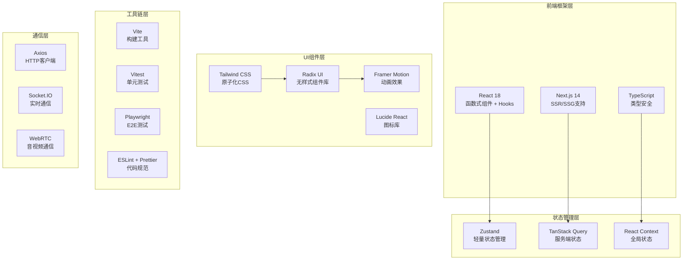

# 在线考试系统 - 前端设计文档

## 概述

基于系统设计需求，打造一个现代化、高性能、用户友好的在线考试系统前端应用。采用响应式设计、组件化架构，支持多端适配，提供无障碍访问，确保10K+并发用户的流畅体验。

### 设计原则
- **用户体验优先**: 直观、简洁、高效的用户界面
- **移动端优先**: 响应式设计，完美适配各种设备
- **可访问性**: 遵循WCAG 2.1 AA标准，支持无障碍访问
- **性能优化**: 快速加载，流畅交互，离线支持
- **组件化**: 可复用、可维护的组件库
- **国际化**: 多语言支持，本地化体验

---

## 1. 前端架构设计

### 1.1 技术栈选型



### 1.2 项目结构设计

```
src/
├── app/                    # Next.js App Router
│   ├── (auth)/            # 认证相关页面
│   │   ├── login/
│   │   ├── register/
│   │   └── layout.tsx
│   ├── (dashboard)/       # 仪表盘页面
│   │   ├── exams/
│   │   ├── questions/
│   │   ├── analytics/
│   │   └── layout.tsx
│   ├── exam/              # 考试页面
│   │   └── [id]/
│   ├── globals.css        # 全局样式
│   ├── layout.tsx         # 根布局
│   └── page.tsx          # 首页
├── components/            # 组件目录
│   ├── ui/               # 基础UI组件
│   │   ├── button.tsx
│   │   ├── input.tsx
│   │   ├── modal.tsx
│   │   └── index.ts
│   ├── exam/             # 考试相关组件
│   │   ├── ExamInterface.tsx
│   │   ├── QuestionRenderer.tsx
│   │   ├── Timer.tsx
│   │   └── ProctorMonitor.tsx
│   ├── dashboard/        # 仪表盘组件
│   │   ├── ExamList.tsx
│   │   ├── QuestionBank.tsx
│   │   └── Analytics.tsx
│   ├── forms/            # 表单组件
│   │   ├── ExamForm.tsx
│   │   ├── QuestionForm.tsx
│   │   └── validators.ts
│   └── layout/           # 布局组件
│       ├── Header.tsx
│       ├── Sidebar.tsx
│       ├── Navigation.tsx
│       └── Footer.tsx
├── hooks/                # 自定义Hooks
│   ├── useAuth.ts
│   ├── useExam.ts
│   ├── useWebRTC.ts
│   └── useLocalStorage.ts
├── lib/                  # 工具库
│   ├── api.ts           # API客户端
│   ├── utils.ts         # 工具函数
│   ├── constants.ts     # 常量定义
│   ├── types.ts         # 类型定义
│   └── validations.ts   # 验证规则
├── stores/              # 状态管理
│   ├── authStore.ts
│   ├── examStore.ts
│   ├── uiStore.ts
│   └── index.ts
├── styles/              # 样式文件
│   ├── components.css   # 组件样式
│   ├── utilities.css    # 工具类
│   └── animations.css   # 动画效果
└── types/               # TypeScript类型
    ├── api.ts
    ├── exam.ts
    ├── user.ts
    └── index.ts
```

### 1.3 组件架构模式

```typescript
// 组件设计模式：容器组件 + 展示组件

// 容器组件 - 负责数据逻辑
const ExamContainer: React.FC<{ examId: string }> = ({ examId }) => {
  const { data: exam, isLoading, error } = useExamQuery(examId);
  const { currentQuestion, submitAnswer, nextQuestion } = useExamSession(examId);
  const { isRecording, startRecording, stopRecording } = useProctoring();
  
  if (isLoading) return <ExamSkeleton />;
  if (error) return <ErrorBoundary error={error} />;
  
  return (
    <ExamInterface
      exam={exam}
      currentQuestion={currentQuestion}
      onAnswerSubmit={submitAnswer}
      onNextQuestion={nextQuestion}
      proctoring={{
        isRecording,
        onStartRecording: startRecording,
        onStopRecording: stopRecording
      }}
    />
  );
};

// 展示组件 - 负责UI渲染
interface ExamInterfaceProps {
  exam: Exam;
  currentQuestion: Question;
  onAnswerSubmit: (answer: Answer) => void;
  onNextQuestion: () => void;
  proctoring: ProctoringProps;
}

const ExamInterface: React.FC<ExamInterfaceProps> = ({
  exam,
  currentQuestion,
  onAnswerSubmit,
  onNextQuestion,
  proctoring
}) => {
  return (
    <div className="exam-interface">
      <ExamHeader exam={exam} />
      <QuestionRenderer 
        question={currentQuestion}
        onAnswerSubmit={onAnswerSubmit}
      />
      <ExamControls onNext={onNextQuestion} />
      <ProctoringMonitor {...proctoring} />
    </div>
  );
};
```

---

## 2. UI/UX设计规范

### 2.1 设计系统 (Design System)

#### 颜色系统
```css
:root {
  /* 主色调 */
  --primary-50: #eff6ff;
  --primary-100: #dbeafe;
  --primary-200: #bfdbfe;
  --primary-300: #93c5fd;
  --primary-400: #60a5fa;
  --primary-500: #3b82f6;  /* 主色 */
  --primary-600: #2563eb;
  --primary-700: #1d4ed8;
  --primary-800: #1e40af;
  --primary-900: #1e3a8a;
  
  /* 辅助色 */
  --success: #10b981;
  --warning: #f59e0b;
  --error: #ef4444;
  --info: #06b6d4;
  
  /* 中性色 */
  --gray-50: #f9fafb;
  --gray-100: #f3f4f6;
  --gray-200: #e5e7eb;
  --gray-300: #d1d5db;
  --gray-400: #9ca3af;
  --gray-500: #6b7280;
  --gray-600: #4b5563;
  --gray-700: #374151;
  --gray-800: #1f2937;
  --gray-900: #111827;
  
  /* 背景色 */
  --bg-primary: #ffffff;
  --bg-secondary: #f8fafc;
  --bg-tertiary: #f1f5f9;
  
  /* 文本色 */
  --text-primary: #0f172a;
  --text-secondary: #475569;
  --text-tertiary: #64748b;
  --text-disabled: #94a3b8;
  
  /* 边框色 */
  --border-light: #e2e8f0;
  --border-medium: #cbd5e1;
  --border-strong: #94a3b8;
}

/* 深色模式支持 */
[data-theme="dark"] {
  --bg-primary: #0f172a;
  --bg-secondary: #1e293b;
  --bg-tertiary: #334155;
  
  --text-primary: #f8fafc;
  --text-secondary: #cbd5e1;
  --text-tertiary: #94a3b8;
  
  --border-light: #334155;
  --border-medium: #475569;
  --border-strong: #64748b;
}
```

#### 字体系统
```css
:root {
  /* 字体族 */
  --font-sans: 'Inter', -apple-system, BlinkMacSystemFont, 'Segoe UI', Roboto, sans-serif;
  --font-mono: 'JetBrains Mono', 'Fira Code', Consolas, monospace;
  --font-serif: 'Merriweather', Georgia, serif;
  
  /* 字体大小 */
  --text-xs: 0.75rem;    /* 12px */
  --text-sm: 0.875rem;   /* 14px */
  --text-base: 1rem;     /* 16px */
  --text-lg: 1.125rem;   /* 18px */
  --text-xl: 1.25rem;    /* 20px */
  --text-2xl: 1.5rem;    /* 24px */
  --text-3xl: 1.875rem;  /* 30px */
  --text-4xl: 2.25rem;   /* 36px */
  --text-5xl: 3rem;      /* 48px */
  
  /* 行高 */
  --leading-tight: 1.25;
  --leading-normal: 1.5;
  --leading-relaxed: 1.625;
  --leading-loose: 2;
  
  /* 字重 */
  --font-light: 300;
  --font-normal: 400;
  --font-medium: 500;
  --font-semibold: 600;
  --font-bold: 700;
  --font-extrabold: 800;
}
```

#### 间距系统
```css
:root {
  /* 间距基数 */
  --space-0: 0;
  --space-1: 0.25rem;   /* 4px */
  --space-2: 0.5rem;    /* 8px */
  --space-3: 0.75rem;   /* 12px */
  --space-4: 1rem;      /* 16px */
  --space-5: 1.25rem;   /* 20px */
  --space-6: 1.5rem;    /* 24px */
  --space-8: 2rem;      /* 32px */
  --space-10: 2.5rem;   /* 40px */
  --space-12: 3rem;     /* 48px */
  --space-16: 4rem;     /* 64px */
  --space-20: 5rem;     /* 80px */
  --space-24: 6rem;     /* 96px */
  
  /* 圆角 */
  --radius-sm: 0.125rem;   /* 2px */
  --radius-base: 0.25rem;  /* 4px */
  --radius-md: 0.375rem;   /* 6px */
  --radius-lg: 0.5rem;     /* 8px */
  --radius-xl: 0.75rem;    /* 12px */
  --radius-2xl: 1rem;      /* 16px */
  --radius-full: 9999px;
  
  /* 阴影 */
  --shadow-sm: 0 1px 2px 0 rgb(0 0 0 / 0.05);
  --shadow-base: 0 1px 3px 0 rgb(0 0 0 / 0.1), 0 1px 2px -1px rgb(0 0 0 / 0.1);
  --shadow-md: 0 4px 6px -1px rgb(0 0 0 / 0.1), 0 2px 4px -2px rgb(0 0 0 / 0.1);
  --shadow-lg: 0 10px 15px -3px rgb(0 0 0 / 0.1), 0 4px 6px -4px rgb(0 0 0 / 0.1);
  --shadow-xl: 0 20px 25px -5px rgb(0 0 0 / 0.1), 0 8px 10px -6px rgb(0 0 0 / 0.1);
}
```

### 2.2 组件设计规范

#### 按钮组件
```tsx
// Button组件规范
interface ButtonProps {
  variant: 'primary' | 'secondary' | 'outline' | 'ghost' | 'danger';
  size: 'sm' | 'md' | 'lg';
  disabled?: boolean;
  loading?: boolean;
  icon?: React.ReactNode;
  iconPosition?: 'left' | 'right';
  fullWidth?: boolean;
  children: React.ReactNode;
  onClick?: () => void;
}

const Button: React.FC<ButtonProps> = ({
  variant = 'primary',
  size = 'md',
  disabled = false,
  loading = false,
  icon,
  iconPosition = 'left',
  fullWidth = false,
  children,
  onClick,
  ...props
}) => {
  const baseClasses = 'inline-flex items-center justify-center font-medium rounded-lg transition-all duration-200 focus:outline-none focus:ring-2 focus:ring-offset-2';
  
  const variantClasses = {
    primary: 'bg-primary-500 text-white hover:bg-primary-600 focus:ring-primary-500 active:bg-primary-700',
    secondary: 'bg-gray-100 text-gray-900 hover:bg-gray-200 focus:ring-gray-500 active:bg-gray-300',
    outline: 'border-2 border-primary-500 text-primary-500 hover:bg-primary-50 focus:ring-primary-500',
    ghost: 'text-gray-700 hover:bg-gray-100 focus:ring-gray-500',
    danger: 'bg-red-500 text-white hover:bg-red-600 focus:ring-red-500 active:bg-red-700'
  };
  
  const sizeClasses = {
    sm: 'px-3 py-1.5 text-sm gap-1.5',
    md: 'px-4 py-2 text-base gap-2',
    lg: 'px-6 py-3 text-lg gap-2.5'
  };
  
  const disabledClasses = 'disabled:opacity-50 disabled:cursor-not-allowed disabled:pointer-events-none';
  const fullWidthClasses = fullWidth ? 'w-full' : '';
  
  return (
    <button
      className={cn(
        baseClasses,
        variantClasses[variant],
        sizeClasses[size],
        disabledClasses,
        fullWidthClasses
      )}
      disabled={disabled || loading}
      onClick={onClick}
      {...props}
    >
      {loading && <Spinner size={size} />}
      {!loading && icon && iconPosition === 'left' && icon}
      <span className={loading ? 'opacity-0' : ''}>{children}</span>
      {!loading && icon && iconPosition === 'right' && icon}
    </button>
  );
};
```

#### 输入框组件
```tsx
// Input组件规范
interface InputProps {
  label?: string;
  placeholder?: string;
  helperText?: string;
  error?: string;
  required?: boolean;
  disabled?: boolean;
  type?: 'text' | 'email' | 'password' | 'number' | 'tel' | 'url';
  value?: string;
  onChange?: (value: string) => void;
  onBlur?: () => void;
  onFocus?: () => void;
  leftIcon?: React.ReactNode;
  rightIcon?: React.ReactNode;
  maxLength?: number;
}

const Input: React.FC<InputProps> = ({
  label,
  placeholder,
  helperText,
  error,
  required = false,
  disabled = false,
  type = 'text',
  value,
  onChange,
  onBlur,
  onFocus,
  leftIcon,
  rightIcon,
  maxLength,
  ...props
}) => {
  const [isFocused, setIsFocused] = useState(false);
  
  const inputClasses = 'w-full px-3 py-2 border rounded-lg text-base transition-all duration-200 focus:outline-none focus:ring-2 focus:ring-offset-1';
  const stateClasses = error 
    ? 'border-red-300 focus:border-red-500 focus:ring-red-500' 
    : 'border-gray-300 focus:border-primary-500 focus:ring-primary-500';
  const disabledClasses = disabled 
    ? 'bg-gray-50 text-gray-500 cursor-not-allowed' 
    : 'bg-white';

  return (
    <div className="space-y-1">
      {label && (
        <label className="block text-sm font-medium text-gray-700">
          {label}
          {required && <span className="text-red-500 ml-1">*</span>}
        </label>
      )}
      
      <div className="relative">
        {leftIcon && (
          <div className="absolute left-3 top-1/2 transform -translate-y-1/2 text-gray-400">
            {leftIcon}
          </div>
        )}
        
        <input
          type={type}
          value={value}
          onChange={(e) => onChange?.(e.target.value)}
          onFocus={() => {
            setIsFocused(true);
            onFocus?.();
          }}
          onBlur={() => {
            setIsFocused(false);
            onBlur?.();
          }}
          placeholder={placeholder}
          disabled={disabled}
          maxLength={maxLength}
          className={cn(
            inputClasses,
            stateClasses,
            disabledClasses,
            leftIcon && 'pl-10',
            rightIcon && 'pr-10'
          )}
          {...props}
        />
        
        {rightIcon && (
          <div className="absolute right-3 top-1/2 transform -translate-y-1/2 text-gray-400">
            {rightIcon}
          </div>
        )}
      </div>
      
      {(helperText || error) && (
        <p className={cn(
          'text-sm',
          error ? 'text-red-600' : 'text-gray-500'
        )}>
          {error || helperText}
        </p>
      )}
      
      {maxLength && value && (
        <div className="flex justify-end">
          <span className="text-xs text-gray-400">
            {value.length}/{maxLength}
          </span>
        </div>
      )}
    </div>
  );
};
```

---

## 3. 核心页面设计

### 3.1 登录页面设计

```tsx
// LoginPage组件
const LoginPage: React.FC = () => {
  const [isLoading, setIsLoading] = useState(false);
  const [showPassword, setShowPassword] = useState(false);
  const { login, isAuthenticated } = useAuth();
  const router = useRouter();

  // 已登录用户重定向
  useEffect(() => {
    if (isAuthenticated) {
      router.push('/dashboard');
    }
  }, [isAuthenticated, router]);

  const loginForm = useForm({
    resolver: zodResolver(loginSchema),
    defaultValues: {
      username: '',
      password: '',
      rememberMe: false
    }
  });

  const onSubmit = async (data: LoginFormData) => {
    setIsLoading(true);
    try {
      await login(data);
      toast.success('登录成功');
      router.push('/dashboard');
    } catch (error) {
      toast.error('登录失败，请检查用户名和密码');
    } finally {
      setIsLoading(false);
    }
  };

  return (
    <div className="min-h-screen bg-gradient-to-br from-primary-50 to-primary-100 flex items-center justify-center p-4">
      <div className="w-full max-w-md">
        {/* Logo区域 */}
        <div className="text-center mb-8">
          <div className="inline-flex items-center justify-center w-16 h-16 bg-primary-500 rounded-2xl mb-4">
            <GraduationCap className="w-8 h-8 text-white" />
          </div>
          <h1 className="text-2xl font-bold text-gray-900">在线考试系统</h1>
          <p className="text-gray-600 mt-2">请登录您的账户</p>
        </div>

        {/* 登录表单 */}
        <Card className="p-6 shadow-lg">
          <form onSubmit={loginForm.handleSubmit(onSubmit)} className="space-y-6">
            <Input
              label="用户名或邮箱"
              placeholder="请输入用户名或邮箱"
              required
              leftIcon={<User className="w-5 h-5" />}
              {...loginForm.register('username')}
              error={loginForm.formState.errors.username?.message}
            />

            <Input
              label="密码"
              type={showPassword ? 'text' : 'password'}
              placeholder="请输入密码"
              required
              leftIcon={<Lock className="w-5 h-5" />}
              rightIcon={
                <button
                  type="button"
                  onClick={() => setShowPassword(!showPassword)}
                  className="text-gray-400 hover:text-gray-600 transition-colors"
                >
                  {showPassword ? <EyeOff className="w-5 h-5" /> : <Eye className="w-5 h-5" />}
                </button>
              }
              {...loginForm.register('password')}
              error={loginForm.formState.errors.password?.message}
            />

            <div className="flex items-center justify-between">
              <Checkbox
                label="记住我"
                {...loginForm.register('rememberMe')}
              />
              <Link 
                href="/forgot-password" 
                className="text-sm text-primary-600 hover:text-primary-500 transition-colors"
              >
                忘记密码？
              </Link>
            </div>

            <Button
              type="submit"
              variant="primary"
              size="lg"
              fullWidth
              loading={isLoading}
              disabled={!loginForm.formState.isValid}
            >
              登录
            </Button>
          </form>

          {/* 第三方登录 */}
          <div className="mt-6">
            <div className="relative">
              <div className="absolute inset-0 flex items-center">
                <div className="w-full border-t border-gray-300" />
              </div>
              <div className="relative flex justify-center text-sm">
                <span className="px-2 bg-white text-gray-500">或使用以下方式登录</span>
              </div>
            </div>

            <div className="mt-6 grid grid-cols-2 gap-3">
              <Button variant="outline" size="md">
                <svg className="w-5 h-5 mr-2" viewBox="0 0 24 24">
                  {/* WeChat图标 */}
                </svg>
                微信
              </Button>
              <Button variant="outline" size="md">
                <svg className="w-5 h-5 mr-2" viewBox="0 0 24 24">
                  {/* 钉钉图标 */}
                </svg>
                钉钉
              </Button>
            </div>
          </div>

          {/* 注册链接 */}
          <div className="mt-6 text-center">
            <span className="text-gray-600">还没有账户？</span>
            <Link 
              href="/register" 
              className="ml-1 text-primary-600 hover:text-primary-500 font-medium transition-colors"
            >
              立即注册
            </Link>
          </div>
        </Card>

        {/* 帮助信息 */}
        <div className="mt-8 text-center">
          <div className="flex items-center justify-center space-x-6 text-sm text-gray-500">
            <Link href="/help" className="hover:text-gray-700 transition-colors">
              使用帮助
            </Link>
            <Link href="/privacy" className="hover:text-gray-700 transition-colors">
              隐私政策
            </Link>
            <Link href="/terms" className="hover:text-gray-700 transition-colors">
              服务条款
            </Link>
          </div>
        </div>
      </div>
    </div>
  );
};
```

### 3.2 考试界面设计

```tsx
// ExamInterface主组件
const ExamInterface: React.FC<{ examId: string }> = ({ examId }) => {
  const { exam, questions, currentQuestionIndex, answers, timeRemaining } = useExamSession(examId);
  const { isRecording, violations, startRecording } = useProctoring(examId);
  const [isFullscreen, setIsFullscreen] = useState(false);
  const [showNavigation, setShowNavigation] = useState(false);

  // 考试开始时启动全屏和监考
  useEffect(() => {
    enterFullscreen();
    startRecording();
  }, []);

  // 防止页面刷新/关闭
  useBeforeUnload((e) => {
    e.preventDefault();
    e.returnValue = '考试正在进行中，确定要离开吗？';
  });

  const currentQuestion = questions[currentQuestionIndex];
  const progress = ((currentQuestionIndex + 1) / questions.length) * 100;

  return (
    <div className="exam-interface h-screen bg-gray-50 flex flex-col overflow-hidden">
      {/* 考试头部 */}
      <ExamHeader
        exam={exam}
        timeRemaining={timeRemaining}
        progress={progress}
        currentQuestion={currentQuestionIndex + 1}
        totalQuestions={questions.length}
        onToggleNavigation={() => setShowNavigation(!showNavigation)}
        isRecording={isRecording}
        violations={violations}
      />

      <div className="flex flex-1 min-h-0">
        {/* 题目导航侧边栏 */}
        <AnimatePresence>
          {showNavigation && (
            <motion.aside
              initial={{ x: -300 }}
              animate={{ x: 0 }}
              exit={{ x: -300 }}
              className="w-80 bg-white border-r border-gray-200 shadow-sm"
            >
              <QuestionNavigation
                questions={questions}
                answers={answers}
                currentIndex={currentQuestionIndex}
                onQuestionSelect={(index) => {
                  setCurrentQuestionIndex(index);
                  setShowNavigation(false);
                }}
              />
            </motion.aside>
          )}
        </AnimatePresence>

        {/* 主内容区域 */}
        <main className="flex-1 flex flex-col min-w-0">
          <div className="flex-1 p-6 overflow-auto">
            <div className="max-w-4xl mx-auto">
              <QuestionRenderer
                question={currentQuestion}
                answer={answers[currentQuestion.id]}
                onAnswerChange={(answer) => updateAnswer(currentQuestion.id, answer)}
                disabled={false}
              />
            </div>
          </div>

          {/* 底部控制栏 */}
          <ExamControls
            canGoPrevious={currentQuestionIndex > 0}
            canGoNext={currentQuestionIndex < questions.length - 1}
            onPrevious={() => setCurrentQuestionIndex(prev => prev - 1)}
            onNext={() => setCurrentQuestionIndex(prev => prev + 1)}
            onSubmit={() => setShowSubmitDialog(true)}
            isLastQuestion={currentQuestionIndex === questions.length - 1}
          />
        </main>

        {/* 监考监控区域 */}
        <ProctoringPanel
          isRecording={isRecording}
          violations={violations}
          onViolationDismiss={(id) => dismissViolation(id)}
        />
      </div>

      {/* 提交确认对话框 */}
      <SubmitExamDialog
        isOpen={showSubmitDialog}
        onClose={() => setShowSubmitDialog(false)}
        onConfirm={submitExam}
        unansweredCount={getUnansweredCount()}
      />
    </div>
  );
};

// 题目渲染器
const QuestionRenderer: React.FC<QuestionRendererProps> = ({
  question,
  answer,
  onAnswerChange,
  disabled
}) => {
  const renderQuestionContent = () => {
    switch (question.type) {
      case 'single_choice':
        return (
          <SingleChoiceQuestion
            question={question}
            selectedOption={answer?.value}
            onOptionSelect={(option) => onAnswerChange({ value: option })}
            disabled={disabled}
          />
        );
      
      case 'multiple_choice':
        return (
          <MultipleChoiceQuestion
            question={question}
            selectedOptions={answer?.value || []}
            onOptionsChange={(options) => onAnswerChange({ value: options })}
            disabled={disabled}
          />
        );
      
      case 'true_false':
        return (
          <TrueFalseQuestion
            question={question}
            selectedValue={answer?.value}
            onValueChange={(value) => onAnswerChange({ value })}
            disabled={disabled}
          />
        );
      
      case 'fill_blank':
        return (
          <FillBlankQuestion
            question={question}
            answers={answer?.value || {}}
            onAnswersChange={(answers) => onAnswerChange({ value: answers })}
            disabled={disabled}
          />
        );
      
      case 'essay':
        return (
          <EssayQuestion
            question={question}
            content={answer?.value || ''}
            onContentChange={(content) => onAnswerChange({ value: content })}
            disabled={disabled}
          />
        );
      
      case 'coding':
        return (
          <CodingQuestion
            question={question}
            code={answer?.value || ''}
            onCodeChange={(code) => onAnswerChange({ value: code })}
            disabled={disabled}
          />
        );
      
      default:
        return <div className="text-red-500">不支持的题目类型</div>;
    }
  };

  return (
    <div className="question-renderer bg-white rounded-lg shadow-sm border border-gray-200 p-6">
      {/* 题目头部 */}
      <div className="question-header mb-6">
        <div className="flex items-start justify-between mb-4">
          <div className="flex items-center space-x-3">
            <span className="inline-flex items-center justify-center w-8 h-8 bg-primary-100 text-primary-600 rounded-full text-sm font-medium">
              {question.order}
            </span>
            <div className="text-sm text-gray-500">
              <span className="inline-flex items-center px-2 py-1 bg-gray-100 rounded-full">
                {getQuestionTypeLabel(question.type)}
              </span>
              {question.difficulty && (
                <span className={cn(
                  "inline-flex items-center px-2 py-1 rounded-full ml-2 text-xs",
                  {
                    'bg-green-100 text-green-700': question.difficulty === 'easy',
                    'bg-yellow-100 text-yellow-700': question.difficulty === 'medium',
                    'bg-red-100 text-red-700': question.difficulty === 'hard'
                  }
                )}>
                  {getDifficultyLabel(question.difficulty)}
                </span>
              )}
            </div>
          </div>
          <div className="text-sm text-gray-500">
            {question.points} 分
          </div>
        </div>

        {/* 题目内容 */}
        <div className="prose prose-gray max-w-none">
          <div 
            className="question-content text-gray-900 leading-relaxed"
            dangerouslySetInnerHTML={{ __html: question.content }}
          />
          {question.media_url && (
            <div className="mt-4">
              {question.media_type === 'image' && (
                
              )}
              {question.media_type === 'video' && (
                <video
                  controls
                  className="max-w-full h-auto rounded-lg border border-gray-200"
                >
                  <source src={question.media_url} type="video/mp4" />
                </video>
              )}
              {question.media_type === 'audio' && (
                <audio controls className="w-full">
                  <source src={question.media_url} type="audio/mpeg" />
                </audio>
              )}
            </div>
          )}
        </div>
      </div>

      {/* 题目答题区域 */}
      <div className="question-body">
        {renderQuestionContent()}
      </div>

      {/* 答题状态指示器 */}
      <div className="question-footer mt-6 pt-4 border-t border-gray-100">
        <div className="flex items-center justify-between">
          <div className="flex items-center space-x-2 text-sm text-gray-500">
            {answer ? (
              <>
                <CheckCircle className="w-4 h-4 text-green-500" />
                <span>已答题</span>
              </>
            ) : (
              <>
                <Circle className="w-4 h-4 text-gray-400" />
                <span>未答题</span>
              </>
            )}
          </div>
          
          <div className="flex items-center space-x-4">
            <Button
              variant="ghost"
              size="sm"
              onClick={() => onAnswerChange(null)}
              disabled={!answer || disabled}
            >
              <X className="w-4 h-4 mr-1" />
              清除答案
            </Button>
            
            <Button
              variant="outline"
              size="sm"
              onClick={() => markForReview(question.id)}
            >
              <Flag className="w-4 h-4 mr-1" />
              标记题目
            </Button>
          </div>
        </div>
      </div>
    </div>
  );
};
```

---

## 4. 响应式设计与移动端适配

### 4.1 断点系统

```css
/* 响应式断点定义 */
:root {
  /* 移动端 */
  --breakpoint-xs: 320px;   /* 小屏手机 */
  --breakpoint-sm: 640px;   /* 大屏手机 */
  
  /* 平板 */
  --breakpoint-md: 768px;   /* 平板竖屏 */
  --breakpoint-lg: 1024px;  /* 平板横屏 */
  
  /* 桌面 */
  --breakpoint-xl: 1280px;  /* 小桌面 */
  --breakpoint-2xl: 1536px; /* 大桌面 */
}

/* Tailwind响应式工具类 */
.container {
  width: 100%;
  margin-left: auto;
  margin-right: auto;
  padding-left: 1rem;
  padding-right: 1rem;
}

@media (min-width: 640px) {
  .container {
    max-width: 640px;
    padding-left: 1.5rem;
    padding-right: 1.5rem;
  }
}

@media (min-width: 768px) {
  .container {
    max-width: 768px;
  }
}

@media (min-width: 1024px) {
  .container {
    max-width: 1024px;
    padding-left: 2rem;
    padding-right: 2rem;
  }
}

@media (min-width: 1280px) {
  .container {
    max-width: 1280px;
  }
}

@media (min-width: 1536px) {
  .container {
    max-width: 1536px;
  }
}
```

### 4.2 移动端考试界面优化

```tsx
// 移动端考试界面适配
const MobileExamInterface: React.FC<{ examId: string }> = ({ examId }) => {
  const [currentQuestionIndex, setCurrentQuestionIndex] = useState(0);
  const [showQuestionList, setShowQuestionList] = useState(false);
  const [isPortrait, setIsPortrait] = useState(true);
  
  // 检测屏幕方向变化
  useEffect(() => {
    const handleOrientationChange = () => {
      setIsPortrait(window.innerHeight > window.innerWidth);
    };
    
    window.addEventListener('orientationchange', handleOrientationChange);
    window.addEventListener('resize', handleOrientationChange);
    
    return () => {
      window.removeEventListener('orientationchange', handleOrientationChange);
      window.removeEventListener('resize', handleOrientationChange);
    };
  }, []);

  return (
    <div className="mobile-exam-interface h-screen bg-white flex flex-col">
      {/* 移动端头部 - 紧凑设计 */}
      <header className="mobile-exam-header bg-white border-b border-gray-200 px-4 py-3 flex items-center justify-between">
        <div className="flex items-center space-x-3">
          <Button
            variant="ghost"
            size="sm"
            onClick={() => setShowQuestionList(true)}
            className="p-2"
          >
            <Menu className="w-5 h-5" />
          </Button>
          <div className="text-sm font-medium text-gray-900">
            {currentQuestionIndex + 1} / {questions.length}
          </div>
        </div>
        
        <div className="flex items-center space-x-2">
          <div className="text-sm font-mono font-bold text-red-600">
            {formatTime(timeRemaining)}
          </div>
          <Button
            variant="ghost"
            size="sm"
            onClick={() => setShowSubmitDialog(true)}
            className="p-2"
          >
            <Send className="w-5 h-5" />
          </Button>
        </div>
      </header>

      {/* 进度条 */}
      <div className="h-1 bg-gray-100">
        <div 
          className="h-full bg-primary-500 transition-all duration-300"
          style={{ width: `${((currentQuestionIndex + 1) / questions.length) * 100}%` }}
        />
      </div>

      {/* 主内容区域 */}
      <main className="flex-1 overflow-auto">
        <div className="p-4">
          <MobileQuestionRenderer
            question={currentQuestion}
            answer={answers[currentQuestion.id]}
            onAnswerChange={(answer) => updateAnswer(currentQuestion.id, answer)}
            isPortrait={isPortrait}
          />
        </div>
      </main>

      {/* 移动端底部导航 */}
      <footer className="mobile-exam-footer bg-white border-t border-gray-200 p-4">
        <div className="flex items-center justify-between">
          <Button
            variant="outline"
            size="md"
            onClick={() => setCurrentQuestionIndex(prev => Math.max(0, prev - 1))}
            disabled={currentQuestionIndex === 0}
            className="flex-1 mr-2"
          >
            <ChevronLeft className="w-4 h-4 mr-1" />
            上一题
          </Button>
          
          {currentQuestionIndex === questions.length - 1 ? (
            <Button
              variant="primary"
              size="md"
              onClick={() => setShowSubmitDialog(true)}
              className="flex-1 ml-2"
            >
              提交考试
              <Send className="w-4 h-4 ml-1" />
            </Button>
          ) : (
            <Button
              variant="primary"
              size="md"
              onClick={() => setCurrentQuestionIndex(prev => prev + 1)}
              className="flex-1 ml-2"
            >
              下一题
              <ChevronRight className="w-4 h-4 ml-1" />
            </Button>
          )}
        </div>
      </footer>

      {/* 移动端题目列表 */}
      <MobileQuestionList
        isOpen={showQuestionList}
        onClose={() => setShowQuestionList(false)}
        questions={questions}
        answers={answers}
        currentIndex={currentQuestionIndex}
        onQuestionSelect={(index) => {
          setCurrentQuestionIndex(index);
          setShowQuestionList(false);
        }}
      />
    </div>
  );
};

// 移动端题目渲染器
const MobileQuestionRenderer: React.FC<MobileQuestionRendererProps> = ({
  question,
  answer,
  onAnswerChange,
  isPortrait
}) => {
  return (
    <div className="mobile-question space-y-4">
      {/* 题目头部信息 */}
      <div className="question-meta flex items-center justify-between bg-gray-50 rounded-lg p-3">
        <div className="flex items-center space-x-2">
          <span className="inline-flex items-center justify-center w-6 h-6 bg-primary-100 text-primary-600 rounded-full text-xs font-medium">
            {question.order}
          </span>
          <span className="text-xs text-gray-600 bg-white px-2 py-1 rounded">
            {getQuestionTypeLabel(question.type)}
          </span>
        </div>
        <span className="text-sm font-medium text-gray-900">{question.points}分</span>
      </div>

      {/* 题目内容 */}
      <div className="question-content">
        <div 
          className="prose prose-sm prose-gray max-w-none leading-relaxed"
          dangerouslySetInnerHTML={{ __html: question.content }}
        />
        
        {/* 媒体内容适配 */}
        {question.media_url && (
          <div className="mt-3">
            {question.media_type === 'image' && (
              
            )}
          </div>
        )}
      </div>

      {/* 答题区域 */}
      <div className="answer-area">
        {renderMobileAnswerComponent(question, answer, onAnswerChange)}
      </div>

      {/* 操作按钮 */}
      <div className="question-actions flex items-center justify-between pt-4 border-t border-gray-100">
        <Button
          variant="ghost"
          size="sm"
          onClick={() => onAnswerChange(null)}
          disabled={!answer}
          className="text-gray-600"
        >
          <X className="w-4 h-4 mr-1" />
          清除
        </Button>
        
        <Button
          variant="ghost"
          size="sm"
          onClick={() => markForReview(question.id)}
          className="text-gray-600"
        >
          <Flag className="w-4 h-4 mr-1" />
          标记
        </Button>
      </div>
    </div>
  );
};
```

### 4.3 PWA移动应用支持

```json
// manifest.json - PWA配置
{
  "name": "在线考试系统",
  "short_name": "考试系统",
  "description": "专业的在线考试平台，支持多种题型和智能监考",
  "start_url": "/",
  "display": "standalone",
  "background_color": "#ffffff",
  "theme_color": "#3b82f6",
  "orientation": "portrait-primary",
  "scope": "/",
  "lang": "zh-CN",
  "icons": [
    {
      "src": "/icons/icon-72x72.png",
      "sizes": "72x72",
      "type": "image/png",
      "purpose": "any maskable"
    },
    {
      "src": "/icons/icon-96x96.png",
      "sizes": "96x96",
      "type": "image/png",
      "purpose": "any maskable"
    },
    {
      "src": "/icons/icon-128x128.png",
      "sizes": "128x128",
      "type": "image/png",
      "purpose": "any maskable"
    },
    {
      "src": "/icons/icon-144x144.png",
      "sizes": "144x144",
      "type": "image/png",
      "purpose": "any maskable"
    },
    {
      "src": "/icons/icon-152x152.png",
      "sizes": "152x152",
      "type": "image/png",
      "purpose": "any maskable"
    },
    {
      "src": "/icons/icon-192x192.png",
      "sizes": "192x192",
      "type": "image/png",
      "purpose": "any maskable"
    },
    {
      "src": "/icons/icon-384x384.png",
      "sizes": "384x384",
      "type": "image/png",
      "purpose": "any maskable"
    },
    {
      "src": "/icons/icon-512x512.png",
      "sizes": "512x512",
      "type": "image/png",
      "purpose": "any maskable"
    }
  ],
  "shortcuts": [
    {
      "name": "开始考试",
      "short_name": "考试",
      "description": "快速开始考试",
      "url": "/exams",
      "icons": [
        {
          "src": "/icons/exam-shortcut.png",
          "sizes": "96x96"
        }
      ]
    },
    {
      "name": "我的成绩",
      "short_name": "成绩",
      "description": "查看考试成绩",
      "url": "/results",
      "icons": [
        {
          "src": "/icons/results-shortcut.png",
          "sizes": "96x96"
        }
      ]
    }
  ],
  "categories": ["education", "productivity"],
  "screenshots": [
    {
      "src": "/screenshots/mobile-exam.png",
      "sizes": "360x640",
      "type": "image/png",
      "platform": "narrow"
    },
    {
      "src": "/screenshots/desktop-dashboard.png",
      "sizes": "1280x720",
      "type": "image/png",
      "platform": "wide"
    }
  ]
}
```

---

## 5. 无障碍访问设计

### 5.1 WCAG 2.1 AA标准实现

```tsx
// 无障碍访问Hooks
const useAccessibility = () => {
  const [isHighContrast, setIsHighContrast] = useState(false);
  const [fontSize, setFontSize] = useState('normal');
  const [isScreenReaderEnabled, setIsScreenReaderEnabled] = useState(false);

  // 检测屏幕阅读器
  useEffect(() => {
    const checkScreenReader = () => {
      const hasScreenReader = 
        navigator.userAgent.includes('NVDA') ||
        navigator.userAgent.includes('JAWS') ||
        navigator.userAgent.includes('VoiceOver') ||
        window.speechSynthesis !== undefined;
      setIsScreenReaderEnabled(hasScreenReader);
    };

    checkScreenReader();
  }, []);

  // 应用高对比度模式
  useEffect(() => {
    if (isHighContrast) {
      document.documentElement.classList.add('high-contrast');
    } else {
      document.documentElement.classList.remove('high-contrast');
    }
  }, [isHighContrast]);

  // 应用字体大小
  useEffect(() => {
    document.documentElement.setAttribute('data-font-size', fontSize);
  }, [fontSize]);

  return {
    isHighContrast,
    setIsHighContrast,
    fontSize,
    setFontSize,
    isScreenReaderEnabled
  };
};

// 无障碍访问考试界面
const AccessibleExamInterface: React.FC<ExamInterfaceProps> = ({
  exam,
  questions,
  currentQuestionIndex,
  onAnswerChange
}) => {
  const { isScreenReaderEnabled, fontSize } = useAccessibility();
  const [announcements, setAnnouncements] = useState<string[]>([]);
  
  // ARIA实时区域公告
  const announce = useCallback((message: string) => {
    setAnnouncements(prev => [...prev, message]);
    setTimeout(() => {
      setAnnouncements(prev => prev.slice(1));
    }, 1000);
  }, []);

  // 键盘导航支持
  const handleKeyDown = useCallback((e: KeyboardEvent) => {
    switch (e.key) {
      case 'ArrowLeft':
        if (e.ctrlKey && currentQuestionIndex > 0) {
          e.preventDefault();
          onPreviousQuestion();
          announce(`切换到第${currentQuestionIndex}题`);
        }
        break;
      case 'ArrowRight':
        if (e.ctrlKey && currentQuestionIndex < questions.length - 1) {
          e.preventDefault();
          onNextQuestion();
          announce(`切换到第${currentQuestionIndex + 2}题`);
        }
        break;
      case 'Escape':
        e.preventDefault();
        setShowQuestionNavigation(prev => !prev);
        break;
    }
  }, [currentQuestionIndex, questions.length]);

  useEffect(() => {
    document.addEventListener('keydown', handleKeyDown);
    return () => document.removeEventListener('keydown', handleKeyDown);
  }, [handleKeyDown]);

  const currentQuestion = questions[currentQuestionIndex];

  return (
    <div 
      className="accessible-exam-interface"
      role="application"
      aria-label="在线考试界面"
    >
      {/* 跳转链接 */}
      <div className="sr-only">
        <a href="#main-content" className="skip-link">
          跳转到主要内容
        </a>
        <a href="#question-navigation" className="skip-link">
          跳转到题目导航
        </a>
      </div>

      {/* ARIA实时区域 */}
      <div
        aria-live="polite"
        aria-atomic="true"
        className="sr-only"
      >
        {announcements.map((message, index) => (
          <div key={index}>{message}</div>
        ))}
      </div>

      {/* 考试头部 */}
      <header 
        className="exam-header"
        role="banner"
        aria-label="考试信息"
      >
        <div className="container mx-auto px-4 py-4">
          <div className="flex items-center justify-between">
            <div>
              <h1 className="text-xl font-bold" id="exam-title">
                {exam.title}
              </h1>
              <div 
                className="text-sm text-gray-600"
                aria-live="polite"
                aria-label="考试进度"
              >
                第 {currentQuestionIndex + 1} 题，共 {questions.length} 题
                <span className="ml-4" aria-label="剩余时间">
                  剩余时间：{formatTime(exam.timeRemaining)}
                </span>
              </div>
            </div>

            {/* 无障碍访问控制 */}
            <AccessibilityControls />
          </div>

          {/* 进度条 */}
          <div 
            className="mt-4"
            role="progressbar"
            aria-valuenow={currentQuestionIndex + 1}
            aria-valuemin={1}
            aria-valuemax={questions.length}
            aria-label={`考试进度：${currentQuestionIndex + 1} / ${questions.length} 题`}
          >
            <div className="w-full bg-gray-200 rounded-full h-2">
              <div 
                className="bg-primary-500 h-2 rounded-full transition-all duration-300"
                style={{ width: `${((currentQuestionIndex + 1) / questions.length) * 100}%` }}
              />
            </div>
          </div>
        </div>
      </header>

      <div className="flex min-h-0 flex-1">
        {/* 题目导航 */}
        <nav 
          id="question-navigation"
          className="question-navigation w-64 bg-white border-r border-gray-200"
          role="navigation"
          aria-label="题目导航"
        >
          <div className="p-4">
            <h2 className="font-medium text-gray-900 mb-4">题目列表</h2>
            <ul role="list" className="space-y-1">
              {questions.map((question, index) => (
                <li key={question.id}>
                  <button
                    className={cn(
                      "w-full text-left px-3 py-2 rounded-lg text-sm transition-colors",
                      "focus:outline-none focus:ring-2 focus:ring-primary-500 focus:ring-offset-2",
                      index === currentQuestionIndex
                        ? "bg-primary-100 text-primary-700 font-medium"
                        : "text-gray-700 hover:bg-gray-100"
                    )}
                    onClick={() => onQuestionSelect(index)}
                    aria-current={index === currentQuestionIndex ? "page" : undefined}
                    aria-describedby={`question-${index}-status`}
                  >
                    <div className="flex items-center justify-between">
                      <span>第 {index + 1} 题</span>
                      <div className="flex items-center space-x-1">
                        {getAnswerStatus(question.id) === 'answered' && (
                          <CheckCircle 
                            className="w-4 h-4 text-green-500" 
                            aria-hidden="true"
                          />
                        )}
                        {getAnswerStatus(question.id) === 'marked' && (
                          <Flag 
                            className="w-4 h-4 text-yellow-500"
                            aria-hidden="true"
                          />
                        )}
                      </div>
                    </div>
                  </button>
                  <div 
                    id={`question-${index}-status`}
                    className="sr-only"
                  >
                    {getAnswerStatusText(question.id)}
                  </div>
                </li>
              ))}
            </ul>
          </div>
        </nav>

        {/* 主内容区域 */}
        <main 
          id="main-content"
          className="flex-1 overflow-auto"
          role="main"
          aria-labelledby="current-question-title"
        >
          <div className="p-6">
            <AccessibleQuestionRenderer
              question={currentQuestion}
              questionIndex={currentQuestionIndex}
              totalQuestions={questions.length}
              answer={getAnswer(currentQuestion.id)}
              onAnswerChange={(answer) => {
                onAnswerChange(currentQuestion.id, answer);
                announce('答案已更新');
              }}
              isScreenReaderEnabled={isScreenReaderEnabled}
            />
          </div>
        </main>
      </div>

      {/* 快捷键提示 */}
      <div className="sr-only" aria-label="快捷键说明">
        <h2>键盘快捷键</h2>
        <ul>
          <li>Ctrl + 左箭头：上一题</li>
          <li>Ctrl + 右箭头：下一题</li>
          <li>Escape：切换题目导航</li>
          <li>Tab：在页面元素间切换</li>
          <li>空格键或回车：激活按钮或选项</li>
        </ul>
      </div>
    </div>
  );
};

// 无障碍访问题目渲染器
const AccessibleQuestionRenderer: React.FC<AccessibleQuestionRendererProps> = ({
  question,
  questionIndex,
  totalQuestions,
  answer,
  onAnswerChange,
  isScreenReaderEnabled
}) => {
  const questionRef = useRef<HTMLDivElement>(null);

  // 题目切换时聚焦到题目内容
  useEffect(() => {
    if (questionRef.current) {
      questionRef.current.focus();
    }
  }, [question.id]);

  return (
    <div 
      ref={questionRef}
      className="accessible-question"
      tabIndex={-1}
      role="group"
      aria-labelledby="current-question-title"
      aria-describedby="question-instructions"
    >
      {/* 题目标题 */}
      <h1 
        id="current-question-title"
        className="text-lg font-semibold mb-4"
      >
        第 {questionIndex + 1} 题 / 共 {totalQuestions} 题
        <span className="text-base font-normal text-gray-600 ml-4">
          ({question.points} 分)
        </span>
      </h1>

      {/* 题目说明 */}
      <div 
        id="question-instructions"
        className="text-sm text-gray-600 mb-4"
      >
        题目类型：{getQuestionTypeLabel(question.type)}
        {question.difficulty && (
          <span className="ml-4">
            难度：{getDifficultyLabel(question.difficulty)}
          </span>
        )}
      </div>

      {/* 题目内容 */}
      <div 
        className="question-content prose prose-gray max-w-none mb-6"
        role="group"
        aria-label="题目内容"
      >
        <div dangerouslySetInnerHTML={{ __html: question.content }} />
        
        {question.media_url && (
          <div className="mt-4">
            {question.media_type === 'image' && (
              
            )}
            {question.media_type === 'video' && (
              <video
                controls
                className="max-w-full h-auto rounded-lg border border-gray-200"
                aria-label="题目视频"
              >
                <source src={question.media_url} type="video/mp4" />
                <track 
                  kind="captions" 
                  src={question.captions_url} 
                  srcLang="zh-CN" 
                  label="中文字幕"
                  default 
                />
              </video>
            )}
          </div>
        )}
      </div>

      {/* 答题区域 */}
      <fieldset className="answer-area">
        <legend className="sr-only">
          请选择或输入您的答案
        </legend>
        {renderAccessibleAnswerComponent(question, answer, onAnswerChange, isScreenReaderEnabled)}
      </fieldset>

      {/* 操作按钮 */}
      <div className="question-actions mt-8 flex items-center space-x-4">
        <Button
          variant="outline"
          size="md"
          onClick={() => {
            onAnswerChange(null);
            announce('答案已清除');
          }}
          disabled={!answer}
          aria-describedby="clear-answer-help"
        >
          <X className="w-4 h-4 mr-2" aria-hidden="true" />
          清除答案
        </Button>
        <div id="clear-answer-help" className="sr-only">
          清除当前题目的答案
        </div>

        <Button
          variant="outline"
          size="md"
          onClick={() => {
            markForReview(question.id);
            announce('题目已标记');
          }}
          aria-describedby="mark-question-help"
        >
          <Flag className="w-4 h-4 mr-2" aria-hidden="true" />
          标记题目
        </Button>
        <div id="mark-question-help" className="sr-only">
          标记此题目以便稍后回顾
        </div>
      </div>
    </div>
  );
};

// 单选题无障碍访问组件
const AccessibleSingleChoiceQuestion: React.FC<SingleChoiceQuestionProps> = ({
  question,
  selectedOption,
  onOptionSelect,
  isScreenReaderEnabled
}) => {
  const groupId = `question-${question.id}-options`;

  return (
    <div role="radiogroup" aria-labelledby={groupId}>
      <div id={groupId} className="sr-only">
        请选择一个答案选项
      </div>
      
      <div className="space-y-3">
        {question.options.map((option, index) => {
          const optionId = `option-${question.id}-${index}`;
          const isSelected = selectedOption === option.value;
          
          return (
            <label
              key={optionId}
              htmlFor={optionId}
              className={cn(
                "flex items-start space-x-3 p-4 rounded-lg border-2 cursor-pointer transition-all duration-200",
                "focus-within:ring-2 focus-within:ring-primary-500 focus-within:ring-offset-2",
                isSelected
                  ? "border-primary-500 bg-primary-50"
                  : "border-gray-200 hover:border-gray-300 hover:bg-gray-50"
              )}
            >
              <input
                id={optionId}
                type="radio"
                name={`question-${question.id}`}
                value={option.value}
                checked={isSelected}
                onChange={() => onOptionSelect(option.value)}
                className="mt-1 w-4 h-4 text-primary-500 border-gray-300 focus:ring-primary-500"
                aria-describedby={`${optionId}-content`}
              />
              
              <div className="flex-1">
                <div 
                  id={`${optionId}-content`}
                  className="text-gray-900"
                  dangerouslySetInnerHTML={{ __html: option.content }}
                />
                {option.explanation && isSelected && (
                  <div 
                    className="mt-2 text-sm text-gray-600"
                    aria-label="选项说明"
                  >
                    {option.explanation}
                  </div>
                )}
              </div>
            </label>
          );
        })}
      </div>
      
      {isScreenReaderEnabled && (
        <div className="sr-only mt-4" aria-live="polite">
          {selectedOption 
            ? `已选择选项：${getOptionLabel(selectedOption)}` 
            : '请选择一个答案选项'
          }
        </div>
      )}
    </div>
  );
};
```

### 5.2 高对比度和大字体支持

```css
/* 高对比度模式样式 */
.high-contrast {
  /* 背景色调整 */
  --bg-primary: #000000;
  --bg-secondary: #1a1a1a;
  --bg-tertiary: #2d2d2d;
  
  /* 文本色调整 */
  --text-primary: #ffffff;
  --text-secondary: #e0e0e0;
  --text-tertiary: #cccccc;
  
  /* 主色调整 */
  --primary-500: #00ffff;
  --primary-600: #00e6e6;
  --primary-700: #00cccc;
  
  /* 边框色调整 */
  --border-light: #666666;
  --border-medium: #888888;
  --border-strong: #aaaaaa;
  
  /* 状态色调整 */
  --success: #00ff00;
  --warning: #ffff00;
  --error: #ff0000;
  --info: #00ffff;
}

/* 字体大小调整 */
[data-font-size="small"] {
  font-size: 0.875em;
}

[data-font-size="normal"] {
  font-size: 1em;
}

[data-font-size="large"] {
  font-size: 1.125em;
}

[data-font-size="extra-large"] {
  font-size: 1.25em;
}

[data-font-size="huge"] {
  font-size: 1.5em;
}

/* 高对比度按钮样式 */
.high-contrast .btn-primary {
  background-color: var(--primary-500);
  color: #000000;
  border: 2px solid var(--primary-500);
  font-weight: bold;
}

.high-contrast .btn-primary:hover {
  background-color: var(--primary-600);
  border-color: var(--primary-600);
}

.high-contrast .btn-primary:focus {
  outline: 3px solid #ffff00;
  outline-offset: 2px;
}

/* 高对比度表单样式 */
.high-contrast input,
.high-contrast textarea,
.high-contrast select {
  background-color: var(--bg-primary);
  color: var(--text-primary);
  border: 2px solid var(--border-strong);
}

.high-contrast input:focus,
.high-contrast textarea:focus,
.high-contrast select:focus {
  outline: 3px solid #ffff00;
  outline-offset: 2px;
  border-color: var(--primary-500);
}

/* 高对比度链接样式 */
.high-contrast a {
  color: var(--primary-500);
  text-decoration: underline;
  font-weight: bold;
}

.high-contrast a:hover {
  color: var(--primary-600);
  text-decoration: none;
}

.high-contrast a:focus {
  outline: 3px solid #ffff00;
  outline-offset: 2px;
}

/* 跳转链接样式 */
.skip-link {
  position: absolute;
  top: -40px;
  left: 6px;
  background: #000;
  color: #fff;
  padding: 8px;
  border-radius: 4px;
  text-decoration: none;
  font-weight: bold;
  z-index: 9999;
  transition: top 0.3s;
}

.skip-link:focus {
  top: 6px;
  outline: 3px solid #ffff00;
  outline-offset: 2px;
}

/* 屏幕阅读器专用内容 */
.sr-only {
  position: absolute;
  width: 1px;
  height: 1px;
  padding: 0;
  margin: -1px;
  overflow: hidden;
  clip: rect(0, 0, 0, 0);
  white-space: nowrap;
  border: 0;
}

/* 焦点指示器增强 */
.focus-visible {
  outline: 3px solid var(--primary-500);
  outline-offset: 2px;
}

.high-contrast .focus-visible {
  outline: 3px solid #ffff00;
  outline-offset: 2px;
}

/* 动画偏好设置 */
@media (prefers-reduced-motion: reduce) {
  *,
  ::before,
  ::after {
    animation-duration: 0.01ms !important;
    animation-iteration-count: 1 !important;
    transition-duration: 0.01ms !important;
    scroll-behavior: auto !important;
  }
}

/* 触摸目标大小 */
.touch-target {
  min-width: 44px;
  min-height: 44px;
  display: inline-flex;
  align-items: center;
  justify-content: center;
}

/* 色彩对比度增强 */
.high-contrast .exam-question {
  background-color: var(--bg-secondary);
  border: 2px solid var(--border-strong);
}

.high-contrast .exam-option {
  background-color: var(--bg-tertiary);
  border: 2px solid var(--border-medium);
}

.high-contrast .exam-option:hover {
  border-color: var(--primary-500);
  background-color: var(--bg-primary);
}

.high-contrast .exam-option.selected {
  background-color: var(--primary-500);
  color: #000000;
  border-color: var(--primary-500);
  font-weight: bold;
}
```

---

## 6. 组件库与设计系统

### 6.1 组件库架构

```typescript
// 组件库核心架构
interface ComponentLibraryConfig {
  theme: Theme;
  tokens: DesignTokens;
  components: ComponentRegistry;
  utilities: UtilityClasses;
}

// 设计令牌系统
interface DesignTokens {
  colors: ColorTokens;
  typography: TypographyTokens;
  spacing: SpacingTokens;
  shadows: ShadowTokens;
  animation: AnimationTokens;
  breakpoints: BreakpointTokens;
}

// 颜色令牌
interface ColorTokens {
  primitive: {
    blue: Record<string, string>;
    gray: Record<string, string>;
    green: Record<string, string>;
    red: Record<string, string>;
    yellow: Record<string, string>;
  };
  semantic: {
    primary: string;
    secondary: string;
    success: string;
    warning: string;
    error: string;
    info: string;
  };
  surface: {
    background: string;
    foreground: string;
    card: string;
    popover: string;
    muted: string;
  };
}

// 组件注册表
interface ComponentRegistry {
  Button: ComponentDefinition<ButtonProps>;
  Input: ComponentDefinition<InputProps>;
  Select: ComponentDefinition<SelectProps>;
  Modal: ComponentDefinition<ModalProps>;
  // ... 其他组件
}

// 组件定义
interface ComponentDefinition<TProps> {
  component: React.ComponentType<TProps>;
  variants: Record<string, VariantConfig>;
  defaultProps: Partial<TProps>;
  documentation: ComponentDocs;
}
```

### 6.2 主题系统实现

```typescript
// 主题提供者
const ThemeProvider: React.FC<{
  theme?: Partial<Theme>;
  children: React.ReactNode;
}> = ({ theme: customTheme, children }) => {
  const theme = useMemo(() => ({
    ...defaultTheme,
    ...customTheme
  }), [customTheme]);

  return (
    <ThemeContext.Provider value={theme}>
      <div 
        className="theme-root"
        data-theme={theme.mode}
        style={getCSSVariables(theme)}
      >
        {children}
      </div>
    </ThemeContext.Provider>
  );
};

// CSS变量生成
const getCSSVariables = (theme: Theme): CSSProperties => {
  const variables: CSSProperties = {};
  
  // 颜色变量
  Object.entries(theme.colors.primitive).forEach(([color, shades]) => {
    Object.entries(shades).forEach(([shade, value]) => {
      variables[`--color-${color}-${shade}` as any] = value;
    });
  });
  
  // 语义化颜色
  Object.entries(theme.colors.semantic).forEach(([name, value]) => {
    variables[`--color-${name}` as any] = value;
  });
  
  // 间距变量
  Object.entries(theme.spacing).forEach(([key, value]) => {
    variables[`--spacing-${key}` as any] = value;
  });
  
  // 字体变量
  Object.entries(theme.typography.fonts).forEach(([name, value]) => {
    variables[`--font-${name}` as any] = value;
  });
  
  return variables;
};

// 主题切换Hook
const useTheme = () => {
  const theme = useContext(ThemeContext);
  const [mode, setMode] = useState<'light' | 'dark'>('light');
  
  const toggleMode = useCallback(() => {
    setMode(prev => prev === 'light' ? 'dark' : 'light');
    localStorage.setItem('theme-mode', mode);
  }, [mode]);
  
  const setCustomTheme = useCallback((customTheme: Partial<Theme>) => {
    // 实现自定义主题逻辑
  }, []);
  
  return {
    theme,
    mode,
    toggleMode,
    setCustomTheme
  };
};
```

### 6.3 复合组件模式

```tsx
// 表单复合组件
const Form = {
  Root: FormRoot,
  Field: FormField,
  Label: FormLabel,
  Input: FormInput,
  Error: FormError,
  Submit: FormSubmit
};

// 表单根组件
interface FormRootProps {
  children: React.ReactNode;
  onSubmit: (data: any) => void;
  validationSchema?: any;
  defaultValues?: Record<string, any>;
}

const FormRoot: React.FC<FormRootProps> = ({
  children,
  onSubmit,
  validationSchema,
  defaultValues
}) => {
  const form = useForm({
    resolver: validationSchema ? zodResolver(validationSchema) : undefined,
    defaultValues
  });

  return (
    <FormProvider {...form}>
      <form onSubmit={form.handleSubmit(onSubmit)} noValidate>
        {children}
      </form>
    </FormProvider>
  );
};

// 表单字段组件
interface FormFieldProps {
  name: string;
  children: React.ReactNode;
}

const FormField: React.FC<FormFieldProps> = ({ name, children }) => {
  const {
    formState: { errors },
    register
  } = useFormContext();

  const error = errors[name]?.message as string;

  return (
    <FormFieldContext.Provider value={{ name, error, register }}>
      <div className="form-field">
        {children}
      </div>
    </FormFieldContext.Provider>
  );
};

// 使用示例
const ExamForm: React.FC = () => {
  const handleSubmit = (data: ExamFormData) => {
    console.log('Form submitted:', data);
  };

  return (
    <Form.Root
      onSubmit={handleSubmit}
      validationSchema={examFormSchema}
      defaultValues={{ duration: 60 }}
    >
      <Form.Field name="title">
        <Form.Label>考试标题</Form.Label>
        <Form.Input placeholder="请输入考试标题" />
        <Form.Error />
      </Form.Field>

      <Form.Field name="duration">
        <Form.Label>考试时长(分钟)</Form.Label>
        <Form.Input type="number" min={1} max={300} />
        <Form.Error />
      </Form.Field>

      <Form.Submit>创建考试</Form.Submit>
    </Form.Root>
  );
};
```

---

## 7. 性能优化策略

### 7.1 代码分割和懒加载

```tsx
// 动态导入和代码分割
import { lazy, Suspense } from 'react';
import { ErrorBoundary } from 'react-error-boundary';

// 懒加载页面组件
const Dashboard = lazy(() => import('../pages/Dashboard'));
const ExamInterface = lazy(() => import('../pages/ExamInterface'));
const QuestionBank = lazy(() => import('../pages/QuestionBank'));
const Analytics = lazy(() => import('../pages/Analytics'));

// 懒加载考试相关组件
const ExamCreator = lazy(() => import('../components/exam/ExamCreator'));
const QuestionEditor = lazy(() => import('../components/question/QuestionEditor'));
const AdvancedAnalytics = lazy(() => import('../components/analytics/AdvancedAnalytics'));

// 路由级别的代码分割
const AppRoutes: React.FC = () => {
  return (
    <Routes>
      <Route path="/dashboard" element={
        <Suspense fallback={<DashboardSkeleton />}>
          <ErrorBoundary fallback={<ErrorPage />}>
            <Dashboard />
          </ErrorBoundary>
        </Suspense>
      } />
      
      <Route path="/exam/:id" element={
        <Suspense fallback={<ExamLoadingSkeleton />}>
          <ErrorBoundary fallback={<ExamErrorPage />}>
            <ExamInterface />
          </ErrorBoundary>
        </Suspense>
      } />
      
      <Route path="/questions" element={
        <Suspense fallback={<QuestionBankSkeleton />}>
          <ErrorBoundary fallback={<ErrorPage />}>
            <QuestionBank />
          </ErrorBoundary>
        </Suspense>
      } />
    </Routes>
  );
};

// 组件级别的懒加载
const LazyComponentLoader: React.FC<{
  componentName: string;
  fallback?: React.ReactNode;
}> = ({ componentName, fallback = <ComponentSkeleton /> }) => {
  const [Component, setComponent] = useState<React.ComponentType | null>(null);
  const [isLoading, setIsLoading] = useState(false);
  const [error, setError] = useState<Error | null>(null);

  const loadComponent = useCallback(async () => {
    if (Component) return;
    
    setIsLoading(true);
    setError(null);
    
    try {
      // 动态导入组件
      const module = await import(`../components/${componentName}`);
      setComponent(() => module.default);
    } catch (err) {
      setError(err as Error);
    } finally {
      setIsLoading(false);
    }
  }, [componentName, Component]);

  useEffect(() => {
    loadComponent();
  }, [loadComponent]);

  if (error) {
    return <ComponentErrorFallback error={error} onRetry={loadComponent} />;
  }

  if (isLoading || !Component) {
    return <>{fallback}</>;
  }

  return <Component />;
};

// 预加载策略
const PreloadManager = {
  // 预加载关键路由
  preloadRoutes: async () => {
    const routes = [
      () => import('../pages/Dashboard'),
      () => import('../pages/ExamInterface'),
      () => import('../pages/QuestionBank')
    ];

    // 在空闲时间预加载
    if ('requestIdleCallback' in window) {
      routes.forEach(route => {
        requestIdleCallback(() => route());
      });
    } else {
      // 降级到setTimeout
      routes.forEach((route, index) => {
        setTimeout(() => route(), index * 100);
      });
    }
  },

  // 预加载用户可能访问的资源
  preloadUserResources: async (userId: string) => {
    const userPreferences = await getUserPreferences(userId);
    
    // 根据用户偏好预加载组件
    if (userPreferences.frequentlyUsedFeatures.includes('analytics')) {
      import('../components/analytics/AdvancedAnalytics');
    }
    
    if (userPreferences.role === 'teacher') {
      import('../components/exam/ExamCreator');
      import('../components/question/QuestionEditor');
    }
  },

  // 预加载考试资源
  preloadExamResources: async (examId: string) => {
    // 预加载考试相关的组件和数据
    const preloadTasks = [
      import('../components/exam/QuestionRenderer'),
      import('../components/exam/Timer'),
      import('../components/exam/ProctoringMonitor'),
      // 预加载考试数据
      examApi.getExam(examId),
      examApi.getExamQuestions(examId)
    ];

    try {
      await Promise.all(preloadTasks);
    } catch (error) {
      console.warn('Failed to preload exam resources:', error);
    }
  }
};
```

### 6.2 虚拟滚动和大数据渲染

```tsx
// 虚拟滚动组件
interface VirtualScrollProps<T> {
  items: T[];
  itemHeight: number;
  containerHeight: number;
  renderItem: (item: T, index: number) => React.ReactNode;
  overscan?: number;
  onScroll?: (scrollTop: number) => void;
}

const VirtualScroll = <T,>({
  items,
  itemHeight,
  containerHeight,
  renderItem,
  overscan = 5,
  onScroll
}: VirtualScrollProps<T>) => {
  const [scrollTop, setScrollTop] = useState(0);
  const scrollElementRef = useRef<HTMLDivElement>(null);

  // 计算可见范围
  const startIndex = Math.max(0, Math.floor(scrollTop / itemHeight) - overscan);
  const endIndex = Math.min(
    items.length - 1,
    Math.ceil((scrollTop + containerHeight) / itemHeight) + overscan
  );

  // 可见项目
  const visibleItems = items.slice(startIndex, endIndex + 1);

  // 总高度
  const totalHeight = items.length * itemHeight;

  // 滚动处理
  const handleScroll = useCallback((e: React.UIEvent<HTMLDivElement>) => {
    const newScrollTop = e.currentTarget.scrollTop;
    setScrollTop(newScrollTop);
    onScroll?.(newScrollTop);
  }, [onScroll]);

  return (
    <div
      ref={scrollElementRef}
      className="virtual-scroll-container overflow-auto"
      style={{ height: containerHeight }}
      onScroll={handleScroll}
    >
      <div style={{ height: totalHeight, position: 'relative' }}>
        <div
          style={{
            transform: `translateY(${startIndex * itemHeight}px)`,
            position: 'absolute',
            top: 0,
            left: 0,
            right: 0
          }}
        >
          {visibleItems.map((item, index) => (
            <div
              key={startIndex + index}
              style={{
                height: itemHeight,
                display: 'flex',
                alignItems: 'center'
              }}
            >
              {renderItem(item, startIndex + index)}
            </div>
          ))}
        </div>
      </div>
    </div>
  );
};

// 大数据题目列表组件
const LargeQuestionList: React.FC<{
  questions: Question[];
  onQuestionSelect: (question: Question) => void;
}> = ({ questions, onQuestionSelect }) => {
  const [filteredQuestions, setFilteredQuestions] = useState(questions);
  const [searchTerm, setSearchTerm] = useState('');
  const [isLoading, setIsLoading] = useState(false);

  // 搜索防抖
  const debouncedSearch = useMemo(
    () => debounce((term: string) => {
      setIsLoading(true);
      
      // 使用Web Worker进行搜索以避免阻塞主线程
      const worker = new Worker('/workers/searchWorker.js');
      worker.postMessage({ questions, searchTerm: term });
      
      worker.onmessage = (e) => {
        setFilteredQuestions(e.data);
        setIsLoading(false);
        worker.terminate();
      };
    }, 300),
    [questions]
  );

  useEffect(() => {
    debouncedSearch(searchTerm);
  }, [searchTerm, debouncedSearch]);

  const renderQuestionItem = useCallback((question: Question, index: number) => (
    <div
      className="question-item p-4 border-b border-gray-200 hover:bg-gray-50 cursor-pointer"
      onClick={() => onQuestionSelect(question)}
    >
      <div className="flex items-start justify-between">
        <div className="flex-1">
          <div className="flex items-center space-x-2 mb-2">
            <span className="text-sm font-medium text-gray-900">
              题目 {index + 1}
            </span>
            <span className={cn(
              "px-2 py-1 text-xs rounded-full",
              getQuestionTypeColorClasses(question.type)
            )}>
              {getQuestionTypeLabel(question.type)}
            </span>
            <span className={cn(
              "px-2 py-1 text-xs rounded-full",
              getDifficultyColorClasses(question.difficulty)
            )}>
              {getDifficultyLabel(question.difficulty)}
            </span>
          </div>
          
          <div className="text-sm text-gray-700 line-clamp-2">
            {stripHtml(question.content)}
          </div>
          
          <div className="flex items-center space-x-4 mt-2 text-xs text-gray-500">
            <span>{question.points} 分</span>
            <span>使用次数: {question.usage_count}</span>
            <span>平均得分: {question.avg_score?.toFixed(1) || 'N/A'}</span>
          </div>
        </div>
        
        <div className="ml-4 text-right">
          <Button
            variant="ghost"
            size="sm"
            onClick={(e) => {
              e.stopPropagation();
              onQuestionEdit(question);
            }}
          >
            <Edit className="w-4 h-4" />
          </Button>
        </div>
      </div>
    </div>
  ), [onQuestionSelect]);

  return (
    <div className="large-question-list h-full flex flex-col">
      {/* 搜索和筛选 */}
      <div className="p-4 border-b border-gray-200 bg-white">
        <div className="flex items-center space-x-4">
          <div className="flex-1">
            <Input
              placeholder="搜索题目内容..."
              value={searchTerm}
              onChange={setSearchTerm}
              leftIcon={<Search className="w-4 h-4" />}
            />
          </div>
          
          <Select
            placeholder="题目类型"
            onValueChange={(type) => setSelectedType(type)}
          >
            <SelectItem value="all">全部类型</SelectItem>
            <SelectItem value="single_choice">单选题</SelectItem>
            <SelectItem value="multiple_choice">多选题</SelectItem>
            <SelectItem value="true_false">判断题</SelectItem>
            <SelectItem value="fill_blank">填空题</SelectItem>
          </Select>
          
          <Select
            placeholder="难度"
            onValueChange={(difficulty) => setSelectedDifficulty(difficulty)}
          >
            <SelectItem value="all">全部难度</SelectItem>
            <SelectItem value="easy">简单</SelectItem>
            <SelectItem value="medium">中等</SelectItem>
            <SelectItem value="hard">困难</SelectItem>
          </Select>
        </div>
        
        <div className="mt-2 text-sm text-gray-500">
          找到 {filteredQuestions.length} 个题目
          {isLoading && (
            <span className="ml-2">
              <LoadingSpinner size="xs" />
              搜索中...
            </span>
          )}
        </div>
      </div>

      {/* 虚拟滚动列表 */}
      <div className="flex-1">
        <VirtualScroll
          items={filteredQuestions}
          itemHeight={120}
          containerHeight={600}
          renderItem={renderQuestionItem}
          overscan={3}
        />
      </div>
    </div>
  );
};
```

### 6.3 缓存策略和离线支持

```typescript
// Service Worker缓存策略
const CACHE_VERSION = 'exam-system-v1.2.0';
const STATIC_CACHE = `${CACHE_VERSION}-static`;
const DYNAMIC_CACHE = `${CACHE_VERSION}-dynamic`;
const API_CACHE = `${CACHE_VERSION}-api`;

// 缓存策略配置
const CACHE_STRATEGIES = {
  // 静态资源 - 缓存优先
  static: {
    urls: [
      '/',
      '/offline',
      '/manifest.json',
      '/icons/',
      '/static/css/',
      '/static/js/',
      '/static/fonts/'
    ],
    strategy: 'cache-first',
    maxAge: 30 * 24 * 60 * 60 * 1000 // 30天
  },
  
  // API数据 - 网络优先
  api: {
    urls: [
      '/api/v1/auth/',
      '/api/v1/users/',
      '/api/v1/exams/',
      '/api/v1/questions/'
    ],
    strategy: 'network-first',
    maxAge: 5 * 60 * 1000 // 5分钟
  },
  
  // 考试数据 - 仅缓存
  examData: {
    urls: ['/api/v1/exams/*/start'],
    strategy: 'cache-only',
    maxAge: 60 * 60 * 1000 // 1小时
  }
};

// Service Worker主逻辑
self.addEventListener('install', (event) => {
  event.waitUntil(
    Promise.all([
      // 预缓存静态资源
      caches.open(STATIC_CACHE).then(cache => 
        cache.addAll(CACHE_STRATEGIES.static.urls)
      ),
      // 跳过等待直接激活
      self.skipWaiting()
    ])
  );
});

self.addEventListener('activate', (event) => {
  event.waitUntil(
    Promise.all([
      // 清理旧版本缓存
      caches.keys().then(cacheNames => 
        Promise.all(
          cacheNames
            .filter(name => name.startsWith('exam-system-') && name !== CACHE_VERSION)
            .map(name => caches.delete(name))
        )
      ),
      // 立即控制所有页面
      self.clients.claim()
    ])
  );
});

self.addEventListener('fetch', (event) => {
  const { request } = event;
  const url = new URL(request.url);

  // 根据URL匹配缓存策略
  const strategy = getCacheStrategy(url.pathname);
  
  if (strategy) {
    event.respondWith(handleRequest(request, strategy));
  }
});

// 请求处理函数
async function handleRequest(request, strategy) {
  const cache = await caches.open(getCacheName(strategy));
  
  switch (strategy.strategy) {
    case 'cache-first':
      return cacheFirst(request, cache, strategy);
    case 'network-first':
      return networkFirst(request, cache, strategy);
    case 'cache-only':
      return cacheOnly(request, cache);
    case 'network-only':
      return fetch(request);
    default:
      return staleWhileRevalidate(request, cache, strategy);
  }
}

// 缓存优先策略
async function cacheFirst(request, cache, strategy) {
  try {
    const cachedResponse = await cache.match(request);
    
    if (cachedResponse && !isExpired(cachedResponse, strategy.maxAge)) {
      return cachedResponse;
    }
    
    const networkResponse = await fetch(request);
    
    if (networkResponse.ok) {
      await cache.put(request, networkResponse.clone());
    }
    
    return networkResponse;
  } catch (error) {
    const cachedResponse = await cache.match(request);
    return cachedResponse || new Response('离线模式，内容不可用', { status: 503 });
  }
}

// 网络优先策略
async function networkFirst(request, cache, strategy) {
  try {
    const networkResponse = await fetch(request);
    
    if (networkResponse.ok) {
      await cache.put(request, networkResponse.clone());
    }
    
    return networkResponse;
  } catch (error) {
    const cachedResponse = await cache.match(request);
    
    if (cachedResponse && !isExpired(cachedResponse, strategy.maxAge)) {
      return cachedResponse;
    }
    
    // 返回离线页面
    if (request.mode === 'navigate') {
      return caches.match('/offline');
    }
    
    return new Response('离线模式，内容不可用', { status: 503 });
  }
}

// React端缓存管理
class CacheManager {
  private static instance: CacheManager;
  private cache = new Map<string, CacheEntry>();
  private readonly maxSize = 100;
  private readonly defaultTTL = 5 * 60 * 1000; // 5分钟

  static getInstance(): CacheManager {
    if (!CacheManager.instance) {
      CacheManager.instance = new CacheManager();
    }
    return CacheManager.instance;
  }

  // 设置缓存
  set<T>(key: string, value: T, ttl: number = this.defaultTTL): void {
    // LRU缓存清理
    if (this.cache.size >= this.maxSize) {
      const firstKey = this.cache.keys().next().value;
      this.cache.delete(firstKey);
    }

    this.cache.set(key, {
      value,
      expiry: Date.now() + ttl,
      lastAccessed: Date.now()
    });
  }

  // 获取缓存
  get<T>(key: string): T | null {
    const entry = this.cache.get(key);
    
    if (!entry) {
      return null;
    }

    // 检查是否过期
    if (Date.now() > entry.expiry) {
      this.cache.delete(key);
      return null;
    }

    // 更新访问时间
    entry.lastAccessed = Date.now();
    return entry.value as T;
  }

  // 删除缓存
  delete(key: string): boolean {
    return this.cache.delete(key);
  }

  // 清空缓存
  clear(): void {
    this.cache.clear();
  }

  // 获取缓存统计
  getStats(): CacheStats {
    return {
      size: this.cache.size,
      hitRate: this.calculateHitRate(),
      memoryUsage: this.estimateMemoryUsage()
    };
  }

  private calculateHitRate(): number {
    // 实现命中率计算逻辑
    return 0.85; // 示例值
  }

  private estimateMemoryUsage(): number {
    // 估算内存使用量
    return this.cache.size * 1024; // 简化计算
  }
}

// 离线存储Hook
const useOfflineStorage = <T>(key: string, initialValue: T) => {
  const [value, setValue] = useState<T>(() => {
    try {
      const item = localStorage.getItem(key);
      return item ? JSON.parse(item) : initialValue;
    } catch {
      return initialValue;
    }
  });

  const setStoredValue = useCallback((newValue: T | ((prev: T) => T)) => {
    try {
      const valueToStore = newValue instanceof Function ? newValue(value) : newValue;
      setValue(valueToStore);
      localStorage.setItem(key, JSON.stringify(valueToStore));
    } catch (error) {
      console.error('Failed to save to localStorage:', error);
    }
  }, [key, value]);

  const clearStoredValue = useCallback(() => {
    try {
      localStorage.removeItem(key);
      setValue(initialValue);
    } catch (error) {
      console.error('Failed to clear localStorage:', error);
    }
  }, [key, initialValue]);

  return [value, setStoredValue, clearStoredValue] as const;
};

// 离线考试数据管理
const useOfflineExam = (examId: string) => {
  const [examData, setExamData] = useOfflineStorage(`exam-${examId}`, null);
  const [answers, setAnswers] = useOfflineStorage(`answers-${examId}`, {});
  const [isOnline, setIsOnline] = useState(navigator.onLine);

  // 监听网络状态
  useEffect(() => {
    const handleOnline = () => setIsOnline(true);
    const handleOffline = () => setIsOnline(false);

    window.addEventListener('online', handleOnline);
    window.addEventListener('offline', handleOffline);

    return () => {
      window.removeEventListener('online', handleOnline);
      window.removeEventListener('offline', handleOffline);
    };
  }, []);

  // 同步离线数据
  const syncOfflineData = useCallback(async () => {
    if (!isOnline || !examData) return;

    try {
      // 同步答案数据
      await examApi.syncAnswers(examId, answers);
      
      // 同步考试进度
      await examApi.syncProgress(examId, {
        currentQuestionIndex: examData.currentQuestionIndex,
        timeSpent: examData.timeSpent,
        lastActivity: Date.now()
      });

      toast.success('离线数据已同步');
    } catch (error) {
      console.error('Failed to sync offline data:', error);
      toast.error('数据同步失败，将在网络恢复后重试');
    }
  }, [isOnline, examId, examData, answers]);

  // 网络恢复时自动同步
  useEffect(() => {
    if (isOnline) {
      syncOfflineData();
    }
  }, [isOnline, syncOfflineData]);

  return {
    examData,
    setExamData,
    answers,
    setAnswers,
    isOnline,
    syncOfflineData
  };
};
```

---

## 8. 国际化与本地化

### 8.1 多语言支持架构

```typescript
// 国际化配置
interface I18nConfig {
  defaultLocale: string;
  locales: string[];
  fallbackLocale: string;
  namespaces: string[];
  resources: Record<string, any>;
}

// 翻译资源结构
interface TranslationResources {
  common: {
    buttons: Record<string, string>;
    navigation: Record<string, string>;
    validation: Record<string, string>;
    messages: Record<string, string>;
  };
  exam: {
    interface: Record<string, string>;
    questions: Record<string, string>;
    results: Record<string, string>;
  };
  dashboard: {
    overview: Record<string, string>;
    analytics: Record<string, string>;
    settings: Record<string, string>;
  };
}

// React国际化Hook
const useTranslation = (namespace?: string) => {
  const { locale, setLocale } = useContext(I18nContext);
  const [resources, setResources] = useState<any>({});

  // 加载翻译资源
  useEffect(() => {
    const loadResources = async () => {
      try {
        const translations = await import(`../locales/${locale}/${namespace || 'common'}.json`);
        setResources(translations.default);
      } catch (error) {
        console.warn(`Failed to load translations for ${locale}/${namespace}`, error);
        // 降级到默认语言
        const fallbackTranslations = await import(`../locales/zh-CN/${namespace || 'common'}.json`);
        setResources(fallbackTranslations.default);
      }
    };

    loadResources();
  }, [locale, namespace]);

  // 翻译函数
  const t = useCallback((key: string, params?: Record<string, any>): string => {
    const keys = key.split('.');
    let value = resources;

    // 深度查找翻译
    for (const k of keys) {
      value = value?.[k];
      if (value === undefined) break;
    }

    if (typeof value !== 'string') {
      console.warn(`Translation missing for key: ${key}`);
      return key;
    }

    // 参数替换
    if (params) {
      return value.replace(/\{\{(\w+)\}\}/g, (match, paramKey) => {
        return params[paramKey] || match;
      });
    }

    return value;
  }, [resources]);

  // 复数形式处理
  const tn = useCallback((key: string, count: number, params?: Record<string, any>): string => {
    const pluralKey = count === 1 ? `${key}.one` : `${key}.other`;
    return t(pluralKey, { ...params, count });
  }, [t]);

  // 日期格式化
  const formatDate = useCallback((date: Date | string, format: 'short' | 'long' | 'relative' = 'short'): string => {
    const dateObj = typeof date === 'string' ? new Date(date) : date;
    
    const formatter = new Intl.DateTimeFormat(locale, 
      format === 'short' ? { year: 'numeric', month: 'short', day: 'numeric' } :
      format === 'long' ? { year: 'numeric', month: 'long', day: 'numeric', weekday: 'long' } :
      { year: 'numeric', month: 'numeric', day: 'numeric' }
    );

    if (format === 'relative') {
      const rtf = new Intl.RelativeTimeFormat(locale, { numeric: 'auto' });
      const diff = Math.floor((dateObj.getTime() - Date.now()) / (1000 * 60 * 60 * 24));
      return rtf.format(diff, 'day');
    }

    return formatter.format(dateObj);
  }, [locale]);

  // 数字格式化
  const formatNumber = useCallback((num: number, options?: Intl.NumberFormatOptions): string => {
    return new Intl.NumberFormat(locale, options).format(num);
  }, [locale]);

  return {
    t,
    tn,
    formatDate,
    formatNumber,
    locale,
    setLocale
  };
};

// 语言切换组件
const LanguageSwitcher: React.FC = () => {
  const { locale, setLocale } = useTranslation();
  
  const languages = [
    { code: 'zh-CN', name: '简体中文', flag: '🇨🇳' },
    { code: 'en-US', name: 'English', flag: '🇺🇸' },
    { code: 'ja-JP', name: '日本語', flag: '🇯🇵' },
    { code: 'ko-KR', name: '한국어', flag: '🇰🇷' }
  ];

  return (
    <Select
      value={locale}
      onValueChange={setLocale}
      aria-label="选择语言"
    >
      <SelectTrigger className="w-40">
        <SelectValue />
      </SelectTrigger>
      <SelectContent>
        {languages.map((lang) => (
          <SelectItem key={lang.code} value={lang.code}>
            <div className="flex items-center space-x-2">
              <span>{lang.flag}</span>
              <span>{lang.name}</span>
            </div>
          </SelectItem>
        ))}
      </SelectContent>
    </Select>
  );
};
```

### 8.2 本地化适配

```typescript
// 本地化配置
interface LocalizationConfig {
  dateFormat: string;
  timeFormat: string;
  numberFormat: {
    decimal: string;
    thousand: string;
    currency: string;
  };
  textDirection: 'ltr' | 'rtl';
  calendar: 'gregorian' | 'lunar' | 'islamic';
}

// 地区特定配置
const localeConfigs: Record<string, LocalizationConfig> = {
  'zh-CN': {
    dateFormat: 'YYYY年MM月DD日',
    timeFormat: 'HH:mm:ss',
    numberFormat: {
      decimal: '.',
      thousand: ',',
      currency: '¥'
    },
    textDirection: 'ltr',
    calendar: 'gregorian'
  },
  'en-US': {
    dateFormat: 'MM/DD/YYYY',
    timeFormat: 'h:mm:ss A',
    numberFormat: {
      decimal: '.',
      thousand: ',',
      currency: '$'
    },
    textDirection: 'ltr',
    calendar: 'gregorian'
  },
  'ar-SA': {
    dateFormat: 'DD/MM/YYYY',
    timeFormat: 'HH:mm:ss',
    numberFormat: {
      decimal: '.',
      thousand: ',',
      currency: 'ر.س'
    },
    textDirection: 'rtl',
    calendar: 'islamic'
  }
};

// 本地化Hook
const useLocalization = () => {
  const { locale } = useTranslation();
  const config = localeConfigs[locale] || localeConfigs['zh-CN'];

  // RTL支持
  useEffect(() => {
    document.documentElement.dir = config.textDirection;
    document.documentElement.lang = locale;
  }, [locale, config.textDirection]);

  // 格式化货币
  const formatCurrency = useCallback((amount: number): string => {
    return new Intl.NumberFormat(locale, {
      style: 'currency',
      currency: getCurrencyCode(locale)
    }).format(amount);
  }, [locale]);

  // 格式化相对时间
  const formatRelativeTime = useCallback((date: Date): string => {
    const rtf = new Intl.RelativeTimeFormat(locale, { numeric: 'auto' });
    const diff = date.getTime() - Date.now();
    const seconds = Math.floor(diff / 1000);
    const minutes = Math.floor(seconds / 60);
    const hours = Math.floor(minutes / 60);
    const days = Math.floor(hours / 24);

    if (Math.abs(days) > 0) return rtf.format(days, 'day');
    if (Math.abs(hours) > 0) return rtf.format(hours, 'hour');
    if (Math.abs(minutes) > 0) return rtf.format(minutes, 'minute');
    return rtf.format(seconds, 'second');
  }, [locale]);

  return {
    config,
    formatCurrency,
    formatRelativeTime,
    isRTL: config.textDirection === 'rtl'
  };
};
```

---

## 9. 测试策略

### 9.1 单元测试

```typescript
// 组件测试工具
import { render, screen, fireEvent, waitFor } from '@testing-library/react';
import { vi } from 'vitest';
import { Button } from '../Button';

// 测试工具函数
const renderWithProviders = (
  ui: React.ReactElement,
  options: {
    theme?: Partial<Theme>;
    locale?: string;
    user?: User;
  } = {}
) => {
  const {
    theme = defaultTheme,
    locale = 'zh-CN',
    user = mockUser
  } = options;

  const Wrapper: React.FC<{ children: React.ReactNode }> = ({ children }) => (
    <ThemeProvider theme={theme}>
      <I18nProvider locale={locale}>
        <AuthProvider user={user}>
          {children}
        </AuthProvider>
      </I18nProvider>
    </ThemeProvider>
  );

  return render(ui, { wrapper: Wrapper });
};

// Button组件测试
describe('Button Component', () => {
  it('renders with correct text', () => {
    renderWithProviders(<Button>Click me</Button>);
    expect(screen.getByRole('button', { name: 'Click me' })).toBeInTheDocument();
  });

  it('handles click events', async () => {
    const handleClick = vi.fn();
    renderWithProviders(<Button onClick={handleClick}>Click me</Button>);
    
    fireEvent.click(screen.getByRole('button'));
    expect(handleClick).toHaveBeenCalledOnce();
  });

  it('shows loading state', () => {
    renderWithProviders(<Button loading>Loading</Button>);
    expect(screen.getByRole('button')).toBeDisabled();
    expect(screen.getByTestId('loading-spinner')).toBeInTheDocument();
  });

  it('applies correct variant styles', () => {
    const { rerender } = renderWithProviders(<Button variant="primary">Primary</Button>);
    expect(screen.getByRole('button')).toHaveClass('bg-primary-500');

    rerender(<Button variant="secondary">Secondary</Button>);
    expect(screen.getByRole('button')).toHaveClass('bg-gray-100');
  });
});

// 考试界面集成测试
describe('ExamInterface Integration', () => {
  const mockExam = {
    id: '1',
    title: '测试考试',
    duration: 60,
    questions: [
      {
        id: '1',
        type: 'single_choice',
        content: '这是一道单选题？',
        options: [
          { value: 'A', content: '选项A' },
          { value: 'B', content: '选项B' }
        ]
      }
    ]
  };

  beforeEach(() => {
    vi.clearAllMocks();
  });

  it('renders exam interface correctly', async () => {
    renderWithProviders(<ExamInterface examId="1" />);
    
    await waitFor(() => {
      expect(screen.getByText('测试考试')).toBeInTheDocument();
      expect(screen.getByText('这是一道单选题？')).toBeInTheDocument();
    });
  });

  it('handles answer selection', async () => {
    const mockUpdateAnswer = vi.fn();
    renderWithProviders(
      <ExamInterface examId="1" onAnswerUpdate={mockUpdateAnswer} />
    );

    await waitFor(() => {
      fireEvent.click(screen.getByLabelText('选项A'));
    });

    expect(mockUpdateAnswer).toHaveBeenCalledWith('1', { value: 'A' });
  });

  it('shows timer countdown', async () => {
    renderWithProviders(<ExamInterface examId="1" />);
    
    await waitFor(() => {
      expect(screen.getByTestId('exam-timer')).toBeInTheDocument();
    });
  });
});

// Hook测试
describe('useExamSession Hook', () => {
  it('initializes with correct state', () => {
    const { result } = renderHook(() => useExamSession('1'), {
      wrapper: ({ children }) => (
        <QueryClient>
          {children}
        </QueryClient>
      )
    });

    expect(result.current.currentQuestionIndex).toBe(0);
    expect(result.current.answers).toEqual({});
  });

  it('updates answer correctly', () => {
    const { result } = renderHook(() => useExamSession('1'));
    
    act(() => {
      result.current.updateAnswer('1', { value: 'A' });
    });

    expect(result.current.answers['1']).toEqual({ value: 'A' });
  });
});
```

### 9.2 端到端测试

```typescript
// Playwright E2E测试
import { test, expect } from '@playwright/test';

test.describe('考试流程', () => {
  test.beforeEach(async ({ page }) => {
    // 登录
    await page.goto('/login');
    await page.fill('[data-testid="username"]', 'test@example.com');
    await page.fill('[data-testid="password"]', 'password123');
    await page.click('[data-testid="login-button"]');
    await expect(page).toHaveURL('/dashboard');
  });

  test('完整考试流程', async ({ page }) => {
    // 1. 进入考试页面
    await page.click('[data-testid="start-exam-1"]');
    await expect(page).toHaveURL('/exam/1');

    // 2. 确认开始考试
    await page.click('[data-testid="confirm-start"]');
    
    // 3. 等待考试界面加载
    await expect(page.locator('[data-testid="exam-interface"]')).toBeVisible();
    await expect(page.locator('[data-testid="exam-timer"]')).toBeVisible();

    // 4. 回答第一题
    await page.click('[data-testid="option-A"]');
    await expect(page.locator('[data-testid="option-A"]')).toBeChecked();

    // 5. 进入下一题
    await page.click('[data-testid="next-question"]');
    await expect(page.locator('[data-testid="question-2"]')).toBeVisible();

    // 6. 回答所有题目
    for (let i = 2; i <= 10; i++) {
      await page.click(`[data-testid="option-A"]`);
      if (i < 10) {
        await page.click('[data-testid="next-question"]');
      }
    }

    // 7. 提交考试
    await page.click('[data-testid="submit-exam"]');
    await page.click('[data-testid="confirm-submit"]');

    // 8. 验证结果页面
    await expect(page).toHaveURL('/exam/1/result');
    await expect(page.locator('[data-testid="exam-score"]')).toBeVisible();
  });

  test('考试监考功能', async ({ page, context }) => {
    // 授权摄像头权限
    await context.grantPermissions(['camera', 'microphone']);

    await page.goto('/exam/1');
    await page.click('[data-testid="confirm-start"]');

    // 验证监考组件已启动
    await expect(page.locator('[data-testid="proctoring-monitor"]')).toBeVisible();
    await expect(page.locator('[data-testid="camera-stream"]')).toBeVisible();

    // 模拟切换标签页（违规行为）
    const newPage = await context.newPage();
    await newPage.goto('https://google.com');
    await newPage.close();

    // 返回考试页面，检查违规警告
    await page.bringToFront();
    await expect(page.locator('[data-testid="violation-warning"]')).toBeVisible();
  });

  test('移动端响应式布局', async ({ page }) => {
    // 设置移动端视窗
    await page.setViewportSize({ width: 375, height: 667 });

    await page.goto('/exam/1');
    await page.click('[data-testid="confirm-start"]');

    // 验证移动端布局
    await expect(page.locator('[data-testid="mobile-exam-header"]')).toBeVisible();
    await expect(page.locator('[data-testid="mobile-question-navigation"]')).toBeHidden();

    // 打开题目导航
    await page.click('[data-testid="toggle-navigation"]');
    await expect(page.locator('[data-testid="mobile-question-navigation"]')).toBeVisible();

    // 验证触摸友好的按钮大小
    const nextButton = page.locator('[data-testid="next-question"]');
    const buttonBox = await nextButton.boundingBox();
    expect(buttonBox?.height).toBeGreaterThanOrEqual(44); // 最小触摸目标
  });

  test('无障碍访问支持', async ({ page }) => {
    await page.goto('/exam/1');
    await page.click('[data-testid="confirm-start"]');

    // 键盘导航测试
    await page.keyboard.press('Tab');
    await expect(page.locator('[data-testid="option-A"]')).toBeFocused();

    await page.keyboard.press('ArrowDown');
    await expect(page.locator('[data-testid="option-B"]')).toBeFocused();

    await page.keyboard.press('Space');
    await expect(page.locator('[data-testid="option-B"]')).toBeChecked();

    // 快捷键测试
    await page.keyboard.press('Control+ArrowRight');
    await expect(page.locator('[data-testid="question-2"]')).toBeVisible();

    // 屏幕阅读器支持测试
    const questionTitle = page.locator('[data-testid="question-title"]');
    await expect(questionTitle).toHaveAttribute('aria-live', 'polite');
  });

  test('离线模式支持', async ({ page, context }) => {
    await page.goto('/exam/1');
    await page.click('[data-testid="confirm-start"]');

    // 模拟网络断开
    await context.setOffline(true);

    // 继续答题（应该使用离线存储）
    await page.click('[data-testid="option-A"]');
    await page.click('[data-testid="next-question"]');

    // 验证离线指示器
    await expect(page.locator('[data-testid="offline-indicator"]')).toBeVisible();

    // 恢复网络
    await context.setOffline(false);

    // 验证数据同步
    await expect(page.locator('[data-testid="sync-success"]')).toBeVisible();
  });
});

// 性能测试
test.describe('性能测试', () => {
  test('页面加载性能', async ({ page }) => {
    // 启用性能监控
    await page.addInitScript(() => {
      window.performance.mark('test-start');
    });

    await page.goto('/exam/1');
    
    // 测量First Contentful Paint
    const fcpMetric = await page.evaluate(() => {
      return new Promise((resolve) => {
        new PerformanceObserver((list) => {
          const entries = list.getEntries();
          const fcp = entries.find(entry => entry.name === 'first-contentful-paint');
          if (fcp) resolve(fcp.startTime);
        }).observe({ entryTypes: ['paint'] });
      });
    });

    expect(fcpMetric).toBeLessThan(2000); // FCP < 2s

    // 测量页面完全加载时间
    const loadTime = await page.evaluate(() => {
      window.performance.mark('test-end');
      window.performance.measure('page-load', 'test-start', 'test-end');
      const measure = window.performance.getEntriesByName('page-load')[0];
      return measure.duration;
    });

    expect(loadTime).toBeLessThan(3000); // 页面加载 < 3s
  });

  test('大量题目渲染性能', async ({ page }) => {
    // 模拟包含100道题目的考试
    await page.route('/api/v1/exams/large/questions', route => {
      const questions = Array.from({ length: 100 }, (_, i) => ({
        id: `${i + 1}`,
        type: 'single_choice',
        content: `题目 ${i + 1}`,
        options: [
          { value: 'A', content: '选项A' },
          { value: 'B', content: '选项B' }
        ]
      }));
      route.fulfill({ json: { questions } });
    });

    await page.goto('/exam/large');
    
    // 测量渲染时间
    const renderTime = await page.evaluate(() => {
      window.performance.mark('render-start');
      return new Promise((resolve) => {
        requestAnimationFrame(() => {
          window.performance.mark('render-end');
          window.performance.measure('render-time', 'render-start', 'render-end');
          const measure = window.performance.getEntriesByName('render-time')[0];
          resolve(measure.duration);
        });
      });
    });

    expect(renderTime).toBeLessThan(1000); // 渲染时间 < 1s
  });
});
```

---

## 10. 部署与优化

### 10.1 构建优化

```javascript
// Next.js配置优化
/** @type {import('next').NextConfig} */
const nextConfig = {
  // 构建优化
  compiler: {
    removeConsole: process.env.NODE_ENV === 'production',
    styledComponents: true
  },
  
  // 图片优化
  images: {
    domains: ['cdn.exam-system.com'],
    formats: ['image/webp', 'image/avif'],
    minimumCacheTTL: 60 * 60 * 24 * 30 // 30天
  },
  
  // 国际化配置
  i18n: {
    locales: ['zh-CN', 'en-US', 'ja-JP', 'ko-KR'],
    defaultLocale: 'zh-CN',
    localeDetection: true
  },
  
  // PWA配置
  pwa: {
    dest: 'public',
    register: true,
    skipWaiting: true,
    runtimeCaching: [
      {
        urlPattern: /^https:\/\/api\.exam-system\.com\//,
        handler: 'NetworkFirst',
        options: {
          cacheName: 'api-cache',
          expiration: {
            maxEntries: 100,
            maxAgeSeconds: 5 * 60 // 5分钟
          }
        }
      }
    ]
  },
  
  // 实验性功能
  experimental: {
    appDir: true,
    serverComponentsExternalPackages: ['canvas'],
    optimizeCss: true,
    modularizeImports: {
      'lucide-react': {
        transform: 'lucide-react/dist/esm/icons/{{member}}'
      }
    }
  },
  
  // Webpack配置
  webpack: (config, { dev, isServer }) => {
    // 生产环境优化
    if (!dev && !isServer) {
      config.optimization.splitChunks = {
        chunks: 'all',
        cacheGroups: {
          vendor: {
            test: /[\\/]node_modules[\\/]/,
            name: 'vendors',
            chunks: 'all'
          },
          common: {
            name: 'common',
            minChunks: 2,
            chunks: 'all',
            enforce: true
          }
        }
      };
    }
    
    // 自定义loader
    config.module.rules.push({
      test: /\.svg$/,
      use: ['@svgr/webpack']
    });
    
    return config;
  },
  
  // 环境变量
  env: {
    CUSTOM_KEY: process.env.CUSTOM_KEY,
  },
  
  // 重定向配置
  redirects: async () => [
    {
      source: '/exam',
      destination: '/dashboard/exams',
      permanent: true,
    }
  ],
  
  // 头部配置
  headers: async () => [
    {
      source: '/(.*)',
      headers: [
        {
          key: 'X-Frame-Options',
          value: 'DENY',
        },
        {
          key: 'X-Content-Type-Options',
          value: 'nosniff',
        },
        {
          key: 'Referrer-Policy',
          value: 'strict-origin-when-cross-origin',
        }
      ],
    }
  ]
};

module.exports = nextConfig;
```

### 10.2 CDN和缓存策略

```typescript
// CDN配置
const CDN_DOMAINS = {
  static: 'https://static.exam-system.com',
  images: 'https://images.exam-system.com',
  videos: 'https://videos.exam-system.com',
  fonts: 'https://fonts.exam-system.com'
};

// 资源优化工具
class AssetOptimizer {
  // 图片懒加载组件
  static LazyImage: React.FC<{
    src: string;
    alt: string;
    width?: number;
    height?: number;
    priority?: boolean;
  }> = ({ src, alt, width, height, priority = false }) => {
    const [isLoaded, setIsLoaded] = useState(false);
    const [isInView, setIsInView] = useState(false);
    const imgRef = useRef<HTMLImageElement>(null);

    // Intersection Observer
    useEffect(() => {
      if (!imgRef.current || priority) return;

      const observer = new IntersectionObserver(
        ([entry]) => {
          if (entry.isIntersecting) {
            setIsInView(true);
            observer.disconnect();
          }
        },
        { threshold: 0.1 }
      );

      observer.observe(imgRef.current);
      return () => observer.disconnect();
    }, [priority]);

    const shouldLoad = priority || isInView;
    const optimizedSrc = shouldLoad ? AssetOptimizer.getOptimizedImageUrl(src, width, height) : '';

    return (
      <div className="relative overflow-hidden">
        {!isLoaded && shouldLoad && (
          <div className="absolute inset-0 bg-gray-200 animate-pulse" />
        )}
         setIsLoaded(true)}
          className={cn(
            'transition-opacity duration-300',
            isLoaded ? 'opacity-100' : 'opacity-0'
          )}
        />
      </div>
    );
  };

  // 获取优化后的图片URL
  static getOptimizedImageUrl(src: string, width?: number, height?: number): string {
    const url = new URL(src);
    const params = new URLSearchParams();

    if (width) params.set('w', width.toString());
    if (height) params.set('h', height.toString());
    params.set('q', '85'); // 质量
    params.set('f', 'webp'); // 格式

    return `${CDN_DOMAINS.images}${url.pathname}?${params.toString()}`;
  }

  // 预加载关键资源
  static preloadCriticalResources() {
    const criticalResources = [
      { href: '/fonts/inter-var.woff2', as: 'font', type: 'font/woff2' },
      { href: '/css/critical.css', as: 'style' },
      { href: '/api/v1/user/profile', as: 'fetch' }
    ];

    criticalResources.forEach(resource => {
      const link = document.createElement('link');
      link.rel = 'preload';
      link.href = resource.href;
      link.as = resource.as;
      if (resource.type) link.type = resource.type;
      if (resource.as === 'font') link.crossOrigin = 'anonymous';
      document.head.appendChild(link);
    });
  }

  // 字体加载优化
  static optimizeFontLoading() {
    // 字体预加载
    const fontFiles = [
      '/fonts/inter-var.woff2',
      '/fonts/jetbrains-mono.woff2'
    ];

    fontFiles.forEach(font => {
      const link = document.createElement('link');
      link.rel = 'preload';
      link.href = font;
      link.as = 'font';
      link.type = 'font/woff2';
      link.crossOrigin = 'anonymous';
      document.head.appendChild(link);
    });

    // 字体显示策略
    const style = document.createElement('style');
    style.textContent = `
      @font-face {
        font-family: 'Inter';
        font-display: swap;
        src: url('/fonts/inter-var.woff2') format('woff2');
      }
    `;
    document.head.appendChild(style);
  }
}

// Service Worker高级缓存策略
const advancedCacheStrategy = {
  // 静态资源缓存
  staticAssets: {
    pattern: /\.(js|css|woff2|png|jpg|svg)$/,
    strategy: 'CacheFirst',
    maxAge: 30 * 24 * 60 * 60 * 1000, // 30天
    maxEntries: 100
  },

  // API数据缓存
  apiData: {
    pattern: /\/api\/v1\//,
    strategy: 'NetworkFirst',
    maxAge: 5 * 60 * 1000, // 5分钟
    maxEntries: 50
  },

  // 考试数据特殊处理
  examData: {
    pattern: /\/api\/v1\/exams\/\d+/,
    strategy: 'StaleWhileRevalidate',
    maxAge: 10 * 60 * 1000, // 10分钟
    backgroundSync: true
  }
};
```

---

## 总结

本前端设计文档全面覆盖了在线考试系统的前端开发需求，包括：

### ✅ 核心特色

1. **现代化技术栈**: React 18 + Next.js 14 + TypeScript，确保类型安全和开发体验
2. **响应式设计**: 移动端优先，完美适配各种设备尺寸
3. **无障碍访问**: 完整的WCAG 2.1 AA标准实现，支持屏幕阅读器和键盘导航
4. **高性能优化**: 代码分割、懒加载、虚拟滚动、Service Worker缓存
5. **国际化支持**: 多语言、本地化、RTL支持
6. **组件化架构**: 可复用的设计系统和组件库

### 🎯 用户体验亮点

- **直观的界面设计**: 清晰的视觉层次和一致的交互模式
- **流畅的考试体验**: 优化的答题界面和实时状态反馈
- **智能的适配机制**: 自动检测设备特性和用户偏好
- **完善的离线支持**: PWA技术确保网络不稳定时的使用体验
- **专业的监考界面**: 集成WebRTC技术的实时监控系统

### 🚀 技术优势

- **高可维护性**: 模块化架构和清晰的代码组织
- **强扩展性**: 插件化的组件系统和主题定制能力
- **优异性能**: 多层缓存策略和资源优化技术
- **安全可靠**: 完善的错误边界和用户数据保护机制
- **测试覆盖**: 单元测试、集成测试、E2E测试的完整覆盖

### 📊 关键指标目标

- **性能指标**: FCP < 2s, LCP < 2.5s, FID < 100ms
- **可用性**: 99.9%可用性，支持10K+并发用户
- **兼容性**: 支持Chrome 90+, Firefox 88+, Safari 14+
- **移动端**: 完美支持iOS 12+, Android 8+
- **无障碍**: WCAG 2.1 AA级别合规

这份设计文档为开发团队提供了完整的技术路线图和实施指导，确保能够交付一个现代化、高质量的在线考试系统前端应用。

<function_calls>
<invoke name="TodoWrite">
<parameter name="todos">[{"content": "Analyze system-design.md for frontend requirements", "status": "completed", "priority": "high", "id": "1"}, {"content": "Design frontend architecture and component structure", "status": "completed", "priority": "high", "id": "2"}, {"content": "Create UI/UX design specifications", "status": "in_progress", "priority": "high", "id": "3"}, {"content": "Design responsive layouts and mobile optimization", "status": "pending", "priority": "high", "id": "4"}, {"content": "Implement accessibility and inclusive design", "status": "pending", "priority": "high", "id": "5"}, {"content": "Create component library and design system", "status": "pending", "priority": "high", "id": "6"}, {"content": "Design performance optimization strategies", "status": "pending", "priority": "medium", "id": "7"}, {"content": "Output comprehensive frontend design to frontend-design.md", "status": "pending", "priority": "high", "id": "8"}]