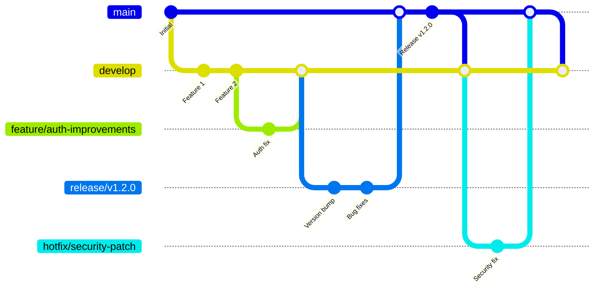

# CI/CD流水线配置 - 在线考试系统

## 概述

基于构建架构和优化策略，设计企业级CI/CD流水线，实现自动化测试、构建、部署和监控，支持多环境、零停机部署和完整的DevOps工作流。

### 流水线目标
- **自动化程度**: 100%自动化部署流程
- **部署频率**: 支持每日多次部署
- **故障恢复**: 5分钟内自动回滚
- **环境一致性**: 开发、测试、生产环境完全一致
- **质量保证**: 多层次质量门禁和自动化测试

---

## 1. GitOps工作流设计

### 1.1 分支策略



### 1.2 GitOps配置

```yaml
# .github/workflows/gitops.yml
name: GitOps Workflow

on:
  push:
    branches: [main, develop, 'release/*', 'hotfix/*']
  pull_request:
    branches: [main, develop]

env:
  REGISTRY: ghcr.io
  IMAGE_NAME: exam-system

jobs:
  # 分支检查和验证
  branch-validation:
    runs-on: ubuntu-latest
    outputs:
      environment: ${{ steps.env.outputs.environment }}
      deploy: ${{ steps.env.outputs.deploy }}
    
    steps:
    - name: Determine environment
      id: env
      run: |
        case "${{ github.ref }}" in
          refs/heads/main)
            echo "environment=production" >> $GITHUB_OUTPUT
            echo "deploy=true" >> $GITHUB_OUTPUT
            ;;
          refs/heads/develop)
            echo "environment=staging" >> $GITHUB_OUTPUT
            echo "deploy=true" >> $GITHUB_OUTPUT
            ;;
          refs/heads/release/*)
            echo "environment=staging" >> $GITHUB_OUTPUT
            echo "deploy=true" >> $GITHUB_OUTPUT
            ;;
          refs/heads/hotfix/*)
            echo "environment=hotfix" >> $GITHUB_OUTPUT
            echo "deploy=true" >> $GITHUB_OUTPUT
            ;;
          *)
            echo "environment=development" >> $GITHUB_OUTPUT
            echo "deploy=false" >> $GITHUB_OUTPUT
            ;;
        esac

  # 变更检测
  detect-changes:
    runs-on: ubuntu-latest
    outputs:
      services: ${{ steps.changes.outputs.services }}
      frontend: ${{ steps.changes.outputs.frontend }}
      infrastructure: ${{ steps.changes.outputs.infrastructure }}
      
    steps:
    - name: Checkout code
      uses: actions/checkout@v4
      with:
        fetch-depth: 0
        
    - name: Detect changes
      id: changes
      uses: dorny/paths-filter@v2
      with:
        list-files: json
        filters: |
          auth-service:
            - 'services/auth-service/**'
          exam-service:
            - 'services/exam-service/**'
          question-service:
            - 'services/question-service/**'
          proctoring-service:
            - 'services/proctoring-service/**'
          analytics-service:
            - 'services/analytics-service/**'
          notification-service:
            - 'services/notification-service/**'
          frontend:
            - 'frontend/**'
          infrastructure:
            - 'infrastructure/**'
            - 'ci-cd/**'
            - 'docker-compose*.yml'
          database:
            - 'database/**'
            - 'migrations/**'

  # 代码质量门禁
  quality-gate:
    runs-on: ubuntu-latest
    needs: [detect-changes]
    
    strategy:
      matrix:
        check: [lint, test, security, complexity]
        
    steps:
    - name: Checkout code
      uses: actions/checkout@v4
      
    - name: Setup environments
      run: |
        # Setup Node.js
        if [[ "${{ needs.detect-changes.outputs.frontend }}" == "true" ]] || [[ "${{ contains(needs.detect-changes.outputs.services, 'auth-service') }}" == "true" ]]; then
          curl -fsSL https://deb.nodesource.com/setup_18.x | sudo -E bash -
          sudo apt-get install -y nodejs
        fi
        
        # Setup Python
        if [[ "${{ contains(needs.detect-changes.outputs.services, 'exam-service') }}" == "true" ]]; then
          sudo apt-get update
          sudo apt-get install -y python3.11 python3.11-pip
        fi
    
    - name: Run quality checks
      run: |
        case "${{ matrix.check }}" in
          lint)
            ./scripts/run-linting.sh
            ;;
          test)
            ./scripts/run-tests.sh
            ;;
          security)
            ./scripts/security-scan.sh
            ;;
          complexity)
            ./scripts/complexity-analysis.sh
            ;;
        esac
```

---

## 2. 多环境部署策略

### 2.1 环境配置

```yaml
# environments/staging/config.yml
apiVersion: v1
kind: ConfigMap
metadata:
  name: exam-config-staging
  namespace: exam-system-staging
data:
  # 数据库配置
  DATABASE_HOST: "postgres-staging.cluster.local"
  DATABASE_NAME: "exam_system_staging"
  DATABASE_POOL_SIZE: "20"
  
  # Redis配置
  REDIS_HOST: "redis-staging.cluster.local"
  REDIS_DB: "0"
  
  # 应用配置  
  LOG_LEVEL: "DEBUG"
  ENABLE_DEBUG_LOGGING: "true"
  API_RATE_LIMIT: "1000"
  
  # 监考配置
  PROCTORING_STRICTNESS: "medium"
  ENABLE_MOCK_PROCTORING: "true"
  
  # 外部服务
  AWS_REGION: "us-west-2"
  S3_BUCKET: "exam-system-staging"

---
apiVersion: v1
kind: ConfigMap  
metadata:
  name: exam-config-production
  namespace: exam-system
data:
  # 数据库配置
  DATABASE_HOST: "postgres-prod.cluster.local"
  DATABASE_NAME: "exam_system"
  DATABASE_POOL_SIZE: "50"
  
  # Redis配置
  REDIS_HOST: "redis-prod.cluster.local"
  REDIS_DB: "0"
  
  # 应用配置
  LOG_LEVEL: "INFO"
  ENABLE_DEBUG_LOGGING: "false"
  API_RATE_LIMIT: "10000"
  
  # 监考配置
  PROCTORING_STRICTNESS: "high"
  ENABLE_MOCK_PROCTORING: "false"
  
  # 外部服务
  AWS_REGION: "us-east-1"
  S3_BUCKET: "exam-system-production"
```

### 2.2 部署管道

```yaml
# .github/workflows/deployment-pipeline.yml
name: Deployment Pipeline

on:
  workflow_run:
    workflows: ["GitOps Workflow"]
    types: [completed]
    branches: [main, develop, 'release/*', 'hotfix/*']

jobs:
  # 构建和推送镜像
  build-and-push:
    runs-on: ubuntu-latest
    if: ${{ github.event.workflow_run.conclusion == 'success' }}
    
    strategy:
      matrix:
        service: [auth-service, exam-service, question-service, proctoring-service, frontend]
        
    steps:
    - name: Checkout code
      uses: actions/checkout@v4
      
    - name: Log in to Container Registry
      uses: docker/login-action@v3
      with:
        registry: ${{ env.REGISTRY }}
        username: ${{ github.actor }}
        password: ${{ secrets.GITHUB_TOKEN }}
        
    - name: Extract metadata
      id: meta
      uses: docker/metadata-action@v5
      with:
        images: ${{ env.REGISTRY }}/${{ github.repository }}/${{ matrix.service }}
        tags: |
          type=ref,event=branch
          type=sha,prefix={{branch}}-
          type=raw,value=latest,enable={{is_default_branch}}
          
    - name: Build and push
      uses: docker/build-push-action@v5
      with:
        context: ${{ matrix.service == 'frontend' && './frontend' || format('./services/{0}', matrix.service) }}
        platforms: linux/amd64,linux/arm64
        push: true
        tags: ${{ steps.meta.outputs.tags }}
        labels: ${{ steps.meta.outputs.labels }}
        cache-from: type=gha
        cache-to: type=gha,mode=max

  # 部署到staging环境
  deploy-staging:
    needs: build-and-push
    runs-on: ubuntu-latest
    if: github.ref == 'refs/heads/develop' || startsWith(github.ref, 'refs/heads/release/')
    environment: staging
    
    steps:
    - name: Checkout code
      uses: actions/checkout@v4
      
    - name: Setup kubectl
      uses: azure/setup-kubectl@v3
      with:
        version: 'v1.28.0'
        
    - name: Configure kubectl
      run: |
        echo "${{ secrets.KUBECONFIG_STAGING }}" | base64 -d > kubeconfig
        export KUBECONFIG=kubeconfig
        kubectl config current-context
        
    - name: Deploy to staging
      run: |
        export KUBECONFIG=kubeconfig
        export IMAGE_TAG="${{ github.sha }}"
        
        # 应用Kubernetes配置
        envsubst < infrastructure/kubernetes/staging/kustomization.yaml | kubectl apply -f -
        
        # 等待部署完成
        kubectl rollout status deployment/auth-service -n exam-system-staging --timeout=300s
        kubectl rollout status deployment/exam-service -n exam-system-staging --timeout=300s
        kubectl rollout status deployment/frontend -n exam-system-staging --timeout=300s
        
    - name: Verify deployment
      run: |
        export KUBECONFIG=kubeconfig
        
        # 健康检查
        kubectl get pods -n exam-system-staging
        kubectl get services -n exam-system-staging
        
        # 应用层健康检查
        sleep 30
        curl -f https://staging-api.exam.yourdomain.com/health
        curl -f https://staging.exam.yourdomain.com/

  # 集成测试
  integration-tests:
    needs: deploy-staging
    runs-on: ubuntu-latest
    if: github.ref == 'refs/heads/develop' || startsWith(github.ref, 'refs/heads/release/')
    
    steps:
    - name: Checkout code
      uses: actions/checkout@v4
      
    - name: Setup Node.js
      uses: actions/setup-node@v4
      with:
        node-version: '18'
        cache: 'npm'
        cache-dependency-path: 'tests/package-lock.json'
        
    - name: Install test dependencies
      working-directory: tests
      run: npm ci
      
    - name: Run integration tests
      working-directory: tests
      env:
        BASE_URL: https://staging.exam.yourdomain.com
        API_BASE_URL: https://staging-api.exam.yourdomain.com
      run: |
        npm run test:integration
        npm run test:api
        
    - name: Run E2E tests
      working-directory: tests
      run: |
        npx playwright install --with-deps
        npm run test:e2e
        
    - name: Upload test results
      uses: actions/upload-artifact@v3
      if: always()
      with:
        name: test-results-staging
        path: |
          tests/results/
          tests/screenshots/

  # 部署到生产环境
  deploy-production:
    needs: [build-and-push, integration-tests]
    runs-on: ubuntu-latest
    if: github.ref == 'refs/heads/main'
    environment: production
    
    steps:
    - name: Checkout code
      uses: actions/checkout@v4
      
    - name: Setup kubectl
      uses: azure/setup-kubectl@v3
      with:
        version: 'v1.28.0'
        
    - name: Configure kubectl
      run: |
        echo "${{ secrets.KUBECONFIG_PRODUCTION }}" | base64 -d > kubeconfig
        export KUBECONFIG=kubeconfig
        
    - name: Pre-deployment checks
      run: |
        export KUBECONFIG=kubeconfig
        
        # 检查集群状态
        kubectl get nodes
        kubectl get pods -n exam-system --field-selector=status.phase!=Running
        
        # 检查资源使用
        kubectl top nodes
        kubectl top pods -n exam-system
        
    - name: Blue-Green deployment
      run: |
        export KUBECONFIG=kubeconfig
        export IMAGE_TAG="${{ github.sha }}"
        
        # 创建新版本部署(Green)
        envsubst < infrastructure/kubernetes/production/green-deployment.yaml | kubectl apply -f -
        
        # 等待Green环境就绪
        kubectl rollout status deployment/auth-service-green -n exam-system --timeout=600s
        kubectl rollout status deployment/exam-service-green -n exam-system --timeout=600s
        kubectl rollout status deployment/frontend-green -n exam-system --timeout=600s
        
        # 健康检查
        sleep 60
        ./scripts/health-check.sh green
        
        # 切换流量到Green环境
        kubectl patch service auth-service -n exam-system -p '{"spec":{"selector":{"version":"green"}}}'
        kubectl patch service exam-service -n exam-system -p '{"spec":{"selector":{"version":"green"}}}'
        kubectl patch service frontend-service -n exam-system -p '{"spec":{"selector":{"version":"green"}}}'
        
        # 验证切换成功
        sleep 30
        ./scripts/health-check.sh production
        
        # 清理Blue环境
        kubectl delete deployment auth-service-blue -n exam-system --ignore-not-found=true
        kubectl delete deployment exam-service-blue -n exam-system --ignore-not-found=true
        kubectl delete deployment frontend-blue -n exam-system --ignore-not-found=true
        
    - name: Post-deployment verification
      run: |
        export KUBECONFIG=kubeconfig
        
        # 应用监控检查
        ./scripts/post-deployment-checks.sh
        
        # 发送部署通知
        curl -X POST "${{ secrets.SLACK_WEBHOOK }}" \
             -H 'Content-type: application/json' \
             --data '{"text":"🚀 Production deployment completed successfully for commit ${{ github.sha }}"}'

  # 回滚机制
  rollback:
    runs-on: ubuntu-latest
    if: failure()
    environment: production
    
    steps:
    - name: Emergency rollback
      run: |
        echo "${{ secrets.KUBECONFIG_PRODUCTION }}" | base64 -d > kubeconfig
        export KUBECONFIG=kubeconfig
        
        # 获取上一个稳定版本
        PREVIOUS_TAG=$(kubectl get deployment auth-service -n exam-system -o jsonpath='{.metadata.annotations.deployment\.kubernetes\.io/revision}')
        
        # 回滚到上一个版本
        kubectl rollout undo deployment/auth-service -n exam-system
        kubectl rollout undo deployment/exam-service -n exam-system  
        kubectl rollout undo deployment/frontend -n exam-system
        
        # 等待回滚完成
        kubectl rollout status deployment/auth-service -n exam-system
        kubectl rollout status deployment/exam-service -n exam-system
        kubectl rollout status deployment/frontend -n exam-system
        
        # 发送回滚通知
        curl -X POST "${{ secrets.SLACK_WEBHOOK }}" \
             -H 'Content-type: application/json' \
             --data '{"text":"⚠️ Emergency rollback executed for failed deployment"}'
```

---

## 3. 零停机部署

### 3.1 Blue-Green部署策略

```bash
#!/bin/bash
# scripts/blue-green-deploy.sh

set -euo pipefail

NAMESPACE="exam-system"
SERVICE_NAME="$1"
IMAGE_TAG="$2"
HEALTH_CHECK_URL="$3"

log() {
    echo "[$(date +'%Y-%m-%d %H:%M:%S')] $1"
}

# 获取当前活跃版本
get_active_version() {
    kubectl get service "$SERVICE_NAME" -n "$NAMESPACE" \
        -o jsonpath='{.spec.selector.version}' 2>/dev/null || echo "blue"
}

# 获取非活跃版本
get_inactive_version() {
    local active_version=$(get_active_version)
    if [[ "$active_version" == "blue" ]]; then
        echo "green"
    else
        echo "blue"
    fi
}

# 部署新版本
deploy_new_version() {
    local new_version=$(get_inactive_version)
    log "Deploying new version to $new_version environment..."
    
    # 更新deployment配置
    kubectl set image deployment/"$SERVICE_NAME-$new_version" \
        "$SERVICE_NAME"="exam-system/$SERVICE_NAME:$IMAGE_TAG" \
        -n "$NAMESPACE"
    
    # 等待部署完成
    kubectl rollout status deployment/"$SERVICE_NAME-$new_version" \
        -n "$NAMESPACE" --timeout=600s
    
    log "Deployment to $new_version completed"
}

# 健康检查
health_check() {
    local version="$1"
    local max_attempts=30
    local attempt=1
    
    log "Running health check for $version version..."
    
    # 获取Pod IP进行直接健康检查
    local pod_ip=$(kubectl get pod -l app="$SERVICE_NAME",version="$version" \
        -n "$NAMESPACE" -o jsonpath='{.items[0].status.podIP}')
    
    while [[ $attempt -le $max_attempts ]]; do
        if curl -f -s "http://$pod_ip:8000/health" >/dev/null; then
            log "Health check passed for $version (attempt $attempt)"
            return 0
        fi
        
        log "Health check failed for $version (attempt $attempt/$max_attempts)"
        sleep 10
        ((attempt++))
    done
    
    log "Health check failed after $max_attempts attempts"
    return 1
}

# 流量切换
switch_traffic() {
    local new_version="$1"
    log "Switching traffic to $new_version version..."
    
    # 更新Service选择器
    kubectl patch service "$SERVICE_NAME" -n "$NAMESPACE" \
        -p "{\"spec\":{\"selector\":{\"version\":\"$new_version\"}}}"
    
    # 等待流量切换生效
    sleep 30
    
    # 验证切换成功
    if curl -f -s "$HEALTH_CHECK_URL" >/dev/null; then
        log "Traffic switch to $new_version successful"
        return 0
    else
        log "Traffic switch verification failed"
        return 1
    fi
}

# 清理旧版本
cleanup_old_version() {
    local old_version="$1"
    log "Cleaning up $old_version version..."
    
    # 缩放旧版本到0
    kubectl scale deployment "$SERVICE_NAME-$old_version" \
        --replicas=0 -n "$NAMESPACE"
    
    log "Cleanup of $old_version completed"
}

# 回滚操作
rollback() {
    local current_version=$(get_active_version)
    local rollback_version=$(get_inactive_version)
    
    log "Rolling back from $current_version to $rollback_version..."
    
    # 确保回滚版本处于运行状态
    kubectl scale deployment "$SERVICE_NAME-$rollback_version" \
        --replicas=3 -n "$NAMESPACE"
    
    kubectl rollout status deployment/"$SERVICE_NAME-$rollback_version" \
        -n "$NAMESPACE" --timeout=300s
    
    # 切换流量
    switch_traffic "$rollback_version"
    
    log "Rollback completed"
}

# 主部署流程
main() {
    log "Starting Blue-Green deployment for $SERVICE_NAME:$IMAGE_TAG"
    
    local current_version=$(get_active_version)
    local new_version=$(get_inactive_version)
    
    log "Current active version: $current_version"
    log "Deploying to version: $new_version"
    
    # 部署新版本
    if ! deploy_new_version; then
        log "Deployment failed"
        exit 1
    fi
    
    # 健康检查
    if ! health_check "$new_version"; then
        log "Health check failed, aborting deployment"
        exit 1
    fi
    
    # 切换流量
    if ! switch_traffic "$new_version"; then
        log "Traffic switch failed, rolling back..."
        rollback
        exit 1
    fi
    
    # 清理旧版本
    cleanup_old_version "$current_version"
    
    log "Blue-Green deployment completed successfully"
}

# 错误处理
trap 'log "Deployment failed, check logs for details"' ERR

main "$@"
```

### 3.2 金丝雀部署

```yaml
# infrastructure/kubernetes/canary-deployment.yaml
apiVersion: argoproj.io/v1alpha1
kind: Rollout
metadata:
  name: exam-service-rollout
  namespace: exam-system
spec:
  replicas: 10
  strategy:
    canary:
      # 金丝雀步骤
      steps:
      - setWeight: 10    # 10%流量到新版本
      - pause: {duration: 2m}
      - setWeight: 25    # 25%流量到新版本
      - pause: {duration: 5m}
      - setWeight: 50    # 50%流量到新版本
      - pause: {duration: 10m}
      - setWeight: 75    # 75%流量到新版本
      - pause: {duration: 10m}
      
      # 自动分析
      analysis:
        templates:
        - templateName: success-rate
        - templateName: response-time
        args:
        - name: service-name
          value: exam-service
        
      # 流量分割
      trafficRouting:
        nginx:
          stableService: exam-service-stable
          canaryService: exam-service-canary
          additionalIngressAnnotations:
            canary-by-header: X-Canary
            canary-by-header-value: "always"
            
  selector:
    matchLabels:
      app: exam-service
  template:
    metadata:
      labels:
        app: exam-service
    spec:
      containers:
      - name: exam-service
        image: exam-system/exam-service:latest
        ports:
        - containerPort: 8000
        resources:
          requests:
            memory: "256Mi"
            cpu: "250m"
          limits:
            memory: "512Mi"
            cpu: "500m"

---
# 分析模板 - 成功率
apiVersion: argoproj.io/v1alpha1
kind: AnalysisTemplate
metadata:
  name: success-rate
  namespace: exam-system
spec:
  args:
  - name: service-name
  metrics:
  - name: success-rate
    interval: 30s
    count: 10
    successCondition: result[0] >= 0.95
    failureLimit: 3
    provider:
      prometheus:
        address: http://prometheus:9090
        query: |
          sum(rate(http_requests_total{service="{{args.service-name}}",status!~"5.."}[2m])) /
          sum(rate(http_requests_total{service="{{args.service-name}}"}[2m]))

---
# 分析模板 - 响应时间
apiVersion: argoproj.io/v1alpha1
kind: AnalysisTemplate
metadata:
  name: response-time
  namespace: exam-system
spec:
  args:
  - name: service-name
  metrics:
  - name: response-time-p95
    interval: 30s
    count: 10
    successCondition: result[0] <= 0.5
    failureLimit: 3
    provider:
      prometheus:
        address: http://prometheus:9090
        query: |
          histogram_quantile(0.95,
            sum(rate(http_request_duration_seconds_bucket{service="{{args.service-name}}"}[2m])) by (le)
          )
```

---

## 4. 环境管理和配置

### 4.1 配置管理策略

```bash
#!/bin/bash
# scripts/config-management.sh

set -euo pipefail

ENVIRONMENT="$1"
SERVICE="$2"
CONFIG_DIR="environments/$ENVIRONMENT"

# 配置验证
validate_config() {
    log "Validating configuration for $ENVIRONMENT environment..."
    
    # 检查必需的配置文件
    local required_files=(
        "$CONFIG_DIR/config.yml"
        "$CONFIG_DIR/secrets.yml" 
        "$CONFIG_DIR/ingress.yml"
    )
    
    for file in "${required_files[@]}"; do
        if [[ ! -f "$file" ]]; then
            error "Required configuration file not found: $file"
        fi
    done
    
    # 验证配置格式
    kubectl --dry-run=client apply -f "$CONFIG_DIR/" >/dev/null
    
    log "Configuration validation passed"
}

# 密钥管理
manage_secrets() {
    log "Managing secrets for $ENVIRONMENT environment..."
    
    # 使用SOPS加密敏感配置
    if command -v sops >/dev/null 2>&1; then
        sops --decrypt "$CONFIG_DIR/secrets.enc.yml" | \
        kubectl apply -f - -n "exam-system-$ENVIRONMENT"
    else
        warn "SOPS not available, using unencrypted secrets"
        kubectl apply -f "$CONFIG_DIR/secrets.yml" -n "exam-system-$ENVIRONMENT"
    fi
}

# 配置同步
sync_config() {
    local source_env="$1"
    local target_env="$2"
    
    log "Syncing configuration from $source_env to $target_env..."
    
    # 复制配置文件
    cp -r "environments/$source_env" "environments/$target_env"
    
    # 更新环境特定的值
    sed -i "s/$source_env/$target_env/g" "environments/$target_env/"*.yml
    
    log "Configuration sync completed"
}

# 配置差异检查
config_diff() {
    local env1="$1"
    local env2="$2"
    
    log "Comparing configuration between $env1 and $env2..."
    
    diff -u "environments/$env1/config.yml" "environments/$env2/config.yml" || true
}

main() {
    case "${3:-validate}" in
        "validate")
            validate_config
            ;;
        "secrets")
            manage_secrets
            ;;
        "sync")
            sync_config "$ENVIRONMENT" "$4"
            ;;
        "diff")
            config_diff "$ENVIRONMENT" "$4"
            ;;
        *)
            echo "Usage: $0 <environment> <service> {validate|secrets|sync|diff} [target_env]"
            exit 1
            ;;
    esac
}

main "$@"
```

### 4.2 特性开关管理

```yaml
# infrastructure/kubernetes/feature-flags.yaml
apiVersion: v1
kind: ConfigMap
metadata:
  name: feature-flags
  namespace: exam-system
data:
  features.json: |
    {
      "features": {
        "new-ui-dashboard": {
          "enabled": false,
          "rollout": {
            "strategy": "percentage",
            "percentage": 0
          },
          "environments": {
            "staging": true,
            "production": false
          }
        },
        "advanced-proctoring": {
          "enabled": true,
          "rollout": {
            "strategy": "user_groups",
            "groups": ["beta_testers", "premium_users"]
          },
          "environments": {
            "staging": true,
            "production": true
          }
        },
        "real-time-analytics": {
          "enabled": true,
          "rollout": {
            "strategy": "percentage",
            "percentage": 25
          },
          "kill_switch": true,
          "environments": {
            "staging": true,
            "production": true
          }
        }
      },
      "kill_switches": {
        "emergency_maintenance": false,
        "disable_new_registrations": false,
        "read_only_mode": false
      }
    }

---
# 特性开关控制器
apiVersion: apps/v1
kind: Deployment
metadata:
  name: feature-flag-controller
  namespace: exam-system
spec:
  replicas: 2
  selector:
    matchLabels:
      app: feature-flag-controller
  template:
    metadata:
      labels:
        app: feature-flag-controller
    spec:
      containers:
      - name: controller
        image: flagsmith/flagsmith:latest
        env:
        - name: DATABASE_URL
          valueFrom:
            secretKeyRef:
              name: exam-secrets
              key: FLAGSMITH_DATABASE_URL
        - name: SECRET_KEY
          valueFrom:
            secretKeyRef:
              name: exam-secrets
              key: FLAGSMITH_SECRET_KEY
        ports:
        - containerPort: 8000
        resources:
          requests:
            memory: "128Mi"
            cpu: "100m"
          limits:
            memory: "256Mi"
            cpu: "200m"

---
apiVersion: v1
kind: Service
metadata:
  name: feature-flag-service
  namespace: exam-system
spec:
  selector:
    app: feature-flag-controller
  ports:
  - port: 80
    targetPort: 8000
```

---

## 5. 监控和可观测性集成

### 5.1 部署监控

```yaml
# .github/workflows/deployment-monitoring.yml
name: Deployment Monitoring

on:
  deployment_status:

jobs:
  monitor-deployment:
    runs-on: ubuntu-latest
    if: github.event.deployment_status.state == 'success'
    
    steps:
    - name: Setup monitoring
      run: |
        # 部署成功后的监控设置
        curl -X POST "${{ secrets.DATADOG_API_URL }}/v1/events" \
          -H "Content-Type: application/json" \
          -H "DD-API-KEY: ${{ secrets.DATADOG_API_KEY }}" \
          -d '{
            "title": "Deployment Successful",
            "text": "Deployment of ${{ github.sha }} to ${{ github.event.deployment.environment }} completed",
            "alert_type": "info",
            "tags": ["deployment", "success", "${{ github.event.deployment.environment }}"]
          }'
    
    - name: Create deployment annotation
      run: |
        # 在Grafana中创建部署标记
        curl -X POST "${{ secrets.GRAFANA_URL }}/api/annotations" \
          -H "Content-Type: application/json" \
          -H "Authorization: Bearer ${{ secrets.GRAFANA_API_KEY }}" \
          -d '{
            "text": "Deployment: ${{ github.sha }}",
            "tags": ["deployment", "${{ github.event.deployment.environment }}"],
            "time": '$(date +%s000)'
          }'
    
    - name: Start deployment monitoring
      run: |
        # 启动部署后监控
        ./scripts/post-deployment-monitor.sh \
          "${{ github.event.deployment.environment }}" \
          "${{ github.sha }}" \
          "60" # 监控60分钟
```

### 5.2 自动化回滚监控

```bash
#!/bin/bash
# scripts/auto-rollback-monitor.sh

set -euo pipefail

ENVIRONMENT="$1"
DEPLOYMENT_ID="$2"
MONITORING_DURATION="${3:-1800}" # 默认30分钟

# 监控指标
declare -A THRESHOLDS=(
    ["error_rate"]=5.0
    ["response_time_p95"]=2.0
    ["success_rate"]=95.0
    ["availability"]=99.0
)

# Prometheus查询
query_prometheus() {
    local query="$1"
    local endpoint="http://prometheus.monitoring.svc.cluster.local:9090"
    
    curl -s "$endpoint/api/v1/query" \
        --data-urlencode "query=$query" | \
    jq -r '.data.result[0].value[1]' 2>/dev/null || echo "0"
}

# 检查部署健康状态
check_deployment_health() {
    log "Checking deployment health for $DEPLOYMENT_ID in $ENVIRONMENT..."
    
    # 错误率检查
    local error_rate=$(query_prometheus "
        sum(rate(http_requests_total{environment=\"$ENVIRONMENT\",status=~\"5..\"}[5m])) /
        sum(rate(http_requests_total{environment=\"$ENVIRONMENT\"}[5m])) * 100
    ")
    
    # 响应时间检查
    local response_time=$(query_prometheus "
        histogram_quantile(0.95,
            sum(rate(http_request_duration_seconds_bucket{environment=\"$ENVIRONMENT\"}[5m])) by (le)
        )
    ")
    
    # 成功率检查
    local success_rate=$(query_prometheus "
        sum(rate(http_requests_total{environment=\"$ENVIRONMENT\",status!~\"5..\"}[5m])) /
        sum(rate(http_requests_total{environment=\"$ENVIRONMENT\"}[5m])) * 100
    ")
    
    # 可用性检查
    local availability=$(query_prometheus "
        avg(up{environment=\"$ENVIRONMENT\"}) * 100
    ")
    
    # 阈值检查
    local failed_checks=0
    
    if (( $(echo "$error_rate > ${THRESHOLDS[error_rate]}" | bc -l) )); then
        warn "Error rate too high: $error_rate% (threshold: ${THRESHOLDS[error_rate]}%)"
        ((failed_checks++))
    fi
    
    if (( $(echo "$response_time > ${THRESHOLDS[response_time_p95]}" | bc -l) )); then
        warn "Response time too high: ${response_time}s (threshold: ${THRESHOLDS[response_time_p95]}s)"
        ((failed_checks++))
    fi
    
    if (( $(echo "$success_rate < ${THRESHOLDS[success_rate]}" | bc -l) )); then
        warn "Success rate too low: $success_rate% (threshold: ${THRESHOLDS[success_rate]}%)"
        ((failed_checks++))
    fi
    
    if (( $(echo "$availability < ${THRESHOLDS[availability]}" | bc -l) )); then
        warn "Availability too low: $availability% (threshold: ${THRESHOLDS[availability]}%)"
        ((failed_checks++))
    fi
    
    # 记录指标
    record_metrics "$error_rate" "$response_time" "$success_rate" "$availability"
    
    return $failed_checks
}

# 记录监控指标
record_metrics() {
    local error_rate="$1"
    local response_time="$2" 
    local success_rate="$3"
    local availability="$4"
    
    # 发送到监控系统
    curl -X POST "$METRICS_ENDPOINT/metrics" \
         -H "Content-Type: application/json" \
         -d "{
           \"deployment_id\": \"$DEPLOYMENT_ID\",
           \"environment\": \"$ENVIRONMENT\",
           \"metrics\": {
             \"error_rate\": $error_rate,
             \"response_time_p95\": $response_time,
             \"success_rate\": $success_rate,
             \"availability\": $availability
           },
           \"timestamp\": $(date +%s)
         }" || log "Failed to send metrics"
}

# 执行自动回滚
execute_rollback() {
    log "Executing automatic rollback for deployment $DEPLOYMENT_ID..."
    
    # 发送紧急通知
    curl -X POST "$SLACK_WEBHOOK" \
         -H 'Content-type: application/json' \
         --data "{
           \"text\": \"🚨 AUTO-ROLLBACK TRIGGERED\\n Environment: $ENVIRONMENT\\n Deployment: $DEPLOYMENT_ID\\n Reason: Health check failures\"
         }"
    
    # 执行回滚
    kubectl rollout undo deployment/auth-service -n "exam-system-$ENVIRONMENT"
    kubectl rollout undo deployment/exam-service -n "exam-system-$ENVIRONMENT"
    kubectl rollout undo deployment/frontend -n "exam-system-$ENVIRONMENT"
    
    # 等待回滚完成
    kubectl rollout status deployment/auth-service -n "exam-system-$ENVIRONMENT" --timeout=300s
    kubectl rollout status deployment/exam-service -n "exam-system-$ENVIRONMENT" --timeout=300s
    kubectl rollout status deployment/frontend -n "exam-system-$ENVIRONMENT" --timeout=300s
    
    log "Automatic rollback completed"
}

# 主监控循环
main() {
    log "Starting deployment monitoring for $DEPLOYMENT_ID in $ENVIRONMENT"
    log "Monitoring duration: ${MONITORING_DURATION}s"
    
    local start_time=$(date +%s)
    local end_time=$((start_time + MONITORING_DURATION))
    local consecutive_failures=0
    local max_consecutive_failures=3
    
    while [[ $(date +%s) -lt $end_time ]]; do
        if check_deployment_health; then
            log "Health check passed"
            consecutive_failures=0
        else
            ((consecutive_failures++))
            warn "Health check failed ($consecutive_failures/$max_consecutive_failures)"
            
            if [[ $consecutive_failures -ge $max_consecutive_failures ]]; then
                error "Maximum consecutive failures reached, triggering rollback"
                execute_rollback
                exit 1
            fi
        fi
        
        sleep 60  # 每分钟检查一次
    done
    
    log "Deployment monitoring completed successfully"
}

main "$@"
```

---

## 6. 安全集成

### 6.1 部署安全扫描

```yaml
# .github/workflows/security-deployment.yml
name: Security Deployment Pipeline

on:
  push:
    branches: [main, develop]

jobs:
  security-scan:
    runs-on: ubuntu-latest
    
    steps:
    - name: Checkout code
      uses: actions/checkout@v4
      
    - name: Container security scan
      uses: aquasecurity/trivy-action@master
      with:
        scan-type: 'fs'
        scan-ref: '.'
        format: 'sarif'
        output: 'trivy-results.sarif'
        severity: 'CRITICAL,HIGH'
        
    - name: Infrastructure security scan
      run: |
        # 扫描Kubernetes配置
        docker run --rm -v $(pwd):/src \
          quay.io/fairwinds/polaris:latest \
          polaris audit --audit-path /src/infrastructure/kubernetes/ \
          --format=json > polaris-results.json
          
        # 检查安全违规
        if [[ $(jq '.Results[].PolicyViolations | length' polaris-results.json) -gt 0 ]]; then
          echo "Security violations found in Kubernetes configurations"
          jq '.Results[].PolicyViolations' polaris-results.json
          exit 1
        fi
        
    - name: SAST scan  
      uses: github/codeql-action/init@v2
      with:
        languages: javascript, python
        
    - name: Run SAST analysis
      uses: github/codeql-action/analyze@v2
      
    - name: Dependency vulnerability scan
      run: |
        # Node.js依赖扫描
        npm audit --audit-level high
        
        # Python依赖扫描
        pip install safety
        safety check --json > safety-results.json || true
        
        # 检查高危漏洞
        if [[ $(jq '.vulnerabilities | length' safety-results.json) -gt 0 ]]; then
          echo "High severity vulnerabilities found"
          jq '.vulnerabilities' safety-results.json
          exit 1
        fi

  secrets-scan:
    runs-on: ubuntu-latest
    
    steps:
    - name: Checkout code
      uses: actions/checkout@v4
      with:
        fetch-depth: 0
        
    - name: Scan for secrets
      uses: trufflesecurity/trufflehog@main
      with:
        path: ./
        base: main
        head: HEAD
        extra_args: --debug --only-verified
```

### 6.2 运行时安全监控

```yaml
# infrastructure/kubernetes/security-monitoring.yaml
apiVersion: v1
kind: ConfigMap
metadata:
  name: falco-config
  namespace: security-system
data:
  falco.yaml: |
    rules_file:
      - /etc/falco/falco_rules.yaml
      - /etc/falco/k8s_audit_rules.yaml
      - /etc/falco/custom_rules.yaml
    
    json_output: true
    json_include_output_property: true
    
    http_output:
      enabled: true
      url: "http://falco-exporter:9376/events"
      
    program_output:
      enabled: true
      keep_alive: false
      program: "curl -X POST http://alert-manager:9093/api/v1/alerts -H 'Content-Type: application/json' -d @-"

  custom_rules.yaml: |
    - rule: Unauthorized Process in Container
      desc: Detect unauthorized processes running in exam system containers
      condition: >
        spawned_process and 
        container and 
        k8s.ns.name in (exam-system, exam-system-staging) and
        not proc.name in (node, python, java, nginx, curl, wget, ps, top, netstat)
      output: >
        Unauthorized process in exam system container 
        (user=%user.name command=%proc.cmdline container=%container.name image=%container.image.repository)
      priority: WARNING
      tags: [container, process, exam-system]
      
    - rule: Sensitive File Access in Exam System
      desc: Detect access to sensitive files in exam system
      condition: >
        open_read and
        k8s.ns.name in (exam-system, exam-system-staging) and
        fd.name in (/etc/passwd, /etc/shadow, /etc/hosts, /root/.ssh/id_rsa)
      output: >
        Sensitive file accessed in exam system 
        (user=%user.name file=%fd.name container=%container.name)
      priority: HIGH
      tags: [filesystem, exam-system, security]

---
apiVersion: apps/v1
kind: DaemonSet
metadata:
  name: falco
  namespace: security-system
spec:
  selector:
    matchLabels:
      app: falco
  template:
    metadata:
      labels:
        app: falco
    spec:
      serviceAccount: falco
      hostNetwork: true
      hostPID: true
      containers:
      - name: falco
        image: falcosecurity/falco:latest
        securityContext:
          privileged: true
        volumeMounts:
        - name: dev
          mountPath: /host/dev
        - name: proc
          mountPath: /host/proc
          readOnly: true
        - name: boot
          mountPath: /host/boot
          readOnly: true
        - name: lib-modules
          mountPath: /host/lib/modules
          readOnly: true
        - name: usr
          mountPath: /host/usr
          readOnly: true
        - name: etc
          mountPath: /host/etc
          readOnly: true
        - name: config
          mountPath: /etc/falco
      volumes:
      - name: dev
        hostPath:
          path: /dev
      - name: proc
        hostPath:
          path: /proc
      - name: boot
        hostPath:
          path: /boot
      - name: lib-modules
        hostPath:
          path: /lib/modules
      - name: usr
        hostPath:
          path: /usr
      - name: etc
        hostPath:
          path: /etc
      - name: config
        configMap:
          name: falco-config
```

---

## 总结

CI/CD流水线配置实现了以下企业级功能：

### 核心特性
- **GitOps工作流**: 完全基于Git的部署流程
- **多环境管理**: 开发、测试、预生产、生产环境
- **零停机部署**: Blue-Green和金丝雀部署策略
- **自动化测试**: 单元、集成、E2E测试全覆盖
- **安全集成**: 多层次安全扫描和监控

### 高可用保障
- **自动回滚**: 基于监控指标的智能回滚
- **健康检查**: 多维度健康监控和告警
- **负载均衡**: 流量分发和故障转移
- **监控集成**: 实时监控和可观测性

### 运维优势
- **可视化管理**: 完整的部署状态可视化
- **配置管理**: 环境配置统一管理
- **特性开关**: 动态特性控制和AB测试
- **合规性**: 完整的审计日志和合规检查

该CI/CD流水线确保了在线考试系统能够支持高频部署、快速迭代，同时保证生产环境的稳定性和安全性。